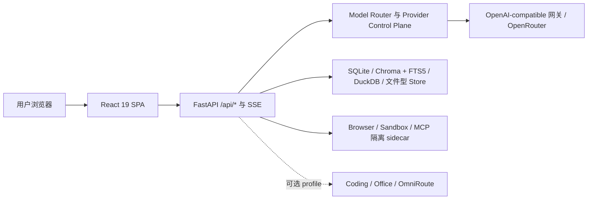

<div align="center">
  
  <h1>模镜 ModelMirror</h1>
  <p><strong> 从寻找一个模型，到编译一套智能。<br>
 From choosing a model to compiling intelligence.</strong></p>
  <p>
    面向中文用户的本地工作台：以操作级 Provider Contract、精确 Workload Binding、<br />
    脱敏路由回执和隔离 Runtime，贯通资源发现、组合与受控执行。
  </p>
  <p>
    <a href="https://github.com/PinkElf-Elysia/ModelMirror/actions/workflows/quality.yml"></a>
    <a href="https://github.com/PinkElf-Elysia/ModelMirror/actions/workflows/multimodal-readiness.yml"></a>
    <a href="https://github.com/PinkElf-Elysia/ModelMirror/actions/workflows/file-readiness.yml"></a>
  </p>
  <p>
    <a href="docs/MODEL_PROVIDER_CONTROL_PLANE.md"></a>
    <a href="docs/MODEL_PROVIDER_CONTROL_PLANE.md"></a>
    <a href="docs/ARCHITECTURE.md#model-provider-control-plane"></a>
    <a href="docs/MODEL_PROVIDER_CONTROL_PLANE.md"></a>
    <a href="docs/architecture/ai-capability-compiler.md"></a>
  </p>
  <p>
    <strong>简体中文</strong> · <a href="README_EN.md">English</a>
  </p>
  <p>
    <a href="#快速开始">快速开始</a> ·
    <a href="#能力地图">能力地图</a> ·
    <a href="#当前架构">当前架构</a> ·
    <a href="#文档导航">文档导航</a>
  </p>
</div>

> [!IMPORTANT]
> 本文按 `main@66b57c3`（2026-08-25）的代码、配置、测试与当前文档复核。文中的“可用”表示主分支存在可运行入口，不等于生产 SLA、企业级多租户能力或真实供应商端到端验收；依赖密钥、功能开关、可选 Compose profile 或人工审批的能力会单独标记。

## 快速开始

推荐使用 Docker Compose。你需要 Git、Docker Desktop / Docker Engine（含 Compose V2），以及至少一种模型访问方式。

### 1. 准备配置

在仓库根目录复制服务端环境变量示例：

```powershell
Copy-Item server/.env.example server/.env
```

在 `server/.env` 中选择一种模型访问方式。最短路径是直接配置 OpenRouter：

```dotenv
OPENROUTER_API_KEY=your-openrouter-key
```

也可以连接任意 OpenAI-compatible 网关：

```dotenv
LLM_GATEWAY_URL=https://your-gateway.example/v1/chat/completions
LLM_GATEWAY_KEY=your-gateway-key
```

newAPI 采用独立 Compose 栈和显式网络 Overlay，不属于默认核心栈；配置方式见[快速上手](docs/QUICK_START.md)和[部署指南](docs/DEPLOYMENT.md)。

### 2. 启动服务

```powershell
docker compose -p modelmirror up -d --build
docker compose -p modelmirror ps
```

默认 Compose 会启动 Web、API，以及隔离的 Browser、Sandbox 和 MCP sidecar。OmniRoute、Coding、Office Host 与 newAPI 需要单独 profile 或独立栈。

### 3. 验证

```powershell
curl.exe http://localhost:8000/api/health
curl.exe http://localhost:5173/models
```

| 入口 | 地址 | 用途 |
| --- | --- | --- |
| 模型招聘会 | [localhost:5173/models](http://localhost:5173/models) | 浏览、筛选和试用模型 |
| 智能调度 | [localhost:5173/chat/auto](http://localhost:5173/chat/auto) | 查看路由策略与脱敏回执 |
| Agent Studio | [localhost:5173/agents/studio](http://localhost:5173/agents/studio) | 创建、发布和运行 Agent |
| 工作流 | [localhost:5173/workflow](http://localhost:5173/workflow) | 编排并运行 classic 工作流 |
| 知识库 | [localhost:5173/rag](http://localhost:5173/rag) | 构建、检索和评测本地知识库 |
| 设置 | [localhost:5173/settings](http://localhost:5173/settings) | 管理 Provider、路由与运行策略 |

完整页面清单见[当前系统架构](docs/ARCHITECTURE.md#稳定路由)。

## 为什么是 ModelMirror

AI 供给已经从少数通用模型，扩展为模型、工具、知识库、Skill、MCP、垂类 Agent 与工作流组成的异构生态。真正困难的问题逐渐变成：一个任务需要哪些能力，如何在质量、成本、时延、可靠性与数据边界之间选择，以及如何验证组合结果。

ModelMirror 先把这条链路收敛到一个本地工作台：

1. **发现**：用中文目录、能力标签、价格与可用性信息找到候选资源。
2. **试用**：通过聊天和多模态工作区验证真实输入输出。
3. **组合**：把模型、工具、知识和 Agent 放入工作流或团队任务。
4. **治理**：用 Provider 策略、审批、回执、评测与运行诊断约束执行。

“AI 牛马招聘会”是面向用户的产品入口与体验隐喻；**AI Capability Compiler（AI 能力编译器）** 是目标产品引擎，不是对当前完成度的声明。

## 能力地图

| 能力域 | 当前主分支基线 | 成熟度 |
| --- | --- | --- |
| 模型目录与多模态聊天 | 模型筛选、价格与能力标签、OpenAI-compatible SSE；按模型能力进入文本、图片、STT、TTS、音频或视频工作区 | **可用 / Provider 依赖** |
| 路由与 Provider 治理 | `/chat/auto` 原生调度；连接、目录、逐 operation Offering、Readiness、资格、策略和脱敏 Receipt 控制面 | **可用 / 分阶段门禁** |
| Agent 与专家团 | AI 人才市场、Agent Studio、Agent Workbench、Goal、Handoff、Automation、Agent App/API 与 Expert Team | **可用 / 部分执行需配置** |
| Classic Workflow | React Flow 画布、本地运行器、SSE、部署、审批、批处理与受控迭代；外部 HTTP、子工作流等高风险能力默认关闭 | **稳定主路径** |
| 知识与 RAG | 文档上传、处理流水线、Chroma + FTS5 双索引、检索、引用、评测与审批写入 | **稳定主路径** |
| Data X 与数据表 | CSV/XLSX/Parquet 快照、DuckDB、语义模型、版本化指标、受限分析、提案审批与本地托管表 | **可用** |
| MCP、Toolset 与 Browser | 原生 stdio MCP、多会话、隔离 sidecar、受控 Remote OAuth 授权与撤销、工具注册与调用；Toolset 支持 MCP、OpenAPI/OData 与内置 Provider | **可用 / 远程能力受控** |
| Skill、Prompt 与 Plugin | Skill/SkillSet 目录、安装、版本、聊天注入、本地导入与 Skill Creator；Prompt Profile 和声明式 Plugin 资源 | **可用 / 供应链门禁** |
| Runtime 与可观测性 | 运行、Checkpoint、任务、Handoff、Goal、环境摘要以及 Provider/Workflow/Agent Receipt | **可用 / 本地单实例为主** |
| Coding、workflow-native、Matrix Oasis | 代码协作底座、隔离工作流实验线与 3D 空间实验入口 | **Experimental / 默认关闭或隔离** |

> [!NOTE]
> 路由存在不代表对应 Provider 已配置；测试通过也不替代付费模型、播放/下载、外部工具或真实数据的端到端验收。功能开关与部署边界以各模块文档为准。

## 当前架构



| 层 | 主要技术 | 当前职责 |
| --- | --- | --- |
| Web | React 19、TypeScript、Vite、Tailwind CSS、React Router、React Flow | 资源目录、聊天与各类工作空间 |
| API 与 Runtime | FastAPI、Pydantic、httpx、SSE、MCP Python SDK | API 装配、执行、校验、路由与外部适配 |
| 数据 | SQLite、Chroma、FTS5、DuckDB、文件型 Store | 路由证据、知识索引、数据分析与本地运行状态 |
| 隔离边界 | Docker Compose、Unix socket、只读容器、受限网络 | Browser、Sandbox、MCP 和可选 Coding 执行面 |

当前 `/workflow` 与 `/rag` 均为 ModelMirror 原生主路径；Dify 只保留历史兼容代理和旧组件，不是默认启动或部署前提。newAPI 是独立可选数据面，ModelMirror 只通过显式 URL/Key 契约连接，不嵌入或代理其管理界面。

## 项目阶段与目标架构

| 层级 | 定义 | 代表内容 |
| --- | --- | --- |
| **Available Today** | 已合入主分支且具有可运行入口 | 资源目录、聊天、Classic Workflow、RAG、Data X、Agent Studio、MCP/Skill |
| **Controlled / Optional** | 代码已合入，但依赖开关、profile、Provider、资格或审批 | Managed Provider、远程 MCP、视频、Coding 写回、部分 Agent/Workflow 执行 |
| **Experimental** | 隔离实验或尚未完成生产门禁 | Coding Worker 认证线、workflow-native、Matrix Oasis 等 |
| **Target / Research** | 用于指导演进，不是当前功能承诺 | Capability Graph、Capability IR、Router Federation、完整评测与自演进闭环 |


> 上图描述目标架构和长期研究边界，不表示所有层级已经交付。当前映射、成熟度和 Non-Goals 见[AI Capability Compiler 目标架构](docs/architecture/ai-capability-compiler.md)。

目标主链路是：生态资源进入统一 Registry 与 Capability Graph，用户目标被转换为 Capability IR，Meta Router 协调 Domain Router 生成执行计划；Runtime 负责安全执行，Evaluation 记录质量、成本、时延与可靠性信号，经过门禁的反馈再用于改进 Registry、策略和元能力。

## 本地开发与验证

本地开发环境使用 Node.js 22、Python 3.11+；Docker 服务镜像使用 Python 3.12。完整说明见[开发者上手指南](docs/ONBOARDING.md)。

后端：

```powershell
cd server
python -m pip install -r requirements.txt
python -m uvicorn main:app --reload --host 0.0.0.0 --port 8000
```

前端：

```powershell
cd client
npm.cmd ci
npm.cmd run dev -- --host 0.0.0.0 --port 5173
```

提交前的主要门禁：

```powershell
cd client
npm.cmd run typecheck
npm.cmd run test:run
npm.cmd run build
```

```powershell
python -m py_compile server/main.py
python -m pytest server/tests/ -q
docker compose -p modelmirror config --quiet
```

请把前端构建、后端测试、Compose 配置检查与真实 Provider 冒烟分别记录；其中任何一项都不能替代另一项。

## 文档导航

| 想了解什么 | 从这里开始 |
| --- | --- |
| 5 分钟启动与页面验收 | [快速上手](docs/QUICK_START.md) |
| 当前代码能证明什么 | [仓库事实基线](docs/REPOSITORY_FACTS.md) |
| 路由、数据流、存储和外部依赖 | [当前系统架构](docs/ARCHITECTURE.md) |
| Compose、可选 profile、备份和回退 | [部署指南](docs/DEPLOYMENT.md) |
| 模块文档与推荐阅读路径 | [文档中心](docs/README.md) |
| 产品叙事与长期方向 | [产品愿景](docs/VISION.md) |
| AI Capability Compiler 八层设计 | [目标架构](docs/architecture/ai-capability-compiler.md) |
| 开发护栏与验收要求 | [Harness Engineering](docs/HARNESS_ENGINEERING.md) |
| AI Agent 协作规则 | [AGENTS.md](AGENTS.md) |
| 第三方来源与归属 | [Third-party notices](THIRD_PARTY_NOTICES.md) |

## 参与、支持与安全

- **参与开发**：先阅读 [AGENTS.md](AGENTS.md) 与 [Harness Engineering](docs/HARNESS_ENGINEERING.md)，保持改动小步、可验证、可回退，并运行与变更范围匹配的检查。
- **问题与建议**：请使用 [GitHub Issues](https://github.com/PinkElf-Elysia/ModelMirror/issues) 提交可复现问题或功能建议。
- **安全问题**：不要创建公开 Issue；请按[安全政策](SECURITY.md)使用 GitHub Private Vulnerability Reporting。

维护：模镜团队 · README 基线复核：2026-08-25
