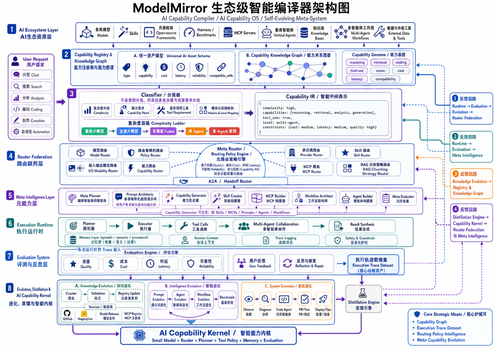

# 模镜 ModelMirror

> 从寻找一个模型，到编译一套智能。<br>
> From choosing a model to compiling intelligence.

ModelMirror 当前是一个可本地部署的 AI 资源发现、比较、调用与组合工作台，面向模型、Agent、MCP、Skill、Prompt、知识库、Data X 和工作流。主分支已经提供原生模型路由、多模态聊天、MCP Runtime、经典工作流、本地知识流水线、Data X 与 Agent Studio 等模块。

“AI 牛马招聘会”是帮助用户理解和试用 AI 资源的产品入口。项目下一阶段探索 **AI Capability Compiler（AI 能力编译器）**：把用户目标转换为结构化能力需求，再映射到可执行、可观察和可评测的模型、工具、知识与 Agent 组合。

最后更新日期：2026-08-09
维护人：模镜团队

## 一眼看懂项目阶段

| 视角 | ModelMirror 的定位 | 状态 |
| --- | --- | --- |
| 用户入口 | “AI 牛马招聘会”：发现、比较和试用 AI 资源 | **Available Today** |
| 当前能力基线 | 可本地部署的 AI 资源与协作工作台 | **Available（含 Experimental 子模块）** |
| 目标产品引擎 | AI Capability Compiler：把目标编译为能力需求与执行组合 | **Target Architecture** |
| 商业方向 | Agent 经济中的中立 AI 能力控制平面与智能分配层 | **Strategic Direction** |
| 长期愿景 | AI Capability OS / Self-Evolving Meta-System | **Research Direction** |

这些标签用于区分当前能力、目标设计和研究方向；`Available` 不代表生产 SLA、真实供应商验收或完整企业级能力。事实边界见[当前系统架构](docs/ARCHITECTURE.md)，目标分层见[AI Capability Compiler 架构](docs/architecture/ai-capability-compiler.md)。

## Why ModelMirror

AI 供给正在从少数通用模型，扩展为由模型、工具、知识库、Skill、MCP、垂类 Agent 和工作流组成的异构生态。新的困难逐渐从“有没有模型”转向：一个任务需要哪些能力，如何在质量、成本、时延、可靠性和数据边界之间选择与组合，以及如何验证结果。

模型网关、Agent 框架、MCP Registry、工作流平台和资源目录分别解决局部问题。ModelMirror 当前先把发现、试用、路由、组合与本地运行闭环放到一个工作台中；目标是进一步用统一能力描述、策略路由和执行反馈，把用户目标编译为可评测的能力组合。

## 当前能力

- 模型招聘会：模型筛选、价格展示、能力标签和聊天入口。
- 智能调度：`/chat/auto` 支持六种策略、稳定会话灰度、健康熔断、预算回执和上下文优化；默认仍可回退 OmniRoute 侧车。
- 面试间：OpenAI 兼容流式聊天、图片输入、高级参数、提示词助手、模型输出图片预览，以及自适应 STT、TTS 和视频工作区。
- 视频闭环：支持 MP4/MPEG/MOV/WebM 文件或 HTTPS/YouTube URL 分析，并通过独立异步任务完成文生视频、首帧图生视频、恢复、播放与下载。
- 图片生成模型：支持 `content` 多模态 parts、`delta.images` / `message.images`、`image_url` 和 `data:image/...` 输出；前端会转成图片卡片并接入 Lightbox 放大与下载。
- AI 人才市场：智能体角色浏览、面试入口、专家团能力。
- MCP 工具：原生 stdio MCP 客户端、多会话管理和工具注册表。
- Skill：Skill 安装、管理和聊天注入。
- 工作流：`/workflow` 使用经典自研 React Flow 画布；`/workflow-native` 保留实验线。
- RAG：`/rag` 使用本地 RAG 资料库，支持文档上传、切分、向量检索和聊天引用。
- Data X：`/datax` 支持 CSV/XLSX/Parquet 快照、语义模型、版本化指标、受限分析和指标提案审批。
- Agent Studio：创建智能体草稿、发布不可变版本，并通过 Goal、Handoff、文件、记忆与 Knowledge Pipeline 组合执行。
- Agent App/API：把已发布版本固定部署为未列出分享 App，并提供带密钥、配额和回滚的 OpenAI 兼容接口。
- newAPI：作为独立可选数据面运行；`/settings` 只显示显式配置的外部管理链接，不嵌入或代理其管理界面。

## 目标架构



> 该图描述目标架构和长期研究边界，不表示所有层级已经交付。当前主分支映射、状态证据和 Non-Goals 见[详细目标架构](docs/architecture/ai-capability-compiler.md)。

目标主链路是：生态资源进入统一 Registry 与 Capability Graph，用户目标由 Classifier 转换为 Capability IR，Meta Router 再协调各 Domain Router 生成执行计划；Runtime 负责安全执行，Evaluation 记录质量、成本、时延与可靠性信号，经过门禁的反馈再用于改进 Registry、策略和元能力。

长期希望沉淀四类可复用资产：

- **Capability Graph**：任务、能力、资源、约束、兼容关系与有效组合。
- **Execution Trace Dataset**：经过授权、脱敏和评测的执行轨迹，而不是日志堆积。
- **Routing Policy Intelligence**：不同质量、成本、时延和风险约束下的选择经验。
- **Meta Capability Evolution**：在测试、评测、审批和发布门禁下改进 Prompt、Skill、MCP、Agent 与 Workflow。

市场判断、品牌故事和生态飞轮见[产品愿景](docs/VISION.md)。

## 技术栈

- 前端：React + TypeScript + Tailwind CSS + Vite + React Router + ReactMarkdown + @xyflow/react。
- 后端：FastAPI + Pydantic + httpx + ChromaDB + DuckDB + MCP Python SDK。
- 本地部署：核心 Docker Compose 默认包含 `client`、`server`、`browser` 和
  `sandbox`；newAPI 使用独立可选栈，OmniRoute 与 Office host 使用可选 profile。

## 快速启动

复制环境变量示例并填写密钥：

```bash
copy server\.env.example server\.env
```

至少显式配置一种模型访问方式。直接网关示例：

```bash
LLM_GATEWAY_URL=https://your-gateway.example/v1/chat/completions
LLM_GATEWAY_KEY=your-gateway-key
```

也可以只配置 OpenRouter：

```bash
OPENROUTER_API_KEY=your-openrouter-key
```

若使用 newAPI，请按[部署文档](docs/DEPLOYMENT.md)单独启动其 Compose 栈，
并通过 Overlay 显式提供容器内 `LLM_GATEWAY_URL`；核心栈不管理 newAPI 生命周期。

启动 Docker Compose：

```bash
docker compose -p modelmirror up -d --build
```

常用入口：

```text
http://localhost:5173/models
http://localhost:5173/chat/recraft%2Frecraft-v3
http://localhost:5173/workflow
http://localhost:5173/agents/studio
http://localhost:5173/agents/goals
http://localhost:5173/rag
http://localhost:5173/datax
http://localhost:5173/settings
http://localhost:3000
```

## 本地开发

后端：

```bash
cd server
python -m pip install -r requirements.txt
python -m uvicorn main:app --reload --host 0.0.0.0 --port 8000
```

前端：

```bash
cd client
npm install
npm run dev -- --host 0.0.0.0 --port 5173
```

## 验证命令

```bash
cd client
npm.cmd run build
```

```bash
python -m py_compile server/main.py
python -m pytest server/tests/ -q
```

图片生成模型的手动冒烟：

```bash
curl -N -X POST http://localhost:8000/api/chat ^
  -H "Content-Type: application/json" ^
  -d "{\"model_id\":\"recraft/recraft-v3\",\"messages\":[{\"role\":\"user\",\"content\":\"画一只猫\"}]}"
```

预期：SSE 中出现 `image_url` 或 `data:image/...`，前端 `/chat/<modelId>` 中显示至少一张可点击图片。

真实结果取决于已配置网关和模型；本地 mock、测试通过或 UI 标签不能替代真实供应商验收。

## 文档

- [文档中心](docs/README.md)
- [产品愿景](docs/VISION.md)
- [当前系统架构](docs/ARCHITECTURE.md)
- [AI Capability Compiler 目标架构](docs/architecture/ai-capability-compiler.md)
- [术语表](docs/GLOSSARY.md)
- [原生 Model Router](docs/MODEL_ROUTER_NATIVE.md)
- [Harness Engineering](docs/HARNESS_ENGINEERING.md)
- [Agent 协作规范](AGENTS.md)

当前 `/workflow` 与 `/rag` 均为 ModelMirror 原生主路径；旧 Dify 方案已归档为
compatibility 参考，不是启动或部署前提。
