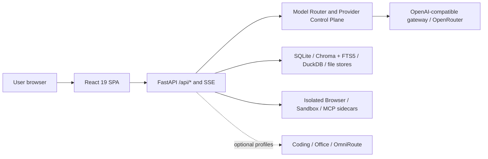

<div align="center">
  
  <h1>ModelMirror</h1>
  <p><strong>Explicit contracts, exact bindings, and auditable execution for heterogeneous AI workloads.</strong></p>
  <p>
    A local workspace built around operation-scoped provider contracts, exact workload bindings,<br />
    redacted routing receipts, and isolated runtimes—from discovery to controlled execution.
  </p>
  <p>
    <a href="https://github.com/PinkElf-Elysia/ModelMirror/actions/workflows/quality.yml"></a>
    <a href="https://github.com/PinkElf-Elysia/ModelMirror/actions/workflows/multimodal-readiness.yml"></a>
    <a href="https://github.com/PinkElf-Elysia/ModelMirror/actions/workflows/file-readiness.yml"></a>
  </p>
  <p>
    <a href="docs/MODEL_PROVIDER_CONTROL_PLANE.md"></a>
    <a href="docs/MODEL_PROVIDER_CONTROL_PLANE.md"></a>
    <a href="docs/ARCHITECTURE.md#model-provider-control-plane"></a>
    <a href="docs/MODEL_PROVIDER_CONTROL_PLANE.md"></a>
    <a href="docs/architecture/ai-capability-compiler.md"></a>
  </p>
  <p>
    <a href="README.md">简体中文</a> · <strong>English</strong>
  </p>
  <p>
    <a href="#quick-start">Quick Start</a> ·
    <a href="#capability-map">Capabilities</a> ·
    <a href="#current-architecture">Architecture</a> ·
    <a href="#documentation">Documentation</a>
  </p>
</div>

> [!IMPORTANT]
> This document was checked against the code, configuration, tests, and current documentation at `main@66b57c3` (August 25, 2026). “Available” means that the main branch contains a runnable entry point. It does not imply a production SLA, enterprise multi-tenancy, or real-provider end-to-end acceptance. Capabilities that require credentials, feature flags, optional Compose profiles, or human approval are marked separately.

## Quick Start

Docker Compose is the recommended path. You need Git, Docker Desktop or Docker Engine with Compose V2, and at least one model access option.

### 1. Prepare the configuration

From the repository root, copy the server environment template:

```powershell
Copy-Item server/.env.example server/.env
```

Choose one model access option in `server/.env`. The shortest path is a direct OpenRouter connection:

```dotenv
OPENROUTER_API_KEY=your-openrouter-key
```

You can also connect any OpenAI-compatible gateway:

```dotenv
LLM_GATEWAY_URL=https://your-gateway.example/v1/chat/completions
LLM_GATEWAY_KEY=your-gateway-key
```

newAPI runs as a separate Compose stack connected through an explicit network overlay; it is not part of the default core stack. See the [Quick Start guide](docs/QUICK_START.md) and [Deployment guide](docs/DEPLOYMENT.md) for setup details.

### 2. Start the services

```powershell
docker compose -p modelmirror up -d --build
docker compose -p modelmirror ps
```

The default Compose stack starts the web app, API, and isolated Browser, Sandbox, and MCP sidecars. OmniRoute, Coding, Office Host, and newAPI require a separate profile or stack.

### 3. Verify the deployment

```powershell
curl.exe http://localhost:8000/api/health
curl.exe http://localhost:5173/models
```

| Entry point | URL | Purpose |
| --- | --- | --- |
| Model marketplace | [localhost:5173/models](http://localhost:5173/models) | Browse, filter, and try models |
| Smart routing | [localhost:5173/chat/auto](http://localhost:5173/chat/auto) | Inspect routing policies and redacted receipts |
| Agent Studio | [localhost:5173/agents/studio](http://localhost:5173/agents/studio) | Create, publish, and run agents |
| Workflow | [localhost:5173/workflow](http://localhost:5173/workflow) | Compose and run classic workflows |
| Knowledge | [localhost:5173/rag](http://localhost:5173/rag) | Build, retrieve from, and evaluate local knowledge bases |
| Settings | [localhost:5173/settings](http://localhost:5173/settings) | Manage providers, routing, and runtime policies |

See the [current architecture guide](docs/ARCHITECTURE.md#稳定路由) for the complete route map.

## Why ModelMirror

AI supply has expanded from a few general-purpose models into a heterogeneous ecosystem of models, tools, knowledge bases, skills, MCP servers, vertical agents, and workflows. The harder question is no longer whether a model exists, but which capabilities a task needs, how to balance quality, cost, latency, reliability, and data boundaries, and how to verify the result.

ModelMirror brings that path into one local workspace:

1. **Discover** candidates through Chinese-first catalogs, capability tags, pricing, and availability signals.
2. **Try** real inputs and outputs in chat and multimodal workspaces.
3. **Compose** models, tools, knowledge, and agents into workflows or team tasks.
4. **Govern** execution with provider policies, approvals, receipts, evaluations, and runtime diagnostics.

The “AI Talent Fair” is the user-facing product entry point and experience metaphor. The **AI Capability Compiler** is the target product engine, not a claim about current completeness.

## Capability Map

| Capability area | Current main-branch baseline | Maturity |
| --- | --- | --- |
| Model catalog and multimodal chat | Model filters, pricing and capability tags, OpenAI-compatible SSE, and adaptive text, image, STT, TTS, audio, or video workspaces | **Available / provider-dependent** |
| Routing and provider governance | Native `/chat/auto` routing plus connections, catalogs, per-operation offerings, readiness, qualifications, policies, and redacted receipt controls | **Available / staged gates** |
| Agents and expert teams | AI talent marketplace, Agent Studio, Agent Workbench, goals, handoffs, automations, Agent App/API, and Expert Team | **Available / some execution requires configuration** |
| Classic Workflow | React Flow canvas, local runner, SSE, deployment, approvals, batches, and controlled iteration; high-risk HTTP and subworkflow features are off by default | **Stable primary path** |
| Knowledge and RAG | Document ingestion, processing pipelines, Chroma + FTS5 dual indexes, retrieval, citations, evaluation, and approval-based writes | **Stable primary path** |
| Data X and managed tables | CSV/XLSX/Parquet snapshots, DuckDB, semantic models, versioned metrics, restricted analysis, proposal approval, and locally managed tables | **Available** |
| MCP, toolsets, and browser | Native stdio MCP, multi-session support, isolated sidecars, controlled Remote OAuth authorization and revocation, tool registration and invocation; toolsets support MCP, OpenAPI/OData, and built-in providers | **Available / remote capabilities controlled** |
| Skills, prompts, and plugins | Skill/SkillSet catalog, installation, versions, chat injection, local import, Skill Creator, Prompt Profiles, and declarative plugin resources | **Available / supply-chain gates** |
| Runtime and observability | Runs, checkpoints, tasks, handoffs, goals, environment summaries, and provider/workflow/agent receipts | **Available / primarily local single-instance** |
| Coding, workflow-native, and Matrix Oasis | Coding collaboration substrate, isolated workflow experiments, and the 3D spatial experiment entry point | **Experimental / off by default or isolated** |

> [!NOTE]
> A route does not prove that its provider is configured. Passing tests also do not replace end-to-end acceptance for paid models, media playback or download, external tools, or real data. Each module document defines its feature flags and deployment boundary.

## Current Architecture



| Layer | Main technologies | Current responsibility |
| --- | --- | --- |
| Web | React 19, TypeScript, Vite, Tailwind CSS, React Router, React Flow | Resource catalogs, chat, and product workspaces |
| API and runtime | FastAPI, Pydantic, httpx, SSE, MCP Python SDK | API assembly, execution, validation, routing, and external adapters |
| Data | SQLite, Chroma, FTS5, DuckDB, file-backed stores | Routing evidence, knowledge indexes, data analysis, and local runtime state |
| Isolation | Docker Compose, Unix sockets, read-only containers, restricted networks | Browser, Sandbox, MCP, and optional Coding execution planes |

`/workflow` and `/rag` are native ModelMirror primary paths. Dify remains only as a legacy compatibility proxy and old components; it is not a default startup or deployment dependency. newAPI is an independent optional data plane connected through an explicit URL/key contract; ModelMirror does not embed or proxy its management UI.

## Project Stages and Target Architecture

| Stage | Definition | Representative scope |
| --- | --- | --- |
| **Available Today** | Merged into the main branch with a runnable entry point | Resource catalogs, chat, Classic Workflow, RAG, Data X, Agent Studio, MCP/Skill |
| **Controlled / Optional** | Merged code that still depends on a flag, profile, provider, qualification, or approval | Managed Providers, remote MCP, video, Coding write-back, selected agent/workflow execution |
| **Experimental** | Isolated experiments or capabilities without completed production gates | Coding Worker certification tracks, workflow-native, Matrix Oasis, and related work |
| **Target / Research** | A direction for system evolution, not a current feature commitment | Capability Graph, Capability IR, Router Federation, full evaluation, and self-evolution loops |


> The diagram describes the target architecture and long-term research boundary. It does not mean that every layer has shipped. See the [AI Capability Compiler target architecture](docs/architecture/ai-capability-compiler.md) for implementation mapping, maturity, and non-goals.

The target path is: ecosystem resources enter a unified registry and Capability Graph; user intent is transformed into Capability IR; a Meta Router coordinates domain routers to produce an execution plan; the runtime executes it under guardrails; and evaluation records quality, cost, latency, and reliability signals. Only gated feedback may update registries, policies, and meta-capabilities.

## Local Development and Validation

Local development uses Node.js 22 and Python 3.11+. Docker service images use Python 3.12. See the [onboarding guide](docs/ONBOARDING.md) for the complete setup.

Backend:

```powershell
cd server
python -m pip install -r requirements.txt
python -m uvicorn main:app --reload --host 0.0.0.0 --port 8000
```

Frontend:

```powershell
cd client
npm.cmd ci
npm.cmd run dev -- --host 0.0.0.0 --port 5173
```

Primary pre-submit gates:

```powershell
cd client
npm.cmd run typecheck
npm.cmd run test:run
npm.cmd run build
```

```powershell
python -m py_compile server/main.py
python -m pytest server/tests/ -q
docker compose -p modelmirror config --quiet
```

Record the frontend build, backend tests, Compose validation, and real-provider smoke tests separately. None of these gates substitutes for another.

## Documentation

| Question | Start here |
| --- | --- |
| Five-minute setup and page acceptance | [Quick Start](docs/QUICK_START.md) |
| Facts that the current repository can prove | [Repository facts](docs/REPOSITORY_FACTS.md) |
| Routes, data flows, storage, and external dependencies | [Current architecture](docs/ARCHITECTURE.md) |
| Compose, optional profiles, backup, and rollback | [Deployment guide](docs/DEPLOYMENT.md) |
| Module documentation and recommended reading paths | [Documentation center](docs/README.md) |
| Product narrative and long-term direction | [Product vision](docs/VISION.md) |
| Eight-layer AI Capability Compiler design | [Target architecture](docs/architecture/ai-capability-compiler.md) |
| Engineering guardrails and acceptance requirements | [Harness Engineering](docs/HARNESS_ENGINEERING.md) |
| AI agent collaboration rules | [AGENTS.md](AGENTS.md) |
| Third-party provenance and attribution | [Third-party notices](THIRD_PARTY_NOTICES.md) |

## Contributing, Support, and Security

- **Contributing**: Read [AGENTS.md](AGENTS.md) and [Harness Engineering](docs/HARNESS_ENGINEERING.md) first. Keep changes small, verifiable, and reversible, and run checks proportional to the affected scope.
- **Issues and ideas**: Use [GitHub Issues](https://github.com/PinkElf-Elysia/ModelMirror/issues) for reproducible bugs and feature proposals.
- **Security**: Do not open a public issue. Follow the [security policy](SECURITY.md) and use GitHub Private Vulnerability Reporting.

Maintained by the ModelMirror team · README baseline reviewed on August 25, 2026
