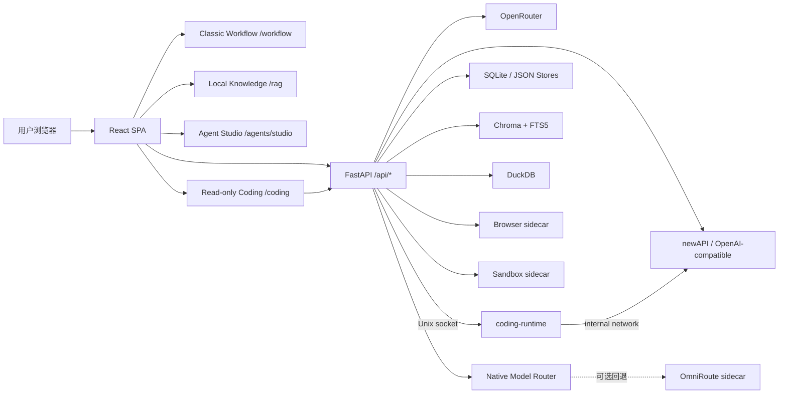
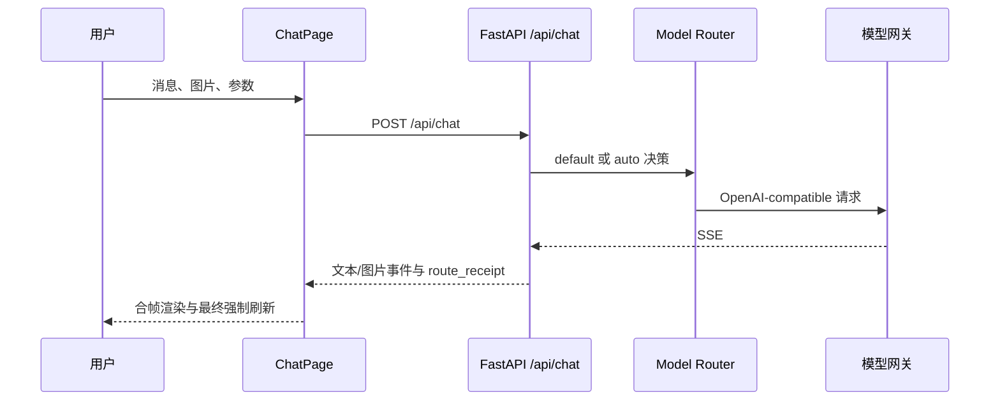
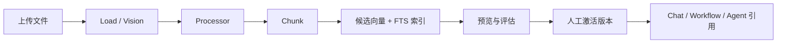

# 项目整体架构

最后更新日期：2026-07-29
维护人：模镜团队

## 当前定位

模镜 ModelMirror 是 AI 资源发现与协作平台。当前主路径均由 ModelMirror
前后端直接提供：

- `/models` 与 `/chat/:modelId`：模型目录、普通聊天和多模态工作区。
- `/chat/auto`：原生智能调度，可按配置进入侧车、观察或原生灰度。
- `/workflow`：classic React Flow 工作流画布与本地运行器。
- `/rag`：本地知识库、知识流水线、检索评估和引用。
- `/agents/studio`：Agent Studio，提供草稿、发布版本和运行闭环。
- `/datax`、`/toolsets`、`/runtime`：数据、工具和运行诊断。
- `/coding`：实验性只读代码问答；通过隔离 Worker 查看固定工作区。

Dify 不再承载 `/workflow` 或 `/rag` 主路径。仓库仍保留
`server/api/dify_proxy.py` 和旧 iframe 组件作为历史兼容代码，但默认前端路由
与 Docker Compose 均不依赖 Dify。历史方案见
[INTEGRATION_DIFY.md](./INTEGRATION_DIFY.md)。

## 技术组成

| 组成 | 当前职责 |
| --- | --- |
| React 19 + TypeScript + Vite | SPA、资源市场、工作区与任务界面。 |
| Tailwind CSS + React Flow | 主题样式与 classic 工作流画布。 |
| FastAPI + Pydantic + httpx | API 装配、校验、SSE 与外部服务适配。 |
| newAPI / OpenAI-compatible | 默认模型服务连接与渠道管理。 |
| OpenRouter | 默认网关不可用时的兼容回退，以及首期多模态能力来源。 |
| 原生 Model Router | 目录、策略、熔断、预算、回执和上下文优化。 |
| SQLite | 原生路由、连接、决策和视频任务元数据。 |
| Chroma + SQLite FTS5 | RAG 向量与全文检索。 |
| DuckDB | Data X 项目隔离分析。 |
| Browser / Sandbox sidecar | 受控浏览器和无网络沙箱执行。 |
| OmniRoute sidecar | 可选兼容、诊断和紧急回退；不是普通用户控制面。 |
| OpenCode + 最小 ACP Worker | 实验性只读代码问答执行面；单实例、默认关闭。 |

## 系统架构

## 稳定路由

路由事实以 `client/src/App.tsx` 为准。

| 分组 | 路由 | 当前用途 |
| --- | --- | --- |
| 资源 | `/models`、`/agents`、`/mcps`、`/skills`、`/prompts`、`/plugins` | 浏览和管理 AI 资源。 |
| 工作空间 | `/studio`、`/runtime`、`/settings` | 聚合入口、运行诊断与模型服务设置。 |
| 聊天 | `/chat/:modelId` | 文本、图片、STT、TTS、视频分析或视频生成自适应工作区。 |
| Agent | `/agents/studio`、`/agents/xpert/:xpertId/chat`、`/agents/goals`、`/agents/automations` | Agent Studio、运行、Goal 与自动化。 |
| 工作流 | `/workflow`、`/workflow/classic` | classic 主入口及兼容入口。 |
| 实验工作流 | `/workflow-native` | 静态校验和设计实验线，不替换 classic 主入口。 |
| 知识 | `/rag`、`/rag/:kbId/pipeline`、`/rag/:kbId/evaluation`、`/rag/:kbId/inbox` | 本地资料库、流水线、评测和审批。 |
| 数据 | `/datax`、`/datax/:projectId`、`/datax/:projectId/inbox` | 文件快照、语义指标和提案审批。 |
| 实验代码问答 | `/coding` | 对固定 ModelMirror 工作区进行只读、流式、可取消的代码问答。 |

内部路径仍使用 `Xpert*` 类型和 `/agents/xpert/...` 兼容 API；面向用户统一显示
“智能体”“Agent Studio”和“Agent App”。内部标识不得仅为改名而迁移。

## 核心数据流

### 普通与智能调度聊天

### 本地知识流水线

### 视频生成

视频生成不复用聊天 SSE。前端提交任务后，后端保存不含 Prompt 或媒体正文的
租户级任务元数据，按上游状态刷新，最终通过鉴权内容代理播放或下载。

## 存储与隔离边界

- 首期运行边界是本地单租户，但新路由和任务记录携带
  `tenant_id="local"`。
- 模型凭据只在服务端保存，并以本地密钥加密；列表、日志和回执只返回脱敏信息。
- RAG 上传、索引、Agent/Runtime Store、Data X 和模型路由目录均通过 Compose
  bind mount 持久化。
- Browser 与 Sandbox 是独立进程边界；Sandbox 默认无网络。
- Coding Runtime 是默认关闭的独立进程边界，只通过 Unix socket 接入 FastAPI；
  构建时排除环境文件、密钥和运行产物后，将源码快照复制进镜像；运行时根文件系统只读，
  网络仅可到内部 newAPI。
- 视频、音频、Prompt 和首帧媒体正文不写入路由或视频任务审计。

## 当前风险与维护边界

- `server/main.py` 仍承担较多应用装配；新增领域逻辑应放入独立包。
- 多数 Agent/Runtime 元数据仍是单进程文件型 Store，不宣称多节点高可用。
- 当前没有完整用户、组织、RBAC 或公网控制台安全模型。
- 静态模型快照与实时目录需要定期校准，价格快照必须标注日期。
- OmniRoute 是可选回退，不得成为普通用户必须理解的配置入口。
- `/coding` 首轮仅适用于本地单实例实验，不提供仓库选择、写入、重启恢复、
  多 Agent、分布式 Worker 或生产多租户能力。
- Dify 代理属于 legacy compatibility；除非形成新的产品决策，不恢复为主路由。
