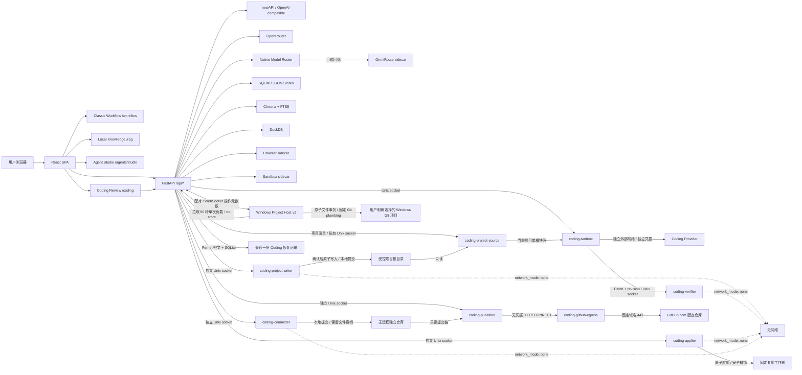
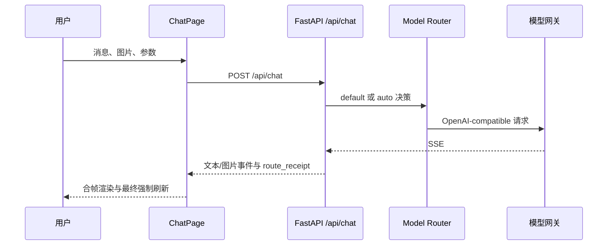
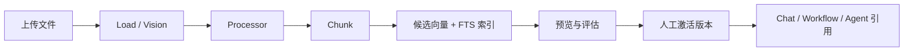
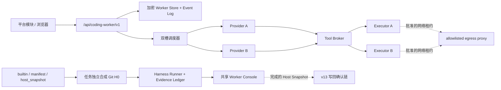
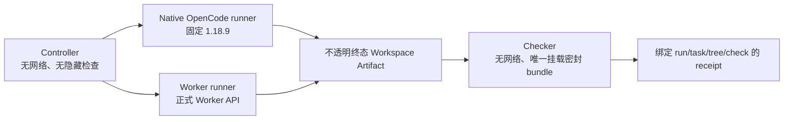

# ModelMirror 当前系统架构

> **文档范围：Current State。** 本文只描述当前主分支中能够由代码、配置和测试定位的已合并实现。AI Capability Compiler、Router Federation、统一 Capability Graph / Evaluation 与自演进闭环属于[目标架构](./architecture/ai-capability-compiler.md)，不能由本文件中的局部 Router、Runtime 或 Evaluation 入口外推为已经完成的平台能力。

最后更新日期：2026-08-21
维护人：模镜团队

## 当前定位

模镜 ModelMirror 是 AI 资源发现与协作平台。当前主路径均由 ModelMirror
前后端直接提供：

- `/models` 与 `/chat/:modelId`：模型目录、普通聊天和多模态工作区。
- `/chat/auto`：原生智能调度，可按配置进入侧车、观察或原生灰度。
- `/workflow`：classic React Flow 工作流画布与本地运行器。
- `/rag`：本地知识库、知识流水线、检索评估和引用。
- `/agents/studio`：Agent Studio，提供草稿、发布版本和运行闭环。
- `/datax`、`/toolsets`、`/runtime`：数据、工具和运行诊断。
- `/coding`：实验性代码协作；默认只读，也可准备、验证、受控应用、保存隔离本地
  提交、恢复最近一份安全草稿，并把固定任务发布为 GitHub Draft PR。

Dify 不再承载 `/workflow` 或 `/rag` 主路径。仓库仍保留
`server/api/dify_proxy.py` 和旧 iframe 组件作为历史兼容与可选集成代码，但默认前端路由
与 Docker Compose 均不依赖 Dify；除非形成新的产品决策，它不会恢复为主路由。历史方案见
[INTEGRATION_DIFY.md](./INTEGRATION_DIFY.md)。

## 技术组成

| 组成 | 当前职责 |
| --- | --- |
| React 19 + TypeScript + Vite | SPA、资源市场、工作区与任务界面。 |
| Tailwind CSS + React Flow | 主题样式与 classic 工作流画布。 |
| FastAPI + Pydantic + httpx | API 装配、校验、SSE 与外部服务适配。 |
| Model Provider Control Plane | 单租户 Provider 连接、加密凭据、策略、诊断和受控出口。 |
| newAPI / OpenAI-compatible | 独立可选数据面；只通过 URL/Key 契约接入，不嵌入其管理 UI。 |
| OpenRouter | 默认网关不可用时的兼容回退，以及首期多模态能力来源。 |
| 原生 Model Router | 目录、策略、熔断、预算、回执和上下文优化。 |
| SQLite | 原生路由、连接、决策、视频任务元数据及单槽加密 Coding 恢复索引。 |
| Chroma + SQLite FTS5 | RAG 向量与全文检索。 |
| DuckDB | Data X 项目隔离分析。 |
| Browser / Sandbox sidecar | 受控浏览器和无网络沙箱执行。 |
| OmniRoute sidecar | 可选兼容、诊断和紧急回退；不是普通用户控制面。 |
| Coding Worker V14 | 供应商中立的持久任务控制面；双槽、默认关闭，OpenCode 1.18.9 为首个内部 Provider，ACP 为回退。 |
| Coding Project Source | 无网络的受控项目清单与单槽 Git HEAD 快照服务；只有它可读取清单 `CODING_PROJECTS_ROOT`。 |
| Coding Project Writer | 对清单中逐项目授权的无远程本地克隆执行原子写入、撤销、本地提交与对账。 |
| Windows Project Host v2 | 在用户电脑上保存项目路径并执行受控原子写入、当前分支本地提交和精确对账；Server 只看到不透明项目 ID。 |
| Coding Verifier | 用户手动触发的草稿项目验证执行面；无网络、固定命令、可选启动。 |
| Coding Applier | 把满足门禁的草稿原子写入固定专用工作树；无网络、无 Git 操作、可选启动。 |
| Coding Committer | 把已应用文件保存到独立本地仓库；无网络、固定分支、只写隔离 `.git`。 |
| Coding Recovery Store | 可选的单任务加密恢复存储；默认保留 7 天，不保存对话或工具过程。 |
| Coding Publisher | 只读复核本地线性提交，经固定 GitHub App 创建 Draft PR；可选启动。 |
| Coding GitHub Egress | 无凭据出口代理，只放行 `github.com:443` 与 `api.github.com:443`。 |

## 系统架构

## 稳定路由

路由事实以 `client/src/App.tsx` 为准。

| 分组 | 路由 | 当前用途 |
| --- | --- | --- |
| 资源 | `/models`、`/agents`、`/mcps`、`/skills`、`/prompts`、`/plugins` | 浏览和管理 AI 资源；`/skills` 支持多来源 Skill/SkillSet、搜索、安装能力筛选与分批渲染。 |
| 工作空间 | `/studio`、`/runtime`、`/settings` | 聚合入口、运行诊断与模型服务设置。 |
| 聊天 | `/chat/:modelId` | 文本、图片、STT、TTS、视频分析或视频生成自适应工作区。 |
| Agent | `/agents/studio`、`/agents/xpert/:xpertId/chat`、`/agents/goals`、`/agents/automations` | Agent Studio、运行、Goal 与自动化。 |
| 工作流 | `/workflow`、`/workflow/classic` | classic 主入口及兼容入口。 |
| 实验工作流 | `/workflow-native` | 静态校验和设计实验线，不替换 classic 主入口。 |
| 知识 | `/rag`、`/rag/:kbId/pipeline`、`/rag/:kbId/evaluation`、`/rag/:kbId/inbox` | 本地资料库、流水线、评测和审批。 |
| 数据 | `/datax`、`/datax/:projectId`、`/datax/:projectId/inbox` | 文件快照、语义指标和提案审批。 |
| 实验代码协作 | `/coding` | 对内置 ModelMirror 或受控本地项目问答、准备草稿并恢复最近一份修改；逐项目授权的本地克隆还可确认写入并保存本地版本。 |

内部路径仍使用 `Xpert*` 类型和 `/agents/xpert/...` 兼容 API；面向用户统一显示
“智能体”“Agent Studio”和“Agent App”。内部标识不得仅为改名而迁移。

## 核心数据流

### 普通与智能调度聊天

### Model Provider Control Plane

Provider Control Plane 是单租户 `local` 的管理与证据层，不是新的统一数据面。
SQLite v14 保存租户隔离的 Provider Inventory、逐 operation Offering 与脱敏刷新证据；
Provider 凭据仍使用既有加密存储。显式目录刷新只发送 `/models` GET，并与连接健康、
Inventory 和 Offering 在同一事务提交。

`GET /api/models/control-plane-catalog` 将 managed Inventory、static/default、OmniRoute、
Chat certification、显式 newAPI Canary 和多模态专用目录的已有证据聚合为只读 Readiness。
该查询不刷新上游、不发起 Chat，也不改变 default、Native 或 Canary 调度。现有普通目录、
多模态目录和各专用调用 API 保持兼容；统一 Catalog 不代表调用协议、默认 Provider 或
计费控制面已经统一。

公共 `/models` 与 Prompt 模型选择器仍使用原有静态快照和适配口径，不消费运行时
`invocable`，也不展示仅由 Provider 发现的模型；运行时 Readiness 只在设置控制面审计。
普通 `/api/chat` 在 R4 仍使用既有环境配置路径，受管 Provider 的数据面迁移属于 Round 5。

Round 5A 在控制面增加 `modelmirror-provider-chat-routing-v1`：`chat_text`、
`chat_tools` 与 `chat_file_output` 各自具有独立认证、稳定模型资格和有序 Managed
Provider 路由。SQLite v15 保存租户隔离的策略、资格、Gate 纪元以及不含用户正文的
父运行/尝试 Receipt。

Round 5B 将 `gateway=default` 的白名单普通文本和已提取文本附件接入该契约。仅当
`MODEL_CONTROL_CHAT_ENABLED=true` 且租户策略为 `newapi_preferred` 时接管；开关关闭、
策略为 `legacy` 或模型不在稳定白名单时原样使用旧路径。首选 newAPI 只允许在资格、
目录、凭据或 DNS/SSRF 预检失败且尚未派发 POST 时选择显式 Managed 备用。一旦 POST
标记派发，HTTP 错误、超时、断流和不确定结果都不得调用第二 IP、Provider、模型或
legacy 网关。Auto、工具、受控文件输出、多模态、Canary、SSE 成功字节和默认部署值
保持不变；该阶段尚未开放 `newapi_required_default`，其门禁与人工批准由 R5E 提供。

Round 5C 在不改变 Auto 选路的前提下，把 `gateway=auto` 的普通文本接入同一父运行/尝试
证据管道。该入口由租户策略中的独立 `auto_enabled` 门禁控制，默认关闭；关闭时 Auto
继续原样运行且不写 v15 Receipt。Native Router 的每个实际 Provider 目标分别记录一次
attempt，并保留其既有 POST 后失败转向下一目标语义；OmniRoute 在 ModelMirror 边界只
记录一次 sidecar attempt，内部 Provider 重试明确标记为 `provider_attempts_not_observed`，
不扩展 sidecar 协议。Auto 运行固定 `primary_newapi=false`，不得计入 R5E required 门禁。
工具、文件输出和多模态仍不进入该证据接入范围。

Round 5D 将 `gateway=default` 的 MCP 工具模式和 `output_mode=allowlisted` 分别接入
`chat_tools` 与 `chat_file_output` 路由。两者必须具备当前连接指纹、精确模型和对应能力
认证；普通文本资格不能替代。控制面只选择并固定 Managed Provider：MCP 工具仍由
ModelMirror Runtime 执行，文件规格仍由 allowlisted renderer 校验和落盘，Provider 不会
获得工具凭据或本地文件权限。多步模型调用在首次派发前固定同一连接和批准 IP，后续步骤
重新校验策略但不得切换 Provider、模型、IP 或 legacy 路径；Receipt 只保存聚合指标和
稳定原因码，不保存消息、工具结果或生成内容。专用多模态与 Canary 行为不变。

Round 5E 在 v15 表上启用普通文本资格纪元与只读证据聚合，不新增迁移。只有真实用户、
`gateway=default`、当前策略指纹、`chat_text`、首选 newAPI 且已派发的稳定模型运行计入
500 次、14 天、99% 和逐模型 10 次成功门槛。Auto、Canary、认证、工具、文件、备用与
客户端取消均被排除。自动门槛只产生“可人工激活”状态，`newapi_required_default` 只能
由带 revision、故障演练、P0/P1 声明和 newAPI 有界验收结论的管理员操作原子激活。

required 运行时重新核对批准、资格纪元、策略与连接指纹，只尝试首选 newAPI；任何阶段
不得进入备用或 legacy。硬失败会在同一证据面关闭纪元、撤销批准并令当前资格失效，策略
仍保持 required 并失败关闭。恢复必须先由管理员显式退回 preferred、重新认证并建立新
纪元。数据库只保存聚合运行证据、稳定原因码和外部验收关联哈希，不保存用户内容、模型
输出、newAPI 余额或完整 Token 日志。

Round 6A 在不接管 Agent/Workflow 数据面的前提下增加
`modelmirror-provider-workload-routing-v1` 与 SQLite v16。每个未来入口按
`entry_id + execution_shape + exact model_id` 精确绑定一个 Managed Connection；
`chat_text`/`chat_tools` 复用 R5 资格，非流式文本、JSON Object 和原生 Fusion 使用各自
独立资格。父运行与逻辑调用 Receipt 不保存 Prompt、消息、模型正文或工具参数，且重启后
不重放 `uncertain` 调用。所有 R6 部署开关默认关闭；R6B 只将 `agent_shadow` 加入数据面
接入集合，其余 Policy/Binding 可配置和审计但不能激活；Workflow、Xpert 与 R5 Chat 调度均
保持 legacy/原行为。接入入口只允许 Python 主进程解析凭据和调用 Provider，Worker 与工具
执行器继续只处理模型消息、Tool Call 和脱敏结果。

`/settings?section=overview|providers|routing` 共用一份 Provider 管理会话。Marble 等其他
集成位于该门禁之外；newAPI 管理 UI 继续只通过安全外链访问，不嵌入或代理。

### 本地知识流水线

### 视频生成

视频生成不复用聊天 SSE。前端提交任务后，后端保存不含 Prompt 或媒体正文的
租户级任务元数据，按上游状态刷新，最终通过鉴权内容代理播放或下载。

## 存储与隔离边界

- 首期运行边界是本地单租户，但新路由和任务记录携带
  `tenant_id="local"`。
- 模型凭据只在服务端保存，并以本地密钥加密；列表、日志和回执只返回脱敏信息。
- RAG 上传、索引、Agent/Runtime Store、Data X 和模型路由目录均通过 Compose
  bind mount 持久化。
- Browser 与 Sandbox 是独立进程边界；Sandbox 默认无网络。
- Coding Runtime 是默认关闭的独立进程边界，只通过 Unix socket 接入 FastAPI；
  构建时排除私有环境文件、密钥和运行产物，仅保留仓库追踪的安全占位模板，再将
  净化源码快照复制到镜像内只读目录。
  Readonly 模式在会话副本上只读运行；Draft 模式把副本复制到 256 MiB 的
  `nosuid,noexec` tmpfs。宿主仓库从不挂载给 Worker；模型出口只经独立的外部
  `coding_provider` 网络到显式配置的 Coding Provider，不复用控制面 Provider 网络。
- Coding Project Source 只在显式加载项目 overlay 后存在。它是唯一只读挂载
  `CODING_PROJECTS_ROOT` 的服务；Server 和 Runtime 既看不到整个项目根目录，也不接收
  物理路径。服务按固定清单校验干净独立 Git 克隆，通过 `git ls-tree` 与
  `git cat-file --batch` 从 HEAD blob 构造单槽快照，不读取工作区换行转换，也不运行
  Hook、过滤器、凭据助手或联网操作。租约释放或失败时清空快照卷。
- 自定义项目有两条互不串扰的来源。清单 `local_clone` 由 Project Source 提供快照，
  version 3 清单可逐项目显式开放容器 Writer；可写项目仍必须无 remote、固定在
  `coding/local-draft`，只支持单轮本地版本且不发布。`host_git` 由 Windows Project
  Host v2 选择，允许仓库已有 remote 并保留选择时的安全当前分支，但不读取 remote URL、
  不执行远程命令或联网；它支持受控线性多轮本地提交，发布始终为 `false`。v1 助手及
  `CODING_PROJECT_HOST_WRITEBACK_ENABLED=false` 只保留问答、草稿、Diff、验证和下载。
  停止任一 Project Source、Writer 或 Project Host 不得降低其他项目来源和内置
  ModelMirror 的既有能力。
- Coding Verifier 是独立的可选进程边界。Worker 只向它发送当前 revision 的内部
  Patch、变化路径和快照指纹；Verifier 重新校验并应用到 1 GiB 临时副本。其根文件
  系统和基准快照只读，网络为 `none`，不接收模型密钥、宿主路径、Docker socket
  或用户命令。Verifier 故障不得影响 Draft、Diff 或 Patch 下载。
- Coding Applier 只在显式加载独立 Compose overlay 后存在。Server 通过与
  Runtime/Verifier 隔离的 Unix socket 发送内部 Patch、revision 和快照指纹；
  浏览器与 Agent 都不能提交路径、命令、分支或 Git 参数。Applier 无网络、无
  模型密钥、无 Docker socket，只把部署时固定的专用工作树挂载为 `/target`，
  并把 `/target/.git` 单独覆盖为只读。
- 应用前，Applier 再次复核 Patch，并要求目标除 `.git` 外与内置净化快照完全
  一致；先在 tmpfs 预演，再以原文件哈希保护执行原子写入。任一步失败会恢复
  已写文件。撤销只有在目标仍精确保持应用后状态时才执行，避免覆盖人工修改。
- Coding Committer 只在显式加载第二个独立 overlay 后存在。目标必须是无远程、
  独立 `.git` 且固定在 `coding/local-draft` 的本地克隆；普通 Git worktree 仍可
  受控应用，但不能提交。容器把 `/target` 挂为只读，仅把 `/target/.git` 单独挂为
  可写，并与 Runtime、Verifier、Applier 使用不同 socket。
- 提交只消费 Server 已保存的 ApplyReceipt 路径和哈希。引擎使用临时索引、固定
  Git plumbing 与 compare-and-swap 引用更新，不运行 Hook、过滤器、签名器、
  凭据助手或远程操作。撤销提交只移动本次引用并保留文件；目标、索引或分支发生
  外部变化时失败关闭。
- Coding Recovery Store 只在显式加载恢复 overlay 时启用。它在固定数据目录中
  最多保存一条记录，SQLite 明文字段仅含 revision、指纹、文件数和时间；规范化
  Patch、验证摘要及 Apply/Commit Receipt 使用本地 Fernet 密钥认证加密。密钥
  缺失、损坏、schema 不兼容或密文被篡改时失败关闭，不生成新密钥覆盖旧记录。
- 自定义项目的 ID、类型、显示名和基准 HEAD 保存在同一 SQLite 的独立认证加密上下文
  表中，不保存宿主路径，也不改变 recovery schema v3 的 `user_version`。旧记录没有
  项目上下文时仍解释为内置 ModelMirror。`local_clone` 被删除或出现未受管的脏树/HEAD
  变化时只允许下载原始 Diff；`host_git` 的合法 applied 脏树与 committed HEAD 前进则由
  已认证 operation 日志和后述 `H0/Hk` 谱系精确对账，不能把 Patch 应用到不同版本。
- Coding Project Writer 只在显式加载写回 overlay 后存在。它是唯一可写挂载受控项目
  根目录的执行面，使用 Project Source 已验证的不透明项目 ID 定位目标；Server、Runtime
  与浏览器都不接收物理路径。Writer 无网络、端口、Docker socket 或模型/Git 凭据，
  先在 tmpfs 预演 Patch，再按原文件哈希原子写入。提交使用临时索引、固定 Git plumbing
  与 compare-and-swap 引用更新，不运行 Hook、过滤器、签名或凭据助手。
- Windows Project Host 是宿主路径的唯一持有者。项目 ID 到路径的映射、host token、
  设备密钥和操作日志使用 Windows DPAPI 保护；Server、Runtime、Verifier、浏览器和模型
  永不接收物理路径。v2 写入请求帧只发送 request、project、operation、action 以及 payload
  ID、摘要、大小和到期时间；revision、分支、HEAD、Patch 和提交说明位于 host token 鉴权、
  绑定 host/project/operation/action、短时单次消费的 HTTP envelope，或其他已绑定的
  inventory/snapshot/回执消息中。回执缺失、畸形或断线只表示结果未知，必须按原
  operation ID reconcile。
- Helper 本地授权把 canonical path、项目根目录和 `.git` 目录的文件身份共同绑定到
  project ID；identity 不公开也不上送 Server。同一路径整体替换仓库或替换 `.git` 会产生
  新 ID，旧授权只作为 `project_reselection_required` 墓碑并拒绝写入。inspect、快照归档和
  五类写操作会持有选择路径祖先、root、`.git`、关键 metadata leaf 与已发现 namespace
  目录的 no-follow guard；这证明已绑定对象未被换绑，但不宣称锁住恶意同用户进程动态创建
  的每一个新 object child。
- 宿主 apply/revert 使用 Windows 句柄和文件身份绑定的可恢复事务；宿主 commit/undo 使用
  私有对象目录、临时索引、受控 reflog 停放和 CAS 更新已保存的当前分支。实现拒绝
  reparse/symlink/hardlink、配置 include、worktree/commondir、alternates、partial clone、
  promisor、replace refs、grafts、过滤器、外部 excludes、Hook、签名和凭据助手；只支持
  files refs 后端，`extensions.refStorage`/reftable 失败关闭。允许 remote 配置存在但不读取
  其值、不执行 remote/fetch/push/ls-remote。生产默认构造在非 Windows 失败关闭；领域
  测试可显式关闭平台门禁运行参考后端，但不构成 POSIX 产品支持。
- 自定义项目写回支持新增、修改、删除及移动 UTF-8 普通文本；移动在内部表示为旧路径
  删除与新路径新增。目录、符号链接、二进制、敏感路径、越界路径、覆盖已有目标和超限
  Patch 继续失败关闭。应用、撤销、提交或撤销提交中断后，只在文件哈希、HEAD、索引和
  对应 Writer 或 Helper DPAPI 日志精确一致时恢复，否则进入只读冲突态。
- 恢复会从镜像内不可变基准重新复核并应用 Patch，再创建全新 Agent 会话；问题、
  回答、计划、工具过程和原始命令输出从不持久化。基准或验证环境指纹变化会使
  结果过期；应用/提交状态无法精确对账时进入只读冲突态，不重复写入或覆盖人工内容。
- `host_git` 多轮恢复将 Project Source/恢复上下文中的初始提交 `H0` 保持不变，并从已完成
  CommitReceipt 线性推导当前轮父提交 `Hk`。恢复以首轮 apply 日志授权读取 `H0` 快照，
  再分别对账当前轮操作和宿主 `Hk`；分支、父提交、路径、revision、指纹或操作链任一不符
  都进入只读冲突。应用后合法脏树、提交后 HEAD 前进以及 Helper/Server 重启不会重新套用
  初始“必须干净”资格。
- Coding Publisher 只在显式加载发布 overlay 后存在。它只读挂载同一无远程独立仓库，
  复核固定分支、HEAD、线性提交链、恢复回执和 GitHub 基础分支；目标分支只允许不存在
  或精确指向任务 HEAD，禁止 force push、Hook、凭据助手和 URL 重写。
- GitHub App 私钥只读挂载给 Publisher，单仓库安装令牌最长一小时且只驻留内存。
  Publisher 不能直接出公网，只能使用无凭据 allowlist 代理；Runtime、Verifier、
  Applier、Committer 和 Server 均不接收私钥或安装令牌。
- 发布意图和 Draft/Ready 回执进入恢复 schema v3 的认证密文。push 或 PR 回执丢失时
  按系统分支和 open PR 对账，禁止重复上传或创建；外部修改、关闭或基线漂移进入冲突态。
- 视频、音频、Prompt 和首帧媒体正文不写入路由或视频任务审计。

## 当前风险与维护边界

- `server/main.py` 仍承担较多应用装配；新增领域逻辑应放入独立包。
- 多数 Agent/Runtime 元数据仍是单进程文件型 Store，不宣称多节点高可用。
- 当前没有完整用户、组织、RBAC 或公网控制台安全模型。
- 静态模型快照与实时目录需要定期校准，价格快照必须标注日期。
- OmniRoute 是可选回退，不得成为普通用户必须理解的配置入口。
- `/coding` 仅适用于本地单实例实验。部署者可登记最多 50 个清单项目，也可通过
  Windows 助手逐个选择干净独立 Git 项目；同一时刻仍只有一个项目租约和一个 Agent
  会话。清单 `local_clone` 的边界与既有 Writer 保持不变；`host_git` 仅在 v2 助手、
  独立开关和项目资格同时满足时开放当前分支写入与线性多轮本地提交。两者都不支持发布。
  Draft 可新增、修改、删除或移动临时 UTF-8 文本；模型处理本身不会写回宿主目录。
  只有清单 v3 逐项目授权的 `local_clone` 或通过 v2 助手资格复核的 `host_git`，才可在
  当前 revision 的原位确认后写入对应项目。语法/项目验证失败、未运行或环境未就绪属于
  可再次确认的质量风险；路径、秘密、文件类型、项目身份、分支、HEAD 和对象身份属于
  不可绕过的安全门禁。
  当前主工作树不挂载给 Applier 或 Committer。内置 ModelMirror 的隔离 Committer 与
  清单 `local_clone` 只在无远程独立克隆中创建本地提交；`host_git` 可保留 remote 配置，
  但不读取其 URL 或执行远程操作。显式启用发布 overlay 后，只有内置 ModelMirror 的
  线性提交链可以一次性
  推送到部署时固定的 GitHub.com 仓库并创建 Draft PR；用户再次确认才标记为 Ready，
  产品不提供合并、关闭 PR 或删除远程分支。
- 应用成功后会话冻结；Diff、Patch 和验证结果仍可读。启用恢复 overlay 后，精确
  对账成功的应用、提交及其撤销能力可在重启后恢复；外部状态不明确时只允许查看和
  下载。有效本地提交存在时必须先撤销提交并保留文件，才可撤销应用。Agent 仍
  不能使用 Shell、Git、测试命令或选择测试范围；`local_clone` 仍不能多轮，所有
  自定义项目都不能发布，只有 v2 `host_git` 可在保存的当前分支进行受控线性多轮。
  系统仍不允许浏览器或 Agent 传入任意绝对路径、仓库或分支，也不提供 force push、
  远端合并、目录操作、多 Agent、分布式
  Worker 或生产多租户。
- Dify 代理属于 legacy compatibility；除非形成新的产品决策，不恢复为主路由。

## Current-State 与 Target-State 的边界

当前主分支已经提供资源目录、原生 Model Router、Classic Workflow、本地 RAG、MCP Runtime、Agent Studio 与轻量 Runtime 观测。Workflow Agent 的 Agent Strategy V2 还提供 `auto`、`function_calling` 和 `react` 三种策略，并可通过 `WORKFLOW_AGENT_STRATEGY_V2_ENABLED` 回退到旧执行路径。这些是当前执行底座和渐进式策略能力，不等同于完整的 Capability Graph、Router Federation、统一 Evaluation Engine 或自演进能力内核。

目标分层、非目标、反馈回路和成熟度要求见 [AI Capability Compiler 目标架构](./architecture/ai-capability-compiler.md)。后续文档不得把目标架构中的层级名称直接当作已交付事实；新增成熟度结论仍需回到主分支代码、配置、测试和真实运行验收。

## V14 通用 Coding Worker

V14 将新的平台级代码任务放入 `server/coding_worker/`，不再把任务控制、工具执行和验收继续堆进 `coding_runtime/api.py`。现有 Coding Runtime 与 Agent Workspace 的活动会话保持 legacy；新会话仅在 `CODING_WORKER_V14_ENABLED=true` 且 Worker 健康时渐进转发。

核心边界：

- `TaskSpec.origin` 由 Server 写入；浏览器和模块不能传物理路径、环境变量、remote URL、凭据、供应商名或原始执行端点。
- 每个任务使用独立 Workspace、事件、审批、进程、Artifact 与 checkpoint；两个固定槽可并行，第三个任务持久排队。
- Provider 与 Executor 分离。Provider 只连接受控模型网络；Executor 只连接内部 `coding_worker_tools` 网络，无法直接访问 Server/newAPI。网络租约只能经独立 egress proxy 生效。
- OpenCode 1.18.9 的端口、认证和原始帧属于 Provider 私有实现；公共契约只包含 capability、open、message、event stream、cancel、checkpoint、restore、close。
- 必需检查由后端冻结并绑定 Workspace tree hash。模型停止调用工具只进入验收阶段；全部必需 Evidence 通过后才能 `completed`，树变化会使旧证据失效。
- 重启不会恢复旧进程或重放未知副作用。只恢复与当前 tree hash 匹配的确定 checkpoint；其余任务进入 `interrupted`，等待显式 resume。
- `host_snapshot` 在任务真正出队时才向 Windows Helper 请求一次性快照并导入 Project Source；Server 始终不获得宿主物理路径。完成后仅能显式交给现有 v13 写回链，Worker 本身不写用户仓库。

`/coding` 和 `/agents/workbench` 使用同一个 Worker Console。前者保留 v13 apply/commit/undo/publish 领域动作；后者只显示通用任务、文件、Diff、审批、Evidence、Artifact 与终端语义。下游 Skill/MCP 创建、AI 应用、3D 引擎和用户开发模块只注册来源、上下文和验收适配器，不向 Worker 内核加入领域逻辑。

## V15 专业执行与双引擎边界

V15 保持 `/api/coding-worker/v1`、`TaskSpec` 和 V14 Workspace/Store 不变，在 Tool Broker 与
Provider 私有层补充专业执行能力：

- 文件修改使用带 preimage hash 的统一 changeset；多文件 Patch、移动或删除任一项冲突时整批
  失败。Shell `mutate` 只在退出码为零且真实 Workspace tree CAS 未变化时发布，`inspect` 的
  任何文件变化均丢弃。完整输出进入 Artifact，公共事件只保存有界、可补发的顺序片段。
- Shell 批准只绑定一个 operation ID、脚本摘要、相对 cwd、模式、超时和网络范围，不存在
  “本任务全部批准”。后台服务、冻结检查和 Shell 共享任务进程归属，但不共享批准租约。
- Pyright 与 TypeScript Language Server 固定在 Executor 镜像内。symbols、definition、
  references、hover 与 diagnostics 均绑定 task、entry ID 和 tree hash；树变化后旧诊断失效，
  重启只重建 LSP，不恢复旧进程。
- Provider 私有契约 v2 统一 Fake、OpenCode 与 Claude 的 capability、工具 allowlist、usage、
  checkpoint compatibility 和错误分类。任务创建时固定内部 Provider；不可用时进入
  `interrupted`，不跨引擎迁移 checkpoint，也不自动换供应商。
- Claude Code 固定为 `2.1.89`，运行在独立、无 Workspace 挂载的 Provider sidecar。内建
  Bash、文件、Web、Skill、插件、hooks、marketplace 与更新检查关闭；仅能调用
  ModelMirror MCP Broker。凭据只以只读 secret 文件进入 Claude sidecar，并仅在启动子进程
  时注入；Executor、Store、日志、Artifact 和公共 API 不接收它。
- 平台内部 route catalog 把 `coding/default`、`coding/quality` 等通用路由固定到执行槽和
  Provider。浏览器、模块与公共 SSE 仍看不到供应商名、端口、原始帧、session ID 或凭据状态。

共享 Console 只查询公共 capability、公开计划、operation output、changeset 与 diagnostics，
并展示精确 Shell 批准字段；它不获得 Provider 控制权。模块 SDK 对每次读取、steering、暂停、
恢复和取消都复核服务端 `origin(module, business_object)`，跨模块任务 ID 在副作用前拒绝。
模块仍不能注册 Provider、工具进程、密钥或任意 MCP Server；领域适配继续位于调用模块。

## V16 会话与受控子任务边界

V16 继续使用同一 `/api/coding-worker/v1` 与 `TaskSpec`，新增的是可回退的公开会话台账和平台所有的一级子任务，不开放任意 Agent、Provider 或提示词注入：

- 父任务最多创建四个 `explore`、`implement` 或 `review` 子任务，深度固定为一。全局仍只有两个真实执行槽；父任务委派后在确定 checkpoint 停车并释放槽位，第三个可执行任务继续持久排队。
- 每个子任务从父任务当前精确 tree 构造独立合成 Git Fork。`explore/review` 必须保持只读；`implement` 只产生绑定 H0、结果 tree 和 changed paths 的候选 changeset。
- 子任务不继承审批、网络租约、operation ID、预算、Artifact、Evidence、Provider session 或隐藏上下文。父任务只接收公开摘要和 Diff 元数据；子任务 Evidence 永远不能满足父 AcceptanceContract。
- 合并逐文件验证 preimage，并对父 Workspace 做 tree CAS；同文件冲突只写 `changeset_conflicted`，不覆盖父 tree，子 Fork 保留。合并后必须在父 Workspace 重跑全部必需检查。
- 公开会话能力包含 plan/todo、一次性问题回答、完整工具边界 compaction、turn history、undo/redo/fork 与脱敏 export。旧任务没有 turn checkpoint 时保持可读，但不伪造这些控制能力。

这些确定性安全与恢复能力不等于 OpenCode 能力等效。只有固定 24 项任务、两侧各三次、连续两轮真实模型门禁和无 P0/P1 人工验收全部通过后，才允许使用任务卡中唯一的范围限定表述。

## V17 Turn Transaction 与可执行认证边界

V17 为新任务写入 `runtime_protocol=v17`。审批、用户输入、子任务、压缩与未知工具结果不再由通用 Provider 事件推导，而是统一进入持久 Turn Transaction：`open → parking → parked → resuming → completed/interrupted`。屏障出现后，Server 先停止当前 Provider turn、确认无活动请求、写入绑定当前 tree 的 checkpoint，再释放执行槽。只有 durable `parked` 才能结算审批或回答；恢复继续使用原 turn、operation 与 checkpoint，不能换 ID 重放副作用。旧 V16 任务保持原恢复路径，不迁移私有 checkpoint。

任务能力由 `enabled / supported / available / reason` 四元组表达，并绑定任务固定路由、sidecar generation 与短期健康观测。Console 使用任务级 capability、平台 Plan/Todo/Question/Turn/Evidence；Provider 原生 plan、question 或 compaction 帧只作为非权威公开提示，不能改变业务状态。`turn_parking`、`turn_parked`、`turn_resumed` 和 `operation_reconciled` 是状态事件，不是失败。

认证执行面使用独立 profile，并保持四个角色分离：

Controller 只能读取公开 manifest、fixture 与三个 Unix socket，不挂载 checker bundle、模型密钥或 Docker socket。Native runner 与 Worker runner 使用不同全新 Workspace/session；checker 是唯一读取隐藏检查正文的进程。公开报告只保存 digest、分类与脱敏 Artifact 清单。确定性 Fake smoke、Compose 展开、CLI 版本探针和本仓库自动测试只能证明协议与隔离结构，不能证明成功率等效。

## V18 真实任务与来源准入边界

V18 将评测任务迁移到独立 Harbor 0.21.0 Task 1.4 包。生产 Server 不导入 Harbor；外置 `ModelMirrorWorkerAgent` 只经正式 Worker API 驱动任务并把公开 ledger 映射为 ATIF。H0、Oracle solution 与 verifier 在文件和运行角色上分离，最终 Workspace Artifact 由独立无网络 verifier 检查。公开仓库只保存 verifier 启动包装和策略检查；隐藏检查正文位于仓库外只读密封目录，CLI 校验逐任务及整体哈希后仅注入临时 Harbor task 副本。Provider、Executor 和产品 API 不挂载公开 verifier 或密封正文。

新任务进入 Store 前必须通过 `WorkspaceSourceAdapter.admit()`。幂等查找先于来源检查，因此已创建任务在来源暂时离线时仍能被原调用方取得；全新 builtin、manifest 或 host snapshot 来源则必须证明注册、精确 revision、当前可用与适配器支持。加密 admission receipt 与任务、`source_admitted` 事件原子写入，Scheduler acquire 仍做 exact revision 复核，receipt 不能替代使用时检查。

Harness v3 报告只接受 Harbor 结果、ATIF/Worker ledger、终态 Workspace 与绑定摘要派生的事实。协调失败、重复副作用、未结算 operation 和孤立交互都携带 evidence ID；缺失或无法重建即失败关闭。V18 的 12×2×2 只用于校准，不进入认证，也不支持任何等效宣传。

校准 Controller 通过仅本机回环可达的私有端点，在整轮前后核验在线 Server 与两个 Provider 的代码包、Controller generation、固定 OpenCode 引擎、通用 route 和模型身份哈希。证明内容不包含原始模型 ID、Provider 凭据或端点；任一在线组件与候选 checkout 不一致时，已有 run 不得汇总为报告。

原生 OpenCode 评测采用默认拒绝的权限图，只开放 H0 内文件工具及 manifest/scenario 冻结的精确命令；inspect 命令可复测，mutate 命令才参与副作用唯一性计算。Harbor 内置非交互 OpenCode runner 目前不能对等编排 question、steering 与故障恢复，因此包含 Session scenario 的完整矩阵在入口处失败关闭。这个 runner 缺口属于 Harness 阻断，不能归因于模型，也不能通过删除交互任务掩盖。

## V19 Coding Substrate 与 Strangler 边界

V19 将 Coding Worker 冻结为模镜的代码与执行能力底座。模块与 Console 只面向 `TaskControlPlane` 和 `InteractionProjection`；模型循环只面向 `HarnessDriver`；Tool Broker 只面向 `ExecutionBackend`；评测 profile 只面向可空的 `EvaluationAdapter`。`runtime.py` 是唯一生产组装根，具体 Store、Workspace、Provider sidecar 和 Executor 只允许出现在 composition root 或 legacy adapter。

`HarnessDriver` 将普通 turn message 与进行中 turn steer 分成独立方法。现有 Provider v4 没有原生 steer 原语，legacy adapter 因此失败关闭并由持久 Control Plane 在完整工具边界结算 steering；未来 ACP/Codex adapter 不能用新 message 冒充进行中 steer。`ExecutionBackend` 缺少 Shell、服务或 LSP 能力时统一返回中立的 unavailable 错误，不泄漏具体对象的 `AttributeError`。

公开 `/api/coding-worker/v1`、`/api/coding`、`/api/agent-workspace`、`TaskSpec`、runtime protocol、数据库与历史 Provider v4 checkpoint 保持不变。SSE 只补发持久投影事件，不读取供应商帧。生产 profile 关闭时，API 和 Provider 启动链不得静态导入 Parity、Harness V3 或 Evaluation 模块。

宿主写回继续由 v13 独占。Worker Control Plane 只生成不可变 `WritebackCandidate`，其中包含 opaque source、revision、tree hash、patch hash 与 rename-disabled patch bytes；v13 再执行 Diff 规范化、Helper exact-head、apply、commit、undo 和 recovery。后续 ACP/Codex 只可作为 Harness Driver adapter 接入，不得绕过 Tool Broker 或把绝对路径、模型、沙箱和凭据字段扩散到公共任务契约。

## V20 Harness Protocol Kernel

V20 将 Harness 的进程监督与会话生命周期拆为两个独立端口。`HarnessSupervisor` 独占 sidecar 健康、槽位 generation、协议和实现版本、Schema digest、route availability 与安全 attestation；`HarnessDriver` 只承接 session/turn 的 open、message、steer、interrupt、checkpoint、restore 与 close。两者由 `runtime.py` 分别注入 `CodingSubstrateHandle`，不得通过 session Driver 反向探测 Supervisor 状态。

私有 `HarnessSessionRef`、`HarnessTurnRef` 与 `HarnessRequestRef` 将 task、route、slot、binding hash、driver generation 和协议描述符绑定到每次交互。规范化 `HarnessEventEnvelope` 使用每 generation 单调 sequence 和去重 ID；错误 generation、跨任务引用、迟到事件、重复请求结算或错误 turn 均失败关闭。供应商原始帧不能直接改变任务状态，只能映射为类型化 Harness request，再由 Control Plane 与 Tool Broker 权威结算。

生产准入同时要求 capability 的 supported/available/maturity、健康窗口、Schema digest、persistence level 与 `HarnessToolOwnership=broker_only` 一致。OpenCode/Claude 的历史 Provider-v4 checkpoint 保持兼容；ACP/Codex adapter 与其 Schema 只允许由 `EvaluationAdapter` 在显式 profile 中延迟加载。公共 API、数据库、runtime protocol、Evidence 与 v13 写回协议不因 V20 改变。

ACP v1.19 与 Codex App Server 0.149.0 的标准 Driver 位于独立 evaluation 镜像。镜像只包含协议核、加载器、sidecar 与对应单一 adapter，不包含 Store、Service、Workspace、生产 Provider 或另一个供应商 adapter。profile 关闭时生产启动链不导入这些模块。ACP 仅接受部署固定的单一 loopback Broker MCP；Codex 因无法证明稳定 `broker_only`，永久以 `unknown` 工具所有权和 `production_route=false` 暴露。两者均不能从任务、模块或浏览器接收 executable、cwd、环境变量、任意 MCP 或供应商选择。

Evaluation sidecar 的 health 只有在 manifest 中的镜像、命令、包版本/完整性、协议版本、Schema 摘要、持久性等级和工具所有权全部与固定 Driver 契约一致时才可成功。两套镜像非 root、只读、无 Docker socket、Workspace、宿主目录或凭据挂载；Codex 镜像额外移除 Code Mode Host、内置 rg、bwrap 与 zsh 资源。本边界只证明受控协议回放与准入，不构成真实任务能力、校准或等效证据。
