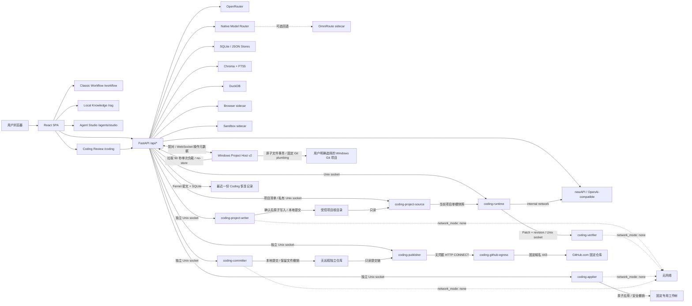
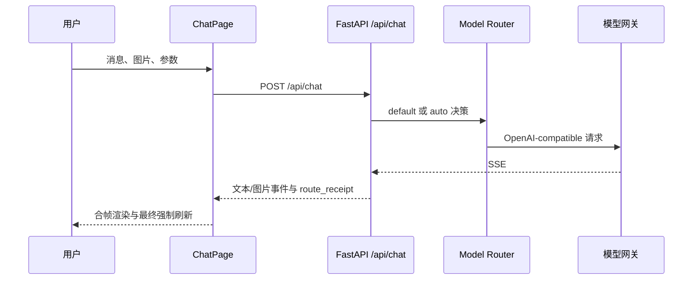
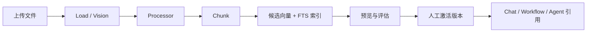

# 项目整体架构

最后更新日期：2026-08-01
维护人：模镜团队

## 当前定位

模镜 ModelMirror 是 AI 资源发现与协作平台。当前主路径均由 ModelMirror
前后端直接提供：

- `/models` 与 `/chat/:modelId`：模型目录、普通聊天和多模态工作区。
- `/chat/auto`：原生智能调度，可按配置进入侧车、观察或原生灰度。
- `/workflow`：classic React Flow 工作流画布与本地运行器。
- `/rag`：本地知识库、知识流水线、检索评估和引用。
- `/agents/studio`：Agent Studio，提供草稿、发布版本和运行闭环。
- `/datax`、`/toolsets`、`/runtime`：数据、工具和运行诊断。
- `/coding`：实验性代码协作；默认只读，也可准备、验证、受控应用、保存隔离本地
  提交、恢复最近一份安全草稿，并把固定任务发布为 GitHub Draft PR。

Dify 不再承载 `/workflow` 或 `/rag` 主路径。仓库仍保留
`server/api/dify_proxy.py` 和旧 iframe 组件作为历史兼容代码，但默认前端路由
与 Docker Compose 均不依赖 Dify。历史方案见
[INTEGRATION_DIFY.md](./INTEGRATION_DIFY.md)。

## 技术组成

| 组成 | 当前职责 |
| --- | --- |
| React 19 + TypeScript + Vite | SPA、资源市场、工作区与任务界面。 |
| Tailwind CSS + React Flow | 主题样式与 classic 工作流画布。 |
| FastAPI + Pydantic + httpx | API 装配、校验、SSE 与外部服务适配。 |
| newAPI / OpenAI-compatible | 默认模型服务连接与渠道管理。 |
| OpenRouter | 默认网关不可用时的兼容回退，以及首期多模态能力来源。 |
| 原生 Model Router | 目录、策略、熔断、预算、回执和上下文优化。 |
| SQLite | 原生路由、连接、决策、视频任务元数据及单槽加密 Coding 恢复索引。 |
| Chroma + SQLite FTS5 | RAG 向量与全文检索。 |
| DuckDB | Data X 项目隔离分析。 |
| Browser / Sandbox sidecar | 受控浏览器和无网络沙箱执行。 |
| OmniRoute sidecar | 可选兼容、诊断和紧急回退；不是普通用户控制面。 |
| OpenCode + 最小 ACP Worker | 实验性代码问答与修改草稿执行面；单实例、默认关闭。 |
| Coding Project Source | 无网络的受控项目清单与单槽 Git HEAD 快照服务；只有它可读取清单 `CODING_PROJECTS_ROOT`。 |
| Coding Project Writer | 对清单中逐项目授权的无远程本地克隆执行原子写入、撤销、本地提交与对账。 |
| Windows Project Host v2 | 在用户电脑上保存项目路径并执行受控原子写入、当前分支本地提交和精确对账；Server 只看到不透明项目 ID。 |
| Coding Verifier | 用户手动触发的草稿项目验证执行面；无网络、固定命令、可选启动。 |
| Coding Applier | 把满足门禁的草稿原子写入固定专用工作树；无网络、无 Git 操作、可选启动。 |
| Coding Committer | 把已应用文件保存到独立本地仓库；无网络、固定分支、只写隔离 `.git`。 |
| Coding Recovery Store | 可选的单任务加密恢复存储；默认保留 7 天，不保存对话或工具过程。 |
| Coding Publisher | 只读复核本地线性提交，经固定 GitHub App 创建 Draft PR；可选启动。 |
| Coding GitHub Egress | 无凭据出口代理，只放行 `github.com:443` 与 `api.github.com:443`。 |

## 系统架构

## 稳定路由

路由事实以 `client/src/App.tsx` 为准。

| 分组 | 路由 | 当前用途 |
| --- | --- | --- |
| 资源 | `/models`、`/agents`、`/mcps`、`/skills`、`/prompts`、`/plugins` | 浏览和管理 AI 资源；`/skills` 支持多来源 Skill/SkillSet、搜索、安装能力筛选与分批渲染。 |
| 工作空间 | `/studio`、`/runtime`、`/settings` | 聚合入口、运行诊断与模型服务设置。 |
| 聊天 | `/chat/:modelId` | 文本、图片、STT、TTS、视频分析或视频生成自适应工作区。 |
| Agent | `/agents/studio`、`/agents/xpert/:xpertId/chat`、`/agents/goals`、`/agents/automations` | Agent Studio、运行、Goal 与自动化。 |
| 工作流 | `/workflow`、`/workflow/classic` | classic 主入口及兼容入口。 |
| 实验工作流 | `/workflow-native` | 静态校验和设计实验线，不替换 classic 主入口。 |
| 知识 | `/rag`、`/rag/:kbId/pipeline`、`/rag/:kbId/evaluation`、`/rag/:kbId/inbox` | 本地资料库、流水线、评测和审批。 |
| 数据 | `/datax`、`/datax/:projectId`、`/datax/:projectId/inbox` | 文件快照、语义指标和提案审批。 |
| 实验代码协作 | `/coding` | 对内置 ModelMirror 或受控本地项目问答、准备草稿并恢复最近一份修改；逐项目授权的本地克隆还可确认写入并保存本地版本。 |

内部路径仍使用 `Xpert*` 类型和 `/agents/xpert/...` 兼容 API；面向用户统一显示
“智能体”“Agent Studio”和“Agent App”。内部标识不得仅为改名而迁移。

## 核心数据流

### 普通与智能调度聊天

### 本地知识流水线

### 视频生成

视频生成不复用聊天 SSE。前端提交任务后，后端保存不含 Prompt 或媒体正文的
租户级任务元数据，按上游状态刷新，最终通过鉴权内容代理播放或下载。

## 存储与隔离边界

- 首期运行边界是本地单租户，但新路由和任务记录携带
  `tenant_id="local"`。
- 模型凭据只在服务端保存，并以本地密钥加密；列表、日志和回执只返回脱敏信息。
- RAG 上传、索引、Agent/Runtime Store、Data X 和模型路由目录均通过 Compose
  bind mount 持久化。
- Browser 与 Sandbox 是独立进程边界；Sandbox 默认无网络。
- Coding Runtime 是默认关闭的独立进程边界，只通过 Unix socket 接入 FastAPI；
  构建时排除私有环境文件、密钥和运行产物，仅保留仓库追踪的安全占位模板，再将
  净化源码快照复制到镜像内只读目录。
  Readonly 模式在会话副本上只读运行；Draft 模式把副本复制到 256 MiB 的
  `nosuid,noexec` tmpfs。宿主仓库从不挂载给 Worker，网络仅可到内部 newAPI。
- Coding Project Source 只在显式加载项目 overlay 后存在。它是唯一只读挂载
  `CODING_PROJECTS_ROOT` 的服务；Server 和 Runtime 既看不到整个项目根目录，也不接收
  物理路径。服务按固定清单校验干净独立 Git 克隆，通过 `git ls-tree` 与
  `git cat-file --batch` 从 HEAD blob 构造单槽快照，不读取工作区换行转换，也不运行
  Hook、过滤器、凭据助手或联网操作。租约释放或失败时清空快照卷。
- 自定义项目有两条互不串扰的来源。清单 `local_clone` 由 Project Source 提供快照，
  version 3 清单可逐项目显式开放容器 Writer；可写项目仍必须无 remote、固定在
  `coding/local-draft`，只支持单轮本地版本且不发布。`host_git` 由 Windows Project
  Host v2 选择，允许仓库已有 remote 并保留选择时的安全当前分支，但不读取 remote URL、
  不执行远程命令或联网；它支持受控线性多轮本地提交，发布始终为 `false`。v1 助手及
  `CODING_PROJECT_HOST_WRITEBACK_ENABLED=false` 只保留问答、草稿、Diff、验证和下载。
  停止任一 Project Source、Writer 或 Project Host 不得降低其他项目来源和内置
  ModelMirror 的既有能力。
- Coding Verifier 是独立的可选进程边界。Worker 只向它发送当前 revision 的内部
  Patch、变化路径和快照指纹；Verifier 重新校验并应用到 1 GiB 临时副本。其根文件
  系统和基准快照只读，网络为 `none`，不接收模型密钥、宿主路径、Docker socket
  或用户命令。Verifier 故障不得影响 Draft、Diff 或 Patch 下载。
- Coding Applier 只在显式加载独立 Compose overlay 后存在。Server 通过与
  Runtime/Verifier 隔离的 Unix socket 发送内部 Patch、revision 和快照指纹；
  浏览器与 Agent 都不能提交路径、命令、分支或 Git 参数。Applier 无网络、无
  模型密钥、无 Docker socket，只把部署时固定的专用工作树挂载为 `/target`，
  并把 `/target/.git` 单独覆盖为只读。
- 应用前，Applier 再次复核 Patch，并要求目标除 `.git` 外与内置净化快照完全
  一致；先在 tmpfs 预演，再以原文件哈希保护执行原子写入。任一步失败会恢复
  已写文件。撤销只有在目标仍精确保持应用后状态时才执行，避免覆盖人工修改。
- Coding Committer 只在显式加载第二个独立 overlay 后存在。目标必须是无远程、
  独立 `.git` 且固定在 `coding/local-draft` 的本地克隆；普通 Git worktree 仍可
  受控应用，但不能提交。容器把 `/target` 挂为只读，仅把 `/target/.git` 单独挂为
  可写，并与 Runtime、Verifier、Applier 使用不同 socket。
- 提交只消费 Server 已保存的 ApplyReceipt 路径和哈希。引擎使用临时索引、固定
  Git plumbing 与 compare-and-swap 引用更新，不运行 Hook、过滤器、签名器、
  凭据助手或远程操作。撤销提交只移动本次引用并保留文件；目标、索引或分支发生
  外部变化时失败关闭。
- Coding Recovery Store 只在显式加载恢复 overlay 时启用。它在固定数据目录中
  最多保存一条记录，SQLite 明文字段仅含 revision、指纹、文件数和时间；规范化
  Patch、验证摘要及 Apply/Commit Receipt 使用本地 Fernet 密钥认证加密。密钥
  缺失、损坏、schema 不兼容或密文被篡改时失败关闭，不生成新密钥覆盖旧记录。
- 自定义项目的 ID、类型、显示名和基准 HEAD 保存在同一 SQLite 的独立认证加密上下文
  表中，不保存宿主路径，也不改变 recovery schema v3 的 `user_version`。旧记录没有
  项目上下文时仍解释为内置 ModelMirror。`local_clone` 被删除或出现未受管的脏树/HEAD
  变化时只允许下载原始 Diff；`host_git` 的合法 applied 脏树与 committed HEAD 前进则由
  已认证 operation 日志和后述 `H0/Hk` 谱系精确对账，不能把 Patch 应用到不同版本。
- Coding Project Writer 只在显式加载写回 overlay 后存在。它是唯一可写挂载受控项目
  根目录的执行面，使用 Project Source 已验证的不透明项目 ID 定位目标；Server、Runtime
  与浏览器都不接收物理路径。Writer 无网络、端口、Docker socket 或模型/Git 凭据，
  先在 tmpfs 预演 Patch，再按原文件哈希原子写入。提交使用临时索引、固定 Git plumbing
  与 compare-and-swap 引用更新，不运行 Hook、过滤器、签名或凭据助手。
- Windows Project Host 是宿主路径的唯一持有者。项目 ID 到路径的映射、host token、
  设备密钥和操作日志使用 Windows DPAPI 保护；Server、Runtime、Verifier、浏览器和模型
  永不接收物理路径。v2 写入请求帧只发送 request、project、operation、action 以及 payload
  ID、摘要、大小和到期时间；revision、分支、HEAD、Patch 和提交说明位于 host token 鉴权、
  绑定 host/project/operation/action、短时单次消费的 HTTP envelope，或其他已绑定的
  inventory/snapshot/回执消息中。回执缺失、畸形或断线只表示结果未知，必须按原
  operation ID reconcile。
- Helper 本地授权把 canonical path、项目根目录和 `.git` 目录的文件身份共同绑定到
  project ID；identity 不公开也不上送 Server。同一路径整体替换仓库或替换 `.git` 会产生
  新 ID，旧授权只作为 `project_reselection_required` 墓碑并拒绝写入。inspect、快照归档和
  五类写操作会持有选择路径祖先、root、`.git`、关键 metadata leaf 与已发现 namespace
  目录的 no-follow guard；这证明已绑定对象未被换绑，但不宣称锁住恶意同用户进程动态创建
  的每一个新 object child。
- 宿主 apply/revert 使用 Windows 句柄和文件身份绑定的可恢复事务；宿主 commit/undo 使用
  私有对象目录、临时索引、受控 reflog 停放和 CAS 更新已保存的当前分支。实现拒绝
  reparse/symlink/hardlink、配置 include、worktree/commondir、alternates、partial clone、
  promisor、replace refs、grafts、过滤器、外部 excludes、Hook、签名和凭据助手；只支持
  files refs 后端，`extensions.refStorage`/reftable 失败关闭。允许 remote 配置存在但不读取
  其值、不执行 remote/fetch/push/ls-remote。生产默认构造在非 Windows 失败关闭；领域
  测试可显式关闭平台门禁运行参考后端，但不构成 POSIX 产品支持。
- 自定义项目写回支持新增、修改、删除及移动 UTF-8 普通文本；移动在内部表示为旧路径
  删除与新路径新增。目录、符号链接、二进制、敏感路径、越界路径、覆盖已有目标和超限
  Patch 继续失败关闭。应用、撤销、提交或撤销提交中断后，只在文件哈希、HEAD、索引和
  对应 Writer 或 Helper DPAPI 日志精确一致时恢复，否则进入只读冲突态。
- 恢复会从镜像内不可变基准重新复核并应用 Patch，再创建全新 Agent 会话；问题、
  回答、计划、工具过程和原始命令输出从不持久化。基准或验证环境指纹变化会使
  结果过期；应用/提交状态无法精确对账时进入只读冲突态，不重复写入或覆盖人工内容。
- `host_git` 多轮恢复将 Project Source/恢复上下文中的初始提交 `H0` 保持不变，并从已完成
  CommitReceipt 线性推导当前轮父提交 `Hk`。恢复以首轮 apply 日志授权读取 `H0` 快照，
  再分别对账当前轮操作和宿主 `Hk`；分支、父提交、路径、revision、指纹或操作链任一不符
  都进入只读冲突。应用后合法脏树、提交后 HEAD 前进以及 Helper/Server 重启不会重新套用
  初始“必须干净”资格。
- Coding Publisher 只在显式加载发布 overlay 后存在。它只读挂载同一无远程独立仓库，
  复核固定分支、HEAD、线性提交链、恢复回执和 GitHub 基础分支；目标分支只允许不存在
  或精确指向任务 HEAD，禁止 force push、Hook、凭据助手和 URL 重写。
- GitHub App 私钥只读挂载给 Publisher，单仓库安装令牌最长一小时且只驻留内存。
  Publisher 不能直接出公网，只能使用无凭据 allowlist 代理；Runtime、Verifier、
  Applier、Committer 和 Server 均不接收私钥或安装令牌。
- 发布意图和 Draft/Ready 回执进入恢复 schema v3 的认证密文。push 或 PR 回执丢失时
  按系统分支和 open PR 对账，禁止重复上传或创建；外部修改、关闭或基线漂移进入冲突态。
- 视频、音频、Prompt 和首帧媒体正文不写入路由或视频任务审计。

## 当前风险与维护边界

- `server/main.py` 仍承担较多应用装配；新增领域逻辑应放入独立包。
- 多数 Agent/Runtime 元数据仍是单进程文件型 Store，不宣称多节点高可用。
- 当前没有完整用户、组织、RBAC 或公网控制台安全模型。
- 静态模型快照与实时目录需要定期校准，价格快照必须标注日期。
- OmniRoute 是可选回退，不得成为普通用户必须理解的配置入口。
- `/coding` 仅适用于本地单实例实验。部署者可登记最多 50 个清单项目，也可通过
  Windows 助手逐个选择干净独立 Git 项目；同一时刻仍只有一个项目租约和一个 Agent
  会话。清单 `local_clone` 的边界与既有 Writer 保持不变；`host_git` 仅在 v2 助手、
  独立开关和项目资格同时满足时开放当前分支写入与线性多轮本地提交。两者都不支持发布。
  Draft 可新增、修改、删除或移动临时 UTF-8 文本；模型处理本身不会写回宿主目录。
  只有清单 v3 逐项目授权的 `local_clone` 或通过 v2 助手资格复核的 `host_git`，才可在
  当前 revision 的原位确认后写入对应项目。语法/项目验证失败、未运行或环境未就绪属于
  可再次确认的质量风险；路径、秘密、文件类型、项目身份、分支、HEAD 和对象身份属于
  不可绕过的安全门禁。
  当前主工作树不挂载给 Applier 或 Committer。内置 ModelMirror 的隔离 Committer 与
  清单 `local_clone` 只在无远程独立克隆中创建本地提交；`host_git` 可保留 remote 配置，
  但不读取其 URL 或执行远程操作。显式启用发布 overlay 后，只有内置 ModelMirror 的
  线性提交链可以一次性
  推送到部署时固定的 GitHub.com 仓库并创建 Draft PR；用户再次确认才标记为 Ready，
  产品不提供合并、关闭 PR 或删除远程分支。
- 应用成功后会话冻结；Diff、Patch 和验证结果仍可读。启用恢复 overlay 后，精确
  对账成功的应用、提交及其撤销能力可在重启后恢复；外部状态不明确时只允许查看和
  下载。有效本地提交存在时必须先撤销提交并保留文件，才可撤销应用。Agent 仍
  不能使用 Shell、Git、测试命令或选择测试范围；`local_clone` 仍不能多轮，所有
  自定义项目都不能发布，只有 v2 `host_git` 可在保存的当前分支进行受控线性多轮。
  系统仍不允许浏览器或 Agent 传入任意绝对路径、仓库或分支，也不提供 force push、
  远端合并、目录操作、多 Agent、分布式
  Worker 或生产多租户。
- Dify 代理属于 legacy compatibility；除非形成新的产品决策，不恢复为主路由。
