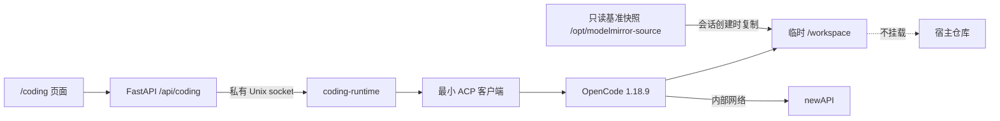

# 代码助手接入说明

最后更新日期：2026-07-30
维护人：模镜团队

## 当前状态

`/coding` 是实验性的单实例代码协作入口。默认 `readonly` 模式允许用户用自然
语言询问 ModelMirror 功能和代码关系；显式启用 `draft` 后，代码助手还可以在
容器内一次性副本中准备可审阅的文本修改。页面会显示回答、修改文件、逐文件
Diff、轻量检查结果和停止按钮。

两种模式都只使用服务端固定的 ModelMirror 镜像快照。Draft 不会写回真实仓库，
也不支持删除、重命名、二进制、Shell、测试执行、Git 操作、远程仓库、多 Agent、
完整 ACP、自动 push/PR、分布式 Worker、重启恢复或生产级多租户。不要将该入口
直接暴露到公网。

## 用户体验约束

- 页面面向没有代码基础的用户，优先使用“代码助手”“分析步骤”“查阅记录”等
  直白说法。
- 页面不展示 ACP、OpenCode、进程、原始协议帧、真实绝对路径或完整工具输出。
- 输入区先于回答区出现；服务不可用时明确禁用输入，不影响其他页面。
- 回答和查阅记录逐步更新；上游提供结构化计划时同步显示。停止操作可重复执行，
  不要求用户理解会话状态。
- Draft 模式明确显示“修改草稿，不会直接改变项目”。回答完成后自动列出文件、
  增删行和检查结果；逐文件 Diff 在页面内滚动，不撑宽移动端。
- “放弃修改”必须二次确认；检查失败时保留草稿供修正，但禁用下载。
- `/coding` 独立懒加载，不侵入 ChatPage，也不新增前端依赖。

## 内部结构



浏览器只接收供应商无关的 `CodingEvent`。OpenCode 和 ACP 是后端实现细节，
后续更换代码智能体时不得要求前端理解新的供应商协议。

## 公共接口

| 接口 | 用途 |
| --- | --- |
| `GET /api/coding/capabilities` | 查询功能是否启用、当前模式及输入/草稿限制。 |
| `POST /api/coding/sessions` | 创建一个临时问答或草稿记录。 |
| `POST /api/coding/sessions/{id}/turns` | 提交问题；请求体只允许 `prompt`。 |
| `GET /api/coding/sessions/{id}/events?after=<seq>` | 通过 SSE 接收事件，并按序号续读。 |
| `POST /api/coding/sessions/{id}/cancel` | 停止当前分析；重复调用安全。 |
| `GET /api/coding/sessions/{id}/changes` | 返回当前 revision、文件统计和最近检查结果。 |
| `GET /api/coding/sessions/{id}/diff?path=&revision=` | 返回指定 revision 的单文件统一 Diff。 |
| `GET /api/coding/sessions/{id}/patch?revision=` | 检查通过后下载完整 `.patch`。 |
| `POST /api/coding/sessions/{id}/validate` | 重新执行固定的轻量检查，不接受命令参数。 |
| `POST /api/coding/sessions/{id}/discard` | 放弃全部草稿并使旧 revision 失效。 |

公共事件限定为：会话开始、分析开始、计划、回答增量、查阅状态、完成、失败、
取消和心跳。服务端只保留有限内存事件，不持久化问题、完整回答或工具输出。
计划事件是可选能力：OpenCode 1.18.9 的 ACP 会话不保证每轮产生结构化计划，
没有计划事件时页面直接展示查阅记录和流式回答。

所有 Diff/Patch 响应均为 `Cache-Control: no-store`，且不返回绝对路径、原始
ACP 帧或完整工具输入。浏览器不能提交工作目录、命令、provider 或自定义检查器。

## 隔离与编辑边界

1. 协议层：Readonly 拒绝全部 ACP 权限请求。Draft 仅对当前会话、`/workspace`
   内、可安全解析的单文件 `edit` 请求选择一次性允许；永不永久允许。畸形帧、
   越界路径、Shell 和其他权限均失败关闭。
2. 智能体层：Readonly 只允许 `read/list/glob/grep/lsp`。Draft 额外把 `edit`
   设为询问；Shell、任务委派、外部目录、联网工具、插件、MCP、Skill、分享和
   自动更新仍禁止。
3. 容器层：构建时通过 `.dockerignore` 排除环境文件、密钥、依赖、缓存和运行
   数据，再把净化源码快照复制到 `/opt/modelmirror-source` 并设为只读；运行时
   使用非 root、只读根文件系统、无特权、资源限额和 `internal: true` 网络。
   `/workspace` 是 256 MiB 的 `nosuid,noexec` tmpfs，宿主仓库不挂载给 Worker。

`coding-runtime` 不映射宿主端口。FastAPI 只通过私有 Unix socket 使用它。
OpenCode 子进程只继承固定 PATH/HOME、模型标识和专用网关连接信息，不继承
FastAPI 的完整环境。源码变化后必须重建 `coding-runtime` 才会刷新只读快照。

## 草稿事务与检查

- 会话创建时把只读基准快照复制到临时工作区；会话关闭、过期或容器重启后清除。
- 每轮开始前建立轻量检查点。取消、模型/协议失败或硬性安全违规只回滚本轮，
  之前已完成的合法草稿继续保留。
- 只允许新增或修改 UTF-8 文本；禁止删除、重命名、二进制、符号链接、秘密模式、
  环境文件、越界路径和禁止目录。
- 最多变化 20 个文件，单文件最终大小 512 KiB，总 Patch 1 MiB。
- 自动检查 Python AST、JSON、冲突标记、新增尾随空白、Diff 完整性和安全策略。
  Python/JSON 等可修正问题保留草稿但禁止下载；硬性安全失败自动回滚本轮。
- 合法变化可跨轮累积；“放弃修改”恢复基准快照并使旧 revision 失效。

这些检查不是 pytest、TypeScript 构建或完整项目测试，下载后的 Patch 仍需由
开发者审阅和验证。

## 配置与启动

功能默认关闭。专用模型配置应放在 Compose 读取的根 `.env` 或启动命令环境中，
不要写入前端，也不要提交：

```bash
CODING_AGENT_ENABLED=true
CODING_AGENT_MODE=readonly
CODING_AGENT_MODEL=your-new-api-model-id
CODING_AGENT_GATEWAY_KEY=your-dedicated-gateway-key
```

`CODING_AGENT_MODE` 默认为 `readonly`，只有显式设置为 `draft` 才开放临时编辑。
`CODING_AGENT_GATEWAY_KEY` 只注入隔离 Worker，不注入 FastAPI。模型标识只允许
字母、数字、点、下划线、斜线、冒号和短横线。

人工重建命令：

```bash
docker compose -p modelmirror --profile coding up -d --build --force-recreate
docker compose -p modelmirror --profile coding ps
curl http://localhost:8000/api/coding/capabilities
```

## 人工验收

1. 以 `CODING_AGENT_MODE=readonly` 提交一个可从当前源码验证的问题，确认流式
   回答、取消和只读行为仍正常。
2. 切换到 `draft` 并重建，在 `/coding` 要求新增或修改临时文本文件；确认页面
   显示文件列表、增删行、逐文件 Diff 和检查结果。
3. 制造 Python/JSON 错误，确认检查能发现且不能下载；修正并重新检查后可下载
   `.patch`。
4. 取消一轮修改，确认本轮变化消失、此前草稿保留；再放弃全部修改，确认变化归零。
5. 尝试删除、Shell、`.env`、外部路径和超限修改，确认被拒绝或本轮自动回滚。
6. 验收前后比较真实仓库 `git status --short`，确认完全一致；页面不得显示真实
   绝对路径。
7. 确认 `coding-runtime` 没有宿主端口和公网出口，基准快照不可写；停止 Worker
   后核心健康检查和其他页面仍可用。

## 回退

先设置 `CODING_AGENT_MODE=readonly` 并重建，可立即关闭草稿编辑、保留只读问答。
需要完全关闭时设置 `CODING_AGENT_ENABLED=false` 并停止 `coding` profile：

```bash
docker compose -p modelmirror --profile coding stop coding-runtime
```

本轮没有数据库迁移或持久化会话。需要整轮回退时，按独立提交逆序撤销并重建
核心服务即可；容器重启会清除所有临时草稿。
