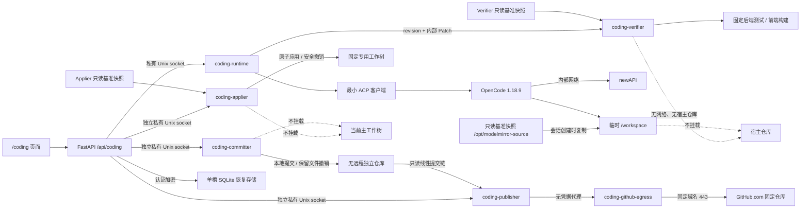

# 代码助手接入说明

最后更新日期：2026-08-01
维护人：模镜团队

## 当前状态

`/coding` 是实验性的单实例代码协作入口。默认 `readonly` 模式允许用户用自然
语言询问 ModelMirror 功能和代码关系；显式启用 `draft` 后，代码助手还可以在
容器内一次性副本中准备可审阅的文本修改。页面会显示回答、修改文件、逐文件
Diff、轻量检查结果和停止按钮。Draft 用户还可以手动启动独立项目验证，按变化
范围运行固定的后端测试或前端生产构建。部署者显式配置固定专用工作树后，用户
可以把满足全部门禁的当前草稿应用到该副本；当目标是无远程的独立本地克隆时，
还可以编辑中文说明并保存为一个真实本地提交。显式启用恢复 overlay 后，最近一份
完整草稿及其脱敏检查、验证、应用和提交状态可在容器重启后继续。部署者再显式配置
固定 GitHub App 和发布 overlay 后，用户可把线性本地提交创建为 Draft PR，并再次
确认是否标记为 Ready。

两种模式都只使用服务端固定的 ModelMirror 镜像快照。Draft 默认不会写回任何
宿主目录；受控应用也只允许写入预先创建的专用工作树，当前主工作树始终不挂载。
系统只在用户确认后向固定独立克隆创建本地提交；远程发布也只允许固定 GitHub.com
仓库、系统分支和 Draft PR，不提供合并、关闭或远端清理。系统不支持删除、重命名、
二进制、Agent Shell/测试命令、仓库或分支选择、多 Agent、完整 ACP、
分布式 Worker、保存对话、多任务历史或生产级多租户。不要将该入口直接暴露到公网。

## 用户体验约束

- 页面面向没有代码基础的用户，优先使用“代码助手”“分析步骤”“查阅记录”等
  直白说法。
- 页面不展示 ACP、OpenCode、进程、原始协议帧、真实绝对路径或完整工具输出。
- 输入区先于回答区出现；服务不可用时明确禁用输入，不影响其他页面。
- 回答和查阅记录逐步更新；上游提供结构化计划时同步显示。停止操作可重复执行，
  不要求用户理解会话状态。
- Draft 模式明确显示“修改草稿，不会直接改变项目”。回答完成后自动列出文件、
  增删行和检查结果；逐文件 Diff 在页面内滚动，不撑宽移动端。
- “放弃修改”必须二次确认；检查失败时保留草稿供修正，但禁用下载。
- “项目验证”由用户手动运行，使用“检查服务代码”“检查页面构建”等日常语言。
  运行时可停止，失败详情默认折叠；“让代码助手修复”只填入摘要，不自动提交。
- 未运行或失败的项目验证不阻止下载，但必须原位警告并让用户再次确认；验证服务
  未启动时，Diff、轻量检查和下载继续可用。
- “应用到本地项目副本”仅在门禁满足时启用；确认区必须说明文件数量、不会提交或
  上传、当前项目目录不改变。目标不匹配或已有修改时使用日常语言提示，技术原因
  默认折叠。
- 应用成功后明确显示“修改已应用”，冻结输入与修改操作，但保留 Diff、验证和
  下载；提供“撤销本次应用”和“结束本次修改”。撤销不得覆盖之后的人工改动。
- 独立本地仓库可用时，页面显示“保存一个可找回的本地版本”，预填系统建议并允许
  编辑说明。确认区明确“只保存在本机，不会上传”；成功后显示短提交编号。
- “撤销本地提交”必须二次确认并明确文件仍保留。有效提交存在时隐藏应用撤销；
  先撤销提交后才恢复应用撤销。普通 worktree 只显示提交不可用，不影响应用。
- 页面发现恢复记录时不自动覆盖当前内容，而是显示“继续上次修改”“下载 Diff”
  和“放弃这份修改”。继续后必须明确说明此前对话未保存；冲突态只保留查看、
  下载和放弃，不提供会覆盖外部内容的操作。
- 本地提交完成后才显示“发布到 GitHub”。标题和说明可编辑；确认区必须明确会上传、
  创建草稿 PR、不会合并。发布进行中只查询状态，不刷新整个页面。
- Draft PR 成功后提供安全外链和“标记为可审阅”；Ready 必须再次原位确认。GitHub
  基线变化、远端分支占用或 PR 被外部修改时使用日常语言提示，技术原因默认折叠。
- `/coding` 独立懒加载，不侵入 ChatPage，也不新增前端依赖。

## 内部结构



浏览器只接收供应商无关的 `CodingEvent`。OpenCode 和 ACP 是后端实现细节，
后续更换代码智能体时不得要求前端理解新的供应商协议。

## 公共接口

| 接口 | 用途 |
| --- | --- |
| `GET /api/coding/capabilities` | 查询功能是否启用、当前模式及输入/草稿限制。 |
| `POST /api/coding/sessions` | 创建一个临时问答或草稿记录。 |
| `GET /api/coding/sessions/{id}` | 检查临时记录是否仍存在；不返回问题、回答或文件内容。 |
| `POST /api/coding/sessions/{id}/turns` | 提交问题；请求体只允许 `prompt`。 |
| `GET /api/coding/sessions/{id}/events?after=<seq>` | 通过 SSE 接收事件，并按序号续读。 |
| `POST /api/coding/sessions/{id}/cancel` | 停止当前分析；重复调用安全。 |
| `GET /api/coding/sessions/{id}/changes` | 返回当前 revision、文件统计和最近检查结果。 |
| `GET /api/coding/sessions/{id}/diff?path=&revision=` | 返回指定 revision 的单文件统一 Diff。 |
| `GET /api/coding/sessions/{id}/patch?revision=` | 轻量检查通过后下载完整 `.patch`。 |
| `POST /api/coding/sessions/{id}/validate` | 重新执行固定的轻量检查，不接受命令参数。 |
| `POST /api/coding/sessions/{id}/discard` | 放弃全部草稿并使旧 revision 失效。 |
| `POST /api/coding/sessions/{id}/verification` | 为指定 revision 启动项目验证；返回 `202`。 |
| `GET /api/coding/sessions/{id}/verification?revision=` | 查询运行状态、结论和固定步骤摘要。 |
| `POST /api/coding/sessions/{id}/verification/cancel` | 停止指定 revision 的验证；重复调用安全。 |
| `POST /api/coding/sessions/{id}/apply` | 应用指定 revision；请求体只允许 `revision`。Windows 绑定目录扫描较慢时最多等待 90 秒。 |
| `POST /api/coding/sessions/{id}/commit` | 保存本地提交；Windows 绑定目录扫描较慢时最多等待 90 秒。 |
| `GET /api/coding/sessions/{id}/apply?revision=` | 查询应用、撤销状态和是否仍可撤销。 |
| `POST /api/coding/sessions/{id}/apply/revert` | 安全撤销；请求体只允许 `revision` 与不透明 `apply_id`。 |
| `POST /api/coding/sessions/{id}/close` | 结束已应用或已撤销的冻结会话，释放单会话 Runtime。 |
| `POST /api/coding/sessions/{id}/commit` | 创建本地提交；请求体只允许 `revision`、`apply_id` 与 `message`。 |
| `GET /api/coding/sessions/{id}/commit?revision=` | 查询建议说明、状态、不透明撤销标识、提交 SHA 与撤销能力。 |
| `POST /api/coding/sessions/{id}/commit/undo` | 撤销本次提交并保留文件；请求体只允许 revision、apply_id 与不透明 commit_id。 |
| `GET /api/coding/sessions/{id}/history` | 查询当前轮、已完成轮次和是否还能继续，不返回 Patch 正文。 |
| `POST /api/coding/sessions/{id}/continue` | 在最新本地提交后开始下一轮；请求体只允许 revision 与 commit_id。 |
| `POST /api/coding/sessions/{id}/publish` | 持久化发布意图后异步创建 Draft PR；请求体只允许 revision、commit_id、title 与 body。 |
| `GET /api/coding/sessions/{id}/publish?revision=` | 查询远程状态、PR 编号/URL和脱敏原因，不返回仓库配置或提交 SHA。 |
| `POST /api/coding/sessions/{id}/publish/ready` | 再次确认后标记为 Ready；请求体只允许 revision 与不透明 publish_id。 |
| `GET /api/coding/recovery` | 查询是否存在最近一份可恢复修改及安全状态，不返回内容正文。 |
| `POST /api/coding/recovery/resume` | 从不可变基准和保存的 Patch 创建全新 Agent 会话。 |
| `POST /api/coding/recovery/discard` | 只删除恢复记录，不修改专用副本或本地提交。 |
| `GET /api/coding/recovery/patch` | 在项目版本变化时仍允许下载保存的 Diff。 |

Capabilities 中的 `verification.available` 表示 Verifier 当前是否可用，
`required_for_patch=false` 表示项目验证不作为 Patch 下载硬门禁。
Draft 模式还返回 `host_apply` 与 `apply`：包含是否已配置、当前可用性、固定目标
`dedicated_worktree`、验证要求、纯文档例外和撤销能力；可选 `reason` 只是安全
原因码，不含真实路径。启用提交 overlay 后还返回 `commit`：目标固定为
`isolated_local_repository`，需要先应用、支持撤销、禁止远程操作，说明上限为
2000 字符。发布 overlay 还返回 `publish`：固定 provider `github`、固定仓库、默认
Draft、精确基础版本要求和 Ready 支持；不可用原因不影响本地能力。
`recovery` 公开 enabled、available、pending、retention_seconds 和
`restores_conversation=false`；不返回存储路径、密钥或加密负载。

公共事件限定为：会话开始、分析开始、计划、回答增量、查阅状态、完成、失败、
取消和心跳。服务端只保留有限内存事件，不持久化问题、完整回答或工具输出。
计划事件是可选能力：OpenCode 1.18.9 的 ACP 会话不保证每轮产生结构化计划，
没有计划事件时页面直接展示查阅记录和流式回答。

所有 Diff/Patch、应用与提交接口响应均为 `Cache-Control: no-store`，且不返回绝对
路径、文件正文、原始 Patch、命令输出、原始 ACP 帧或完整工具输入。浏览器不能
提交工作目录、命令、provider、自定义检查器、目标路径、分支或 Git 参数。

## 隔离与编辑边界

1. 协议层：Readonly 拒绝全部 ACP 权限请求。Draft 仅对当前会话、`/workspace`
   内、可安全解析的单文件 `edit` 请求选择一次性允许；永不永久允许。畸形帧、
   越界路径、Shell 和其他权限均失败关闭。
2. 智能体层：Readonly 只允许 `read/list/glob/grep/lsp`。Draft 额外把 `edit`
   设为询问；Shell、任务委派、外部目录、联网工具、插件、MCP、Skill、分享和
   自动更新仍禁止。
3. 容器层：构建时通过 `.dockerignore` 排除私有环境文件、密钥、依赖、缓存和
   运行数据，只重新纳入仓库追踪的 3 个安全 `.env.example` 占位模板；再把净化
   源码快照复制到 `/opt/modelmirror-source` 并设为只读。运行时使用非 root、
   只读根文件系统、无特权、资源限额和 `internal: true` 网络。`/workspace` 是
   256 MiB 的 `nosuid,noexec` tmpfs，宿主仓库不挂载给 Worker。

`coding-runtime` 不映射宿主端口。FastAPI 只通过私有 Unix socket 使用它。
OpenCode 子进程只继承固定 PATH/HOME、模型标识和专用网关连接信息，不继承
FastAPI 的完整环境。源码变化后必须重建 `coding-runtime` 才会刷新只读快照。

## 草稿事务与检查

- 会话创建时把只读基准快照复制到临时工作区；会话关闭、过期或容器重启后清除。
- 每轮开始前建立轻量检查点。取消、模型/协议失败或硬性安全违规只回滚本轮，
  之前已完成的合法草稿继续保留。
- 只允许新增或修改 UTF-8 文本；禁止删除、重命名、二进制、符号链接、秘密模式、
  环境文件、越界路径和禁止目录。
- 最多变化 20 个文件，单文件最终大小 512 KiB，总 Patch 1 MiB。
- 自动检查 Python AST、JSON、冲突标记、新增尾随空白、Diff 完整性和安全策略。
  Python/JSON 等可修正问题保留草稿但禁止下载；硬性安全失败自动回滚本轮。
- 合法变化可跨轮累积；“放弃修改”恢复基准快照并使旧 revision 失效。

这些轻量检查不是完整项目测试。项目验证是额外的用户手动步骤；无论结果如何，
下载后的 Patch 仍需由开发者审阅。

## 隔离项目验证

- `coding-verifier` 位于独立 `coding-verify` profile，使用非 root、只读根目录、
  无特权、无宿主端口、无 Docker socket 和 `network_mode: none`。
- Worker 只发送当前 revision 的内部 Patch、变化路径和快照指纹。Verifier 不接收
  宿主路径、模型密钥或用户命令，并再次检查 Patch 路径、大小和文件状态。
- Worker 与 Verifier 的净化快照指纹必须一致；不一致时结果为“未运行”，Draft
  主功能不降级。
- 仅变化 `server/**` 时运行后端全量测试，仅变化 `client/**` 时运行前端生产
  构建；混合、根目录或未知代码路径运行两项，纯文档变化为“不适用”。
- 变化 `server/tests/**` 时先用不可修改的基准测试验证草稿代码，再运行草稿测试；
  变化依赖清单或锁文件时不联网安装，结果为“未运行”。
- 固定上限为后端 300 秒、前端 240 秒、整次 600 秒。取消会终止进程组并清理
  1 GiB 临时工作区。
- 输出按步骤聚合、脱敏和截断。验证期间禁止新 Agent 轮次与放弃草稿，但 Diff 和
  Patch 保持可读；revision 变化后旧结果标记 stale。

## 受控应用与撤销

- `coding-applier` 只存在于显式加载的独立 Compose overlay，使用非 root、只读
  根目录、无特权、无宿主端口、无 Docker socket 和 `network_mode: none`。
  只有 Server 挂载独立应用 socket；Runtime 与 Verifier 不能访问。
- `/target` 是部署者固定配置的专用工作树。它的 `.git` 指针文件单独只读挂载；
  浏览器与 Agent 不知道真实路径。当前主工作树、实现工作树和任意用户路径都不
  在 Applier 的挂载范围内。
- 应用要求轻量检查通过，验证属于精确 revision、已完成且非 stale；结论必须为
  `passed`，只有系统重新判定为纯文档时才接受
  `not_applicable/documentation_only`。失败、未运行、取消、运行中、依赖变化和
  stale 一律拒绝。
- Applier 再次检查快照指纹、Patch 路径/限额/文件状态，并要求目标除 `.git` 外
  与基准完全一致。它先在 tmpfs 预演，再按原文件哈希原子写入；多文件任一步
  失败都会恢复已写文件。相同会话与 revision 的重复请求返回原结果，不再次写入。
- 成功后会话冻结，只允许查看变化、Diff、Patch、验证和应用结果。撤销只有在
  目标仍精确保持应用后状态时执行；新增文件只在这次撤销中删除。外部修改会使
  撤销失败，不会被覆盖。
- 应用凭据仅存 Server 内存。会话关闭、过期或 Server 重启后不保证页面撤销；
  应删除并从同一提交重建专用工作树。Applier 不可用不会影响 Draft、Diff、
  Verifier、Patch 下载或核心服务健康。

## 隔离本地提交与撤销

- `coding-committer` 只存在于独立 Compose overlay，使用非 root、只读根目录、
  无特权、无端口、无 Docker socket 和 `network_mode: none`；不接收模型密钥、
  Git 凭据或远程地址。只有 Server 挂载提交 socket。
- 目标必须是无 remote、独立 `.git`、固定分支 `coding/local-draft` 的本地克隆。
  `/target` 只读，只有 `/target/.git` 可写；Git worktree、alternates、共享 Git、
  错误分支、脏索引、额外文件和基线不匹配均失败关闭。
- 浏览器只提交 revision、apply_id 和说明。路径来自已验证的 ApplyReceipt；作者由
  部署变量固定，默认 `ModelMirror Coding Assistant <coding@modelmirror.local>`。
- 说明统一为 LF、长度 1–2000 字符、首行不超过 120 字符，并拒绝控制字符。系统
  建议：纯文档 `docs: 更新项目说明`、纯测试 `test: 更新项目检查`，其他变化
  `feature: 更新项目功能`。
- 引擎使用临时索引、固定 Git plumbing 与 compare-and-swap 更新固定分支，不执行
  Hook、签名、clean/smudge filter、凭据助手或仓库命令。失败恢复索引与引用；
  重复请求返回原提交，不生成第二个提交。
- 撤销只在目标、索引和分支仍保持提交后的精确状态时移动引用，工作区文件保持
  不变。有效提交存在时禁止撤销应用；Committer 不可用不影响其他 Coding 能力。

## 加密任务恢复

- 恢复存储最多保留最近一份完整 revision，默认 7 天。SQLite 明文字段只保存
  revision、状态、文件数、指纹和时间；Patch、检查摘要、ApplyReceipt 与
  CommitReceipt 全部放在 Fernet 认证密文中。
- 密钥首次启用时在独立挂载目录本地生成。数据库存在但密钥缺失、密钥不可读、
  密文被篡改或 schema 不兼容时失败关闭，绝不生成新密钥覆盖旧记录。
- 一轮处理只有在安全快照成功落盘后才向页面发出完成事件；取消、失败或中断只
  保留上一份完整 revision，半轮修改不会恢复。
- 继续时 Worker 重新复核路径、UTF-8、文件类型和限额，并从只读基准重建全新
  工作区。Prompt、回答、计划、工具日志、原始命令输出和 ACP 帧从不持久化。
- 基准或验证环境指纹不一致时验证结论过期。应用、提交及撤销中断后只进行精确
  只读对账；结果不明确或有人修改目标时进入冲突态，不重复写入、不覆盖人工内容。
- 活跃任务空闲 30 分钟后关闭进程但保留记录；有 pending 记录时必须先继续或
  放弃，不能静默创建另一任务。到期清理只删除恢复记录，不触碰外部仓库。

## 多轮本地修改

- 加载恢复 overlay 并设置 `CODING_INCREMENTAL_ENABLED=true` 后，同一任务最多可完成
  10 轮修改、验证、应用和本地提交。每次提交成功后，用户必须明确点击“继续修改”才会
  开始下一轮；旧轮次保持只读。
- 项目验证针对基准、此前全部已提交轮次和当前草稿的累计状态运行；应用和提交只处理
  当前轮增量。目标仓库保持线性父子提交关系，不允许选择分支或改写旧轮次。
- 页面默认展示当前轮文件与 Diff，历史折叠显示，并可分别下载当前轮或全部累计修改。
  只允许撤销最新一轮；达到 10 轮后仍可查看、下载和结束任务。
- 恢复 schema v3 保存已完成轮次、当前完整草稿和加密发布意图/回执；旧 v1/v2 记录
  仍可读取。恢复不包含
  此前对话，外部文件、索引或分支状态不明确时转为只读冲突态。

## GitHub Draft PR 受控发布

- `coding-publisher` 只读挂载无 remote 独立仓库；只接受 Server 根据恢复回执生成的
  固定仓库、基线 SHA、HEAD、线性提交链和系统分支。浏览器与 Agent 不能提供 URL、
  仓库、分支、路径、凭据或 Git 参数。
- 发布前再次复核本地分支 `coding/local-draft`、干净状态、提交父子链、文件集、回执、
  GitHub 仓库 ID 与 `main` SHA。`.github/workflows/**`、remote、alternates、Hook、
  credential helper、proxy、URL rewrite、非快进和 force push 全部失败关闭。
- GitHub App 私钥只读挂载给 Publisher；单仓库安装令牌只申请 Contents/Pull requests
  写入和 Metadata 读取，最长一小时且只驻留内存。Publisher 不能直连公网，只能经
  无凭据出口代理访问 `github.com:443` 和 `api.github.com:443`。
- 分支固定为 `codex/modelmirror-<task-id>-<head-sha>`。push、PR 创建或回执落盘中断后，
  系统先查询固定分支与 open PR；精确匹配才恢复，禁止重复 push、重复 PR 或覆盖远端。
- 发布意图出现后任务冻结。外部修改/关闭 PR、占用分支或结果不明确时进入只读冲突态；
  仍可查看 Diff、验证和历史，但不能继续修改、撤销提交或撤销应用。
- 首次 PR 永远是 Draft；Ready 使用固定 GraphQL 操作并要求用户再次确认。产品不拥有
  merge、close、删除分支、评论、标签、Reviewer 或 CI 状态管理能力。

## 配置与启动

功能默认关闭。专用模型配置应放在 Compose 读取的根 `.env` 或启动命令环境中，
不要写入前端，也不要提交：

```bash
CODING_AGENT_ENABLED=true
CODING_AGENT_MODE=readonly
CODING_AGENT_MODEL=your-new-api-model-id
CODING_AGENT_GATEWAY_KEY=your-dedicated-gateway-key
CODING_INCREMENTAL_ENABLED=false
CODING_GITHUB_PUBLISH_ENABLED=false
```

`CODING_AGENT_MODE` 默认为 `readonly`，只有显式设置为 `draft` 才开放临时编辑。
`CODING_AGENT_GATEWAY_KEY` 只注入隔离 Worker，不注入 FastAPI。模型标识只允许
字母、数字、点、下划线、斜线、冒号和短横线。
多轮模式依赖恢复、Applier 和 Committer 同时可用；任一执行面缺失时 capabilities 会
明确显示不可用，不会静默降级为可写多轮流程。恢复 overlay 默认开启该能力；设置
`CODING_INCREMENTAL_ENABLED=false` 可立即回到第六轮单次流程。
发布功能还要求恢复、Applier、Committer 与无 remote 独立仓库均可用，并显式加载
`docker-compose.coding-publish.yml`。App ID、安装 ID、仓库 ID、`owner/repository`
和私钥绝对路径的完整配置及重建命令见 [DEPLOYMENT.md](./DEPLOYMENT.md)；私钥正文
和安装令牌不得写入 `.env`、日志、Git 配置或恢复数据库。

人工重建命令：

```bash
docker compose -p modelmirror --profile coding --profile coding-verify up -d --build --force-recreate
docker compose -p modelmirror --profile coding --profile coding-verify ps
curl http://localhost:8000/api/coding/capabilities
```

如需启用受控应用，先从实现 HEAD 创建干净的专用工作树，再设置绝对路径：

```bash
git worktree add --detach C:\tmp\modelmirror-coding-apply-target-v4 <implementation-head-sha>
CODING_APPLY_WORKTREE=C:\tmp\modelmirror-coding-apply-target-v4
docker compose -f docker-compose.yml -f docker-compose.coding-apply.yml -p modelmirror --profile coding --profile coding-verify --profile coding-apply up -d --build --force-recreate
```

必须同时写出两个 `-f`；不要把 overlay 设为默认 Compose 文件。overlay 的 bind
mount 使用 `create_host_path: false`，路径缺失时失败关闭，不自动创建目标。

如需继续启用本地提交，改用独立克隆作为应用与提交的共同目标，并加载提交 overlay：

```bash
git clone --no-local --no-hardlinks <implementation-worktree> C:\tmp\modelmirror-coding-repository-v5
git -C C:\tmp\modelmirror-coding-repository-v5 remote remove origin
git -C C:\tmp\modelmirror-coding-repository-v5 switch -C coding/local-draft <implementation-head-sha>
CODING_APPLY_WORKTREE=C:\tmp\modelmirror-coding-repository-v5
CODING_COMMIT_REPOSITORY=C:\tmp\modelmirror-coding-repository-v5
docker compose -f docker-compose.yml -f docker-compose.coding-apply.yml -f docker-compose.coding-commit.yml -p modelmirror --profile coding --profile coding-verify --profile coding-apply --profile coding-commit up -d --build --force-recreate
```

如需启用重启恢复，先创建 `${MODELMIRROR_DATA_ROOT}/server/coding-recovery`，再加载
`docker-compose.coding-recovery.yml`。重建前必须先运行 overlay 中无网络、全只读的
`coding-recovery-preflight`；它要求绝对数据根目录、非空 `server/.env`、无 remote
的 `coding/local-draft` 干净独立目标，并比较实现与目标的净化内容指纹。
完整 PowerShell 命令见 [DEPLOYMENT.md](./DEPLOYMENT.md)。

## 人工验收

### 重启、超时与对账检查

- Windows 绑定目录不得在应用或提交请求中重复读取并哈希整个项目。启动时校验完整基准，运行时扫描全部路径与元数据，并只重新哈希变化文件。
- 页面出现“等待时间过长”时，先查询对应 revision 的 apply/commit 状态并检查目标仓库；操作可能已经成功。必须使用原操作 ID 对账，禁止直接生成第二次写入或提交。
- Applier 与 Committer 最多等待 90 秒。当前验收环境的参考值为：单文件应用约 21–28 秒，本地提交约 33 秒；明显超过时应检查绑定目录性能和重复扫描，不继续增加超时。
- `docker ps` 的 healthy 仅是第一层检查。还必须从 Server 通过各自 Unix socket 调用五个 Coding 执行面的 health，确认 socket 路径存在且可连接。
- 多轮恢复中，累计修改可以位于 `base_patch`，当前轮 `patch` 可以为空；`patch/paths` 与 `base_patch/base_paths` 分别成对校验。恢复页连续返回 `invalid_request` 时优先检查这一契约。
- 完整重建前检查 pending 恢复记录。源码快照指纹变化后旧记录只能下载或标记过期，不得改写指纹强行恢复。

1. 以 `CODING_AGENT_MODE=readonly` 提交一个可从当前源码验证的问题，确认流式
   回答、取消和只读行为仍正常。
2. 切换到 `draft` 并重建，在 `/coding` 要求新增或修改临时文本文件；确认页面
   显示文件列表、增删行、逐文件 Diff 和检查结果。
3. 制造 Python/JSON 错误，确认轻量检查能发现且不能下载；修正并重新检查后可
   下载 `.patch`。
4. 取消一轮修改，确认本轮变化消失、此前草稿保留；再放弃全部修改，确认变化归零。
5. 尝试删除、Shell、`.env`、外部路径和超限修改，确认被拒绝或本轮自动回滚。
6. 分别制造仅后端、仅前端和混合草稿，确认项目验证只运行适用步骤；制造测试或
   构建失败，确认页面保留草稿、显示简述并可把摘要填回输入框。
7. 修改既有测试，确认不可绕过基准测试；修改依赖清单，确认显示“未运行”且不
   联网安装。取消验证后确认无残留进程并可重新运行。
8. 停止 `coding-verifier`，确认 Draft、Diff、轻量检查和下载仍可用；未验证或失败
   的 Patch 可在明确警告后二次确认下载。
9. 验收前后比较真实仓库 `git status --short`，确认完全一致；页面不得显示真实
   绝对路径。
10. 确认 Runtime 无宿主端口、只连接内部网关；Verifier 无网络、无宿主端口、
    无密钥，且两侧基准快照不可写。停止 Verifier 后核心健康和其他页面仍可用。
11. 从实现 HEAD 创建固定专用工作树并启用 Applier。后端、前端、混合及纯文档
    草稿满足门禁后可应用；失败、未运行、依赖变化和 stale revision 均被阻止。
12. 分别让目标出现已有修改、额外文件、版本不匹配和符号链接，确认应用被拒绝；
    重复点击不重复写入，成功后草稿冻结但 Diff、验证和下载仍可查看。
13. 正常撤销后目标精确回到基准；再次应用后手工修改目标，确认撤销拒绝且不覆盖
    人工内容。停止 Applier，确认 Draft、Diff、验证和下载不受影响。
14. 验收前后确认实现工作树和当前主工作树的 `git status --short` 不变，只有专用
    目标发生预期变化；Applier 无公网、宿主端口、密钥或可写 `.git`。
15. 从最终 HEAD 创建无远程独立克隆并固定到 `coding/local-draft`。分别用纯文档、
    后端、前端和混合草稿完成验证、应用和本地提交；确认建议说明可编辑、作者固定、
    提交文件准确且仓库干净。
16. 重复点击确认不新增提交。撤销提交后 HEAD 恢复且文件保留，可修改说明重新提交，
    或继续撤销应用；有效提交存在时应用撤销必须被阻止。
17. 分别制造 remote、worktree、alternates、错误分支、脏索引、额外文件、基线不匹配
    和外部文件修改；确认提交或撤销失败且不覆盖内容。停止 Committer 后，尚未提交
    的应用仍可撤销，已提交结果仍可查看和结束。
18. 以随机文件名和随机正文建立草稿，分别重启 Server、Runtime、Verifier 和完整
    Coding 容器组；继续后确认 revision、Diff、检查和验证摘要一致，页面没有旧对话。
19. 分别在验证通过、应用完成和本地提交完成后重启，确认状态与撤销能力精确恢复，
    Git HEAD 不产生重复提交；重启前人工改文件或分支时必须进入只读冲突态。
20. 改变项目基准，确认不能继续应用但仍可下载保存的 Diff；相对数据根目录、空
    `server/.env`、脏目标或指纹不一致必须在共享栈重建前被预检拒绝。
21. 用 2–3 轮随机文件名和正文完成线性提交后发布，确认远端 Draft PR 的提交顺序、
    文件内容、标题和说明精确一致；重复点击只返回同一 PR。
22. 分别在 push 后、PR 创建后和回执保存前重启 Server/Publisher，确认恢复到同一
    Draft PR；预占系统分支或推进 `main` 后必须拒绝且不 force push、不创建第二个 PR。
23. 在 GitHub 外部修改或关闭 Draft PR，确认任务进入只读冲突态且不覆盖远端；正常
    Ready 后重复确认保持 Ready，系统不提供合并、关闭或删除分支。
24. 尝试发布 workflow 文件、错误仓库/App 安装和权限不足配置，确认失败关闭且响应、
    日志和恢复数据库没有私钥、JWT、安装令牌或随机秘密文本。
25. 从 Publisher/出口代理请求其他公网域名必须失败；停止 Publisher 后，草稿、验证、
    应用、本地提交、多轮恢复和下载仍正常。验收 PR 由用户在 GitHub 手工清理。

## 回退

先设置 `CODING_GITHUB_PUBLISH_ENABLED=false` 或省略发布 overlay，即恢复第七轮
本地多轮能力。此操作不会关闭或删除已创建的 GitHub PR/分支，远端内容只能由用户
在 GitHub 明确处理。

再设置 `CODING_RECOVERY_ENABLED=false` 或省略恢复 overlay，即恢复第五轮内存
行为。恢复记录不会改变专用副本或本地提交；存储目录只在用户明确授权后清理。

再停止 Committer 并在后续启动中省略提交 overlay，即可恢复第四轮能力；已创建的
本地提交不会被自动删除：

```bash
docker compose -f docker-compose.yml -f docker-compose.coding-apply.yml -f docker-compose.coding-commit.yml -p modelmirror --profile coding-commit stop coding-committer
```

再停止 Applier，并在后续启动中省略应用 overlay，即可恢复第三轮能力：

```bash
docker compose -f docker-compose.yml -f docker-compose.coding-apply.yml -p modelmirror --profile coding-apply stop coding-applier
```

目标工作树不会被自动删除。若会话撤销已不可用，应人工确认后删除并从相同提交
重建专用工作树。再停止并省略 `coding-verify` profile，即可恢复第二轮 Draft、
Diff 和下载能力：

```bash
docker compose -p modelmirror --profile coding-verify stop coding-verifier
```

设置 `CODING_AGENT_MODE=readonly` 并重建，可关闭草稿编辑、保留只读问答。需要
完全关闭时设置 `CODING_AGENT_ENABLED=false` 并停止 `coding` profile：

```bash
docker compose -p modelmirror --profile coding stop coding-runtime
```

恢复 SQLite 是 Coding 专用、可选的单槽存储，不迁移其他业务数据库。需要整轮
回退时，省略恢复 overlay 并按独立提交逆序撤销；已有外部文件和本地提交不会被
自动删除。
