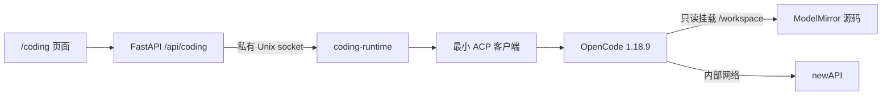

# 代码助手接入说明

最后更新日期：2026-07-29
维护人：模镜团队

## 当前状态

`/coding` 是实验性的单实例只读代码问答入口。用户可以用自然语言询问
ModelMirror 功能和代码关系，页面会显示分析步骤、查阅记录、逐步生成的回答和
停止按钮。

首轮只支持服务端固定的 ModelMirror 工作区，不支持文件修改、Diff、Shell、
测试执行、Git 操作、远程仓库、多 Agent、完整 ACP、自动 push/PR、分布式
Worker、重启恢复或生产级多租户。不要将该入口直接暴露到公网。

## 用户体验约束

- 页面面向没有代码基础的用户，优先使用“代码助手”“分析步骤”“查阅记录”等
  直白说法。
- 页面不展示 ACP、OpenCode、进程、原始协议帧、真实绝对路径或完整工具输出。
- 输入区先于回答区出现；服务不可用时明确禁用输入，不影响其他页面。
- 回答、计划和查阅记录逐步更新；停止操作可重复执行，不要求用户理解会话状态。
- `/coding` 独立懒加载，不侵入 ChatPage，也不新增前端依赖。

## 内部结构



浏览器只接收供应商无关的 `CodingEvent`。OpenCode 和 ACP 是后端实现细节，
后续更换代码智能体时不得要求前端理解新的供应商协议。

## 公共接口

| 接口 | 用途 |
| --- | --- |
| `GET /api/coding/capabilities` | 查询功能是否启用、是否可用及输入限制。 |
| `POST /api/coding/sessions` | 创建一个临时只读问答记录。 |
| `POST /api/coding/sessions/{id}/turns` | 提交问题；请求体只允许 `prompt`。 |
| `GET /api/coding/sessions/{id}/events?after=<seq>` | 通过 SSE 接收事件，并按序号续读。 |
| `POST /api/coding/sessions/{id}/cancel` | 停止当前分析；重复调用安全。 |

公共事件限定为：会话开始、分析开始、计划、回答增量、查阅状态、完成、失败、
取消和心跳。服务端只保留有限内存事件，不持久化问题、完整回答或工具输出。

## 三层只读边界

1. 协议层：所有 ACP 权限请求统一拒绝；畸形帧、超时和进程退出均失败关闭。
2. 智能体层：只允许 `read/list/glob/grep/lsp`，禁止编辑、Shell、任务委派、
   外部目录、联网工具、插件、MCP、Skill、分享和自动更新。
3. 容器层：非 root、只读根文件系统、源码只读挂载、无特权、资源限额和
   `internal: true` 网络；即使上层配置失效也不能改写真实仓库或直连公网。

`coding-runtime` 不映射宿主端口。FastAPI 只通过私有 Unix socket 使用它。
OpenCode 子进程只继承固定 PATH/HOME、模型标识和专用网关连接信息，不继承
FastAPI 的完整环境。

## 配置与启动

功能默认关闭。专用模型配置应放在 Compose 读取的根 `.env` 或启动命令环境中，
不要写入前端，也不要提交：

```bash
CODING_AGENT_ENABLED=true
CODING_AGENT_MODEL=your-new-api-model-id
CODING_AGENT_GATEWAY_KEY=your-dedicated-gateway-key
```

`CODING_AGENT_GATEWAY_KEY` 只注入隔离 Worker，不注入 FastAPI。模型标识只允许
字母、数字、点、下划线、冒号和短横线。

人工重建命令：

```bash
docker compose -p modelmirror --profile coding up -d --build --force-recreate
docker compose -p modelmirror --profile coding ps
curl http://localhost:8000/api/coding/capabilities
```

## 人工验收

1. 在 `/coding` 提交一个可从当前源码验证的问题。
2. 确认分析步骤、查阅记录和回答逐步出现，页面不显示真实绝对路径。
3. 在回答生成期间点击“停止分析”，确认页面可再次提问。
4. 提示智能体修改文件或执行命令，确认请求被拒绝。
5. 验收前后比较 `git status --short`，确认没有智能体生成的源码变化。
6. 确认 `coding-runtime` 没有宿主端口，且不能直连公网。
7. 停止 `coding-runtime`，确认核心健康检查和其他页面仍可用。

## 回退

设置 `CODING_AGENT_ENABLED=false` 并停止 `coding` profile：

```bash
docker compose -p modelmirror --profile coding stop coding-runtime
```

首轮没有数据库迁移或持久化会话。需要整轮回退时，按独立提交逆序撤销并重建
核心服务即可。
