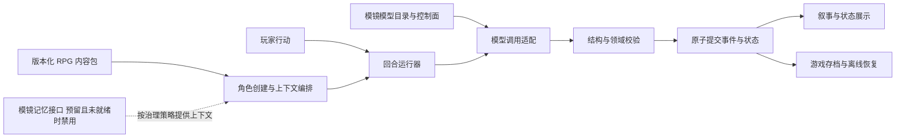

# AI RPG 实验模块技术审计

审计日期：2026-09-04。对象：[无限重生系统卡片及其基础运行空间](https://afengy.cash/zh/explore/installed/e23bbc64-4fdd-46d8-92c0-64923961e5d8)。

## 判断

**具备制作独立、最小 AI RPG 实验模块的可行性。值得沉淀的是内容包结构、角色初始化、跨世界玩法和回合协议；现有 HTML、提示词状态管理不能直接作为可靠游戏引擎。**

卡片开局 HTML 已直接审读并完成数据统计；开局及短回合行为已实测。按用户再次明确的范围，仅通过公开可见资源和消息探针理解核心逻辑与重要思路，最终由我们依据专业逻辑自行设计。**不追求背后完整提示词还原，也不模仿 UI。** 原始主提示词、完整世界书、专属文风正文和服务端实现不在必须获取范围内；其不可见性属于证据边界，不构成本次可行性审计的阻塞。

沿用用户已完成的法律审计，本报告不重新评价授权或地区法律。未查看、引用或复用酒馆 AGPL 项目代码，也不建议复制卡片或平台 UI。

## 用户确认的边界

- 本轮仅审计与必要消息探针，不实现实验模块。
- 模型列表、供应商、凭据、路由、预算和调用策略归模镜模型列表与控制面管理。
- 记忆能力归模镜管理；不复制目标网站的记忆管理、记忆宫殿或自动总结实现。
- 第一阶段只做可玩闭环所需的内容包、角色配置、回合状态、存档和控制面适配。
- 第一阶段完成后，才可选择性研究网站的记忆宫殿、模型管理、自动总结等可选功能。
- 探针预算：本次审计最多 5 次；第一轮开发最多 20 次。超过各阶段预算须由用户重新授权；因上游模型原因失败的请求不消耗授权次数，可切换模型观察。不会将卡片逻辑失败或不理想回答归类为上游失败来增加额度。
- 实验模块保持可分割，不修改已有矩阵绿洲入口或将实验绑定进父项目主链路。

## 证据范围与方法

通过已登录 Edge 中的目标页面，使用正常 UI、可访问性树、页面已加载的 `iframe[srcdoc]` 和回复原文编辑窗口进行只读检查；原文窗口只读取，取消退出，未保存修改。创建单独的“新的对话-4”进行探针，没有修改原有三个会话。

HTML 数据统计使用只接受对象、数组、字符串、数值和布尔值的静态字面量解析器；没有执行从卡片提取的 JavaScript，也未访问隐藏运行时对象、凭据、服务器文件或猜测私有接口。

证据分级：

- **直接证据**：浏览器可见 UI、已加载 HTML、函数源文本、表单导出、模型回复原文。
- **页面声明**：作者更新日志、作品统计面板、提示文字。能证明作者或平台作出该说明，不能证明后端实现完全符合。
- **工程判断**：基于上述事实给出的模块边界、数据迁移和验收建议。

通用网页读取工具未能打开此 URL；实际页面证据来自用户已登录浏览器。Edge 的整页内容导出不受支持；报告保留结构统计、函数定位和探针摘要，没有宣称已交付完整素材归档。页面素材和短会话不能证明服务端全部行为。

## 1. 实际内容规模

开局 HTML 的 title 为 `无限重生系统 - 启动协议 v16.2 (Pyrite修复版)`，可见日志含 9.04 更新。`srcdoc.length` 为 **1,756,353 个 JavaScript 字符单位**，不是 token 数、UTF-8 字节数或每轮模型输入长度。

| 对象 | 实际统计 | 数据字段 |
|---|---:|---|
| 世界 | 622 | name、desc、boss、identities、talents |
| 身份 | 3,117 | name、items；抽取时额外赋 rank |
| 世界专属天赋数组条目 | 10,359 | name、color、cost、desc、type |
| 通用天赋数组条目 | 472 | 同上 |
| 天赋总条目 | 10,831 | 不等于独立机制数量 |
| 不同天赋名称 | 10,568 | 214 组同名；比总条目少 263 |

`worldDB` 字面量占 1,644,979 字符单位，`commonTalents` 占 50,448。世界对象字段没有独立的 lore、style、稳定 ID 或可执行规则字段。

作品详情另外显示“固定设定：3,469”“世界书：387,391”。这只是页面统计计数，本轮未取得对应正文，也未核实统计单位和是否与当前安装版本完全一致。不能把这两个计数与开局 HTML 相加后解释为 token 消耗。

因此可以明确区分：**开局资源库 ≠ 完整世界书 ≠ 文风配置 ≠ 主提示词 ≠ 每轮请求上下文。**

## 2. 已确认的信息与交互框架

```text
角色档案
  → 开局模式（全新 / 继承 / 体验）
  → 世界（名称搜索 / 随机六选一 / 自定义）
  → 身份（随机 / 自定义）
  → 天赋（本源六选二；异界与通用十二选三）
  → 导出纯文本配置
  → 人工复制到平台聊天框
  → 模型生成叙事、状态栏、任务、推荐行动
  → 玩家继续输入或使用快捷命令
```

### 开局器

- 档案含姓名、性别、年龄、外貌、性格、偏好、其他设定。新模块可重新设计这些字段，不必继承与实验目的无关的字段。
- 新玩家模式从零开始；继承模式读入积分、遗产和任务证明并提供天赋商店；体验模式允许更自由的自定义。
- 世界搜索对 `name` 执行包含匹配；随机入口抽六个不同索引。身份通常固定为 E 级。
- 本源池取本世界天赋；异界与通用池通常由九个其他世界天赋加三个通用天赋组成。
- 天赋采用稀有度加权抽样；已选择项在后续抽样中锁定；前端限制本源最多两个、通用最多三个。
- 导出字段包括玩家、模式、所选世界简介及 S 级代表、身份与物资、所选天赋；继承模式额外输出初始/剩余积分、遗产和任务证明。
- `generateExportData()` 仅写入文本框；`copyData()` 要求玩家复制后自行发到聊天。此 HTML 未检出 fetch、XMLHttpRequest、postMessage、localStorage、sessionStorage 或 indexedDB 字样。这是当前 HTML 范围内的静态观察，不表示平台整体无持久化。

### 玩法闭环

作者玩法说明将“世界重要度”作为主要进度：战斗力、影响力、核心剧情及 NPC 接触等共同影响评级，达到 S 级后可以选择结算，跨世界继承积分与遗产。死亡、存档、保留天赋和携带部分遗产构成重生主题。

上述评级因素和重生说明来自页面文字；精确计算公式、奖励边界、结算幂等与死亡恢复尚不能据此认定为确定性实现。

### 回合输出

已直接读取到回复使用 `details / summary / hr / p / span`，包含：

| 分区 | 字段 |
|---|---|
| 场景头 | 时间、位置层级、环境、现状、出场 NPC |
| 叙事 | 感官描述、行动与 NPC 反应 |
| 玩家档案 | 身份、天赋、重要度、进度、关系、生命/其他属性、装备、物品、钱包 |
| NPC | 基础信息、外貌、词条、能力、关系、状态、隐藏信息 |
| 系统面板 | 任务进度/奖惩、积分、五件商店商品 |
| 世界信息 | 当前世界、世界事件观察 |
| 记忆档案 | LTM/STM 表格、Slot 存档记录 |
| 推荐行动 | 字母序号的候选行动文本 |

这些内容直接存在于模型回复中。推荐行动在所见页面是文本；存档快捷按钮已验证为填入 `【指令：新增存档】`，仍需发送给模型。第三次探针返回 `SAVE DATA 1 START` 至 `SAVE DATA END` 的文本快照，含世界信息、状态、关系、记忆核心和任务。回复还提示玩家手动把快照加入会话世界书，用“选择读取存档1”触发。**当前实测存档形态是供人工配置的文本快照，而非已经证实的事务存档。** 本轮没有按回复提示修改世界书，也未据此宣称恢复成功。

### 世界书与文风

原始正文尚不可见，但有两类相关证据：

1. 作者更新日志声明部分人物档案以“世界名 AND 人物名”触发，并称新世界条目含任务设计。这可作为内容组织线索。
2. 平台自定义配置 UI 明示：前置词、后置词、主提示词、世界书；支持用户/AI 触发区、与/或条件、影响主提示/前置/后置，以及正则替换和 CSS。本轮全局和会话自定义字段为空，它们不是原卡隐藏配置的导出。

因此“按世界与实体筛选相关背景，再拼接回合上下文”在技术上成立；**精确匹配规则、历史扫描深度、递归触发、优先级、token 预算、缓存和完整条目列表尚未证实。** 不能把询问模型得到的“系统说明”当作这些机制的源代码。

样本叙事表现为第三人称、强感官描写、低起点生存压力、NPC 反应和状态表组合。这只是当前 `gemini-3.1-pro-preview` 的少量样本，不能证明每个世界具有独立文风配置或其他模型呈现一致。

## 3. 需要重新设计的技术问题

### 实测探针记录

本轮 **4 / 5 次已使用，4 次均完成，未使用上游失败豁免；剩余 1 次未发送**。第一轮开发 **0 / 20 次**，尚未启动。四次均使用页面已选的 `gemini-3.1-pro-preview`，没有切换模型。页面时间未独立核实其时区；下表消耗为网站积分，不是游戏内 Pts、token 数或法币。

| 次数 | 页面显示发送时间 | 检查目的 | 观察结果 | 网站输入 / 输出积分 |
|---|---|---|---|---:|
| 1 | 2026-09-04 23:43:05 | 从开局器的中性测试角色进入 Minecraft | 生成场景、玩家/NPC/系统/世界/记忆分区及候选行动；背包 64 颗绿宝石、五项天赋、20/20 生命、游戏 Pts 为 0 | 373 / 622 |
| 2 | 2026-09-04 23:46:58 | 仅把 5 颗绿宝石从背包移到地面，保留其他状态 | 背包 59、地面 5，五项天赋保持；要求简短仍有长篇叙事；时间从 18:45 推进至 19:15 | 1,097 / 594 |
| 3 | 2026-09-04 23:48:37 | 使用原生“增加存档”快捷命令 | 返回文本快照，保留 59 + 5 和五项天赋；提示人工加入会话世界书；未执行该配置或恢复 | 1,606 / 307 |
| 4 | 2026-09-04 23:53:22 | 游戏积分为 0 时尝试购买标价 50 Pts 的木剑，禁止兑换、透支与代行其他动作 | 拒绝购买，无木剑、无物品扣减，59 + 5 与天赋保持；但时间推进至 19:30、敌人靠近，加入玩家准备承受攻击的意图描写 | 1,670 / 466 |

网站积分合计 **6,735**。第四次曾长时间停在未结束状态，随后自行完成；最终回复尾部完整、消耗显示、输入框恢复可用。没有执行停止、重发、刷新生成或退款操作，不能把这次延迟归为上游失败。

短样本验证了资源数量和购买前提在这些请求中得到遵守；不证明通用数值规则、并发事务或长期一致性。回复中的“钱包 0”与“物品栏绿宝石 59”同时存在，应以具体物品记录判断，不能误报为货币丢失。

第四条还提示一个需要自主设计的边界：**规则查询、世界动作、存档命令应有不同的时间推进策略**。该输入同时含“尝试购买”和“只判断”，应由协议明确归类；拒绝交易是否耗时由规则明确规定，不能仅凭时间推进判定违规。但模型不应自动替玩家决定等待、承伤或其他意图，本样本中擅自补写承伤意图属于具体的指令遵循问题，不是对平台全部回合行为的断言。完整中性探针输入及摘要见同目录 `AI_RPG_PROBE_LEDGER.json`。

下列源码行号指本轮浏览器取得的开局 `srcdoc`，用于定位当前快照，不是父仓库文件。

### F1：存档流程需要人工写入世界书

直接证据：第三次探针原样发送卡片的新增存档命令，得到文本快照与手动配置指示。快照保留背包 59、地面 5 颗绿宝石和五项天赋，但没有提供已完成独立持久化或恢复的证据。

影响：把快照作为提示词召回，难以证明完整状态、版本、并发、失败回滚和重放一致性。这不是否认平台存在其他存档能力，而是本卡这条路径的实测边界。

建议：正式存档保存经过校验的游戏状态与事件序号，并纳入模镜的权限和存储治理；不复制“人工世界书当存档”的流程，不以模型摘要代替事实。

### F2：以显示名称作为天赋身份，会冲突

直接证据：`selectTalent`（约 20267 行）、`buyTalent`（20097 行）、`refundTalent`（20106 行）使用 name 判断选择、购买或退款。同名共 214 组，例如多个世界的“过目不忘”具有不同等级和价格。

影响：选项、购物或退款可能将不同内容视为一项；使用数值前缀或显示文案拼接世界名也难以支持重命名。

建议：世界、身份、天赋、物品、NPC 使用稳定 ID，并分别保留展示名、来源世界、内容版本；去重与引用使用 ID。

### F3：保底宣传超过实际候选集能力

直接证据：`rollTalents()` 每 5/10/20/50 次分别选择 S/SS/SSS/UR 候选；只在精确等级候选存在时替换，但统一显示“双池各生成一个”的成功提示。

622 个世界中，没有对应候选的世界数分别是 S 8、SS 8、SSS 57、UR 618。测试世界 Minecraft 没有 UR，因此该世界的本源池无法实现界面宣称的 UR 保底。这是静态路径结论，未执行 50 次 UI 抽取。

建议：内容校验先确认保底候选是否存在；将“最低等级”与“精确等级”区分；空候选需明确降级规则或拒绝配置，成功提示依据实际抽取结果。

### F4：稀有度缺少统一合同

直接证据：`rarityWeights`（350 行）定义 D/C/B/A/S/SS/SSS/Pink/UR；数据还含 E 与八种中文色名，共 337 条落入 `|| 100` 的默认权重。回复展示又使用白/蓝等颜色标记。

影响：不同内容的等级和概率含义不统一，导入后难以验证。该现象不能单独说明作者希望 E 对应多少概率。

建议：将 rank 与 displayColor 分离，建立显式旧值映射；未知值进入导入报告，不静默套默认值。另有 15 条负价格天赋，可能代表负面特质补偿，不应一概删除；需明确为 penalty/reward 机制后再校验资源守恒。

### F5：开局流程缺少完整状态校验

直接证据：`selectWorld()`（19961 行）清理已选临时天赋但不清空 `selectedIdentity`；`generateExportData()`（20284 行）不要求模式、世界、身份和选项齐全。空模式会落入“体验者”文本分支。

影响：切换世界后可能导出旧身份与新世界的组合；漏选可能静默形成不完整开局。此项依据函数静态路径，未污染实测会话去复现异常开局。

建议：采用角色创建状态机，变更上游字段时使下游失效；导出前验证世界、身份与天赋所属关系和规则模式。

### F6：模型输出同时承载叙事、状态和展示，缺少已证实的独立权威层

直接证据：回复原文内含全部状态、任务、记忆表和存档槽。短回合数量能保持正确，但没有获得后台独立状态、事务或回放证据。

影响：每轮重写大量模板会消耗上下文；叙事生成失败、格式漂移、截断或摘要错误可能影响可见状态。不能由此断言平台后台没有额外机制。

建议：最小实验也要把状态与展示分开。确定性资源变化由运行器校验后提交，模型负责叙事与受约束的事件提案；状态面板从已提交状态生成。保存模型原始结果以供追溯，但恢复存档不重新询问模型“记住了什么”。

### F7：直接移植 HTML 会继承代码和内容耦合

直接证据：HTML 把样式、数据、随机抽取、积分修改与文案输出放在单文档内；档案与身份字段有直接 `innerHTML` 插值。当前 iframe 带 `allow-scripts allow-forms allow-pointer-lock`，不含 allow-same-origin。

建议：提取数据，不把整份 HTML 放到模镜同源页面执行。第一阶段使用本地组件或安全 Markdown 展示；如保留参考 HTML，仅用于隔离预览，不授予模型、记忆、网络和控制面写权限。未实施注入探针，也不声称当前隔离已被突破。

## 4. 模镜接入的现实边界

当前父仓基线为分支 `codex/workflow-agent-runtime-strategy`，HEAD `2434257f`，存在大量既有修改。以下只代表本轮读取的工作区实现，不代表已发布版本或真实服务验收。

| 接入点 | 当前证据与约束 |
|---|---|
| 模型目录 | `client/src/data/models.ts:22` 的 Model 合同有 ID、能力、上下文与价格等字段；实验只引用模镜模型 ID |
| 调用合同 | `client/src/utils/fetchChatStream.ts:270` 使用 `/api/chat`，传 model_id、messages、gateway、routing 与生成参数 |
| 后端控制 | `server/main.py:6390` 负责网关选择与校验；`ChatRequest` 的 messages 最多 80 条，prompt_suffix 最多 4,000 字符 |
| 管理入口 | `client/src/pages/SystemSettingsPage.tsx:41` 通过 newAPI 管理渠道与调用策略；实验不另设供应商密钥页 |
| 可选模型目录 API | `server/omniroute/api.py:9` 暴露模型目录/路由状态接口，但相关代码未跟踪，不能当稳定前置依赖 |
| 统一长期记忆 | `docs/AGENT_MEMORY_PHASE1_TASK_BRIEF.md:101` 是规划合同；当前 checkout 未找到 server/agent_memory 实现，不能声明已可直接接入 |

第一阶段应把“受模镜控制的会话历史与游戏存档”和“长期语义记忆服务”区分。持久化游戏事实是正确性基础，不能用网站 LTM/STM 表格取代；长期记忆由模镜侧接口治理，未就绪时明确禁用，不另建站外或实验自有记忆管理体系。不要将完整世界书塞进 prompt_suffix，也不要为 RPG 擅自放宽父接口限制。

## 5. 最小框架建议



第一阶段仅需六个职责：

1. **内容包**：manifest、世界、身份、天赋、开局、规则、可选世界书条目和文风配置；稳定 ID、版本和来源映射。
2. **角色创建**：标准模式、指定世界、身份和天赋选择；校验后生成结构化初始状态。体验和继承模式可以稍后增加。
3. **回合运行器**：一名玩家、一个 GM、一条时间线；动作 ID、状态版本、有限的属性/背包/任务变化，不允许任意代码或任意状态写入。
4. **上下文编排**：固定规则、当前世界、相关实体与背景、受模镜管理的有限会话上下文、玩家输入、输出合同；可查看本轮用了哪些条目和版本。
5. **模镜适配**：选择已有模型；调用遵守现有控制面。记录 requested/actual model（仅在可得时）、用量、失败与取消；不复制网站模型或记忆设置。
6. **存档与展示**：文字/选项、状态面板、事件记录、保存与恢复；回放已接受结果，不重新生成历史。没有规则变更的单纯叙事可作为独立事件保存。

建议先用 1—3 个小型内容包证明闭环，选择不同规则风格；622 世界的批量迁移与完整质量验证作为后续数据工作。内容容量和通用规则能力是两回事，不应让“支持大量世界”变成“实现全部原作机制”的隐含承诺。

第一阶段排除：平台市场、社区、支付、Mod 商店、图片音频生成、多人、NPC 社会模拟、3D 引擎、工作流画布、新供应商管理、新记忆平台、记忆宫殿、自动总结和多模型协作。

### 用户提供角色卡的结构分析

来源是用户在本任务中明确提供的全虚拟、已脱敏成品卡，仅作为结构样本；未发送到目标网站，不占用探针。它补足了开局导出文本中“一个字段混合多种语义”的实例。下面是我们建议的合同拆分，不是对原卡后台实现的推断，也不是对原作设定的考据。

| 样本内容 | 建议建模 | 必须明确的规则 |
|---|---|---|
| 白羽绫音的姓名、外貌、性格、龙人族公主设定 | 人物档案、种族、出身背景、叙事偏好分别保存 | 外貌和性格不自动转成数值优势；“XP”在此指内容偏好，不是经验值 |
| 当前世界为蛊真人、身份为中洲门派外门弟子 E | worldRef、当前身份及其进度，与跨世界人物档案分开 | 公主出身与本世界低等级身份可以共存；具体来历及谁知晓该背景需显式定义，不让 NPC 自动全知 |
| 门派令牌、纸鹤蛊 | 带物品 ID、数量、归属、使用条件的初始物资 | 蛊虫是可携带/使用的道具还是能力载体，需由该世界规则声明 |
| 至尊仙胎蛊 | 有激活条件的能力或道具，产生身体状态变化 | “拥有”不等于“已使用”；初始化不能自动给予描述中的全部使用后效果 |
| 坚持 | 心智特质与 GM 叙事约束 | 不自动等同于无敌、免伤或行动必定成功 |
| 九转尊者资质 | 成长潜力与解锁条件 | 潜力与当前战力分离；SSS 稀有度不自动覆盖 E 级当前身份 |
| 春秋蝉重生 | 死亡触发的时间线恢复能力 | 目标存档/时间点、成功条件、失败后果、保留知识与资源、再次触发限制需要规则化 |
| 系统核心权限·root | 游戏内特殊能力 ID 与两个受限效果 | 名称中的 root 不授予真实模型、记忆、工具、文件或控制面权限 |
| 每世界一次，刷新五件 S 级以上商品 | 作用域为世界实例的次数计数与原子商店重抽事件 | 明确 S+ 的等级次序、可用候选集和不足五件时的规则；成功后再消费次数 |
| 一次无掉落原地复活，系统记住越权 | 复活效果、已用次数和剧情事件标记 | 原文对这次复活的次数重置范围不够明确，不能擅自解释为每世界重置；“记住”先记录游戏事件，不因此引入记忆宫殿 |

该样本有 **四个同世界天赋 + 一个通用天赋**，与已审读开局器的标准“本源最多两个”约束不同。后续如支持自由导入，建议显式区分带版本的标准规则与自由导入规则，并生成可读的差异说明；不据此断言用户样本无效，也不让模型自行猜测它应遵守哪套配额。此样本用于识别合同扩展点，不把自由导入或全部高阶能力自动加入第一阶段验收范围。

后续若实际支持重生与原地复活同时存在，内容包需声明效果优先级或让玩家选择，避免同一次死亡重复触发、重复奖励或错误消耗次数。时间回退后，世界状态、玩家已知信息、永久能力用量是否分别回退也应显式定义。对于“无掉落复活”等防止重复获益的标记，可在时间线之外保存受规则约束的进度记录；它仍属于游戏事实存档，接受模镜存储治理。这些高级规则不要求在最小框架阶段一并实现。

最小实现不必把 10,831 条自然语言天赋全部编译成规则代码。先选择少量明确机制实现受校验的效果类型；其余作为带来源的叙事约束，由 GM 提出事件并接受同样的状态边界校验。没有数值定义的“潜质”“恢复力惊人”等保持定性，不随意捏造固定倍率；通用模板的能力来自可扩展合同和清晰规则，而非天赋数量。

### 提示词重构方向

建议组织为：主持职责与玩家控制权 → 世界硬规则 → 当前已提交状态 → 当前实体相关世界书 → 模镜提供的会话上下文 → 玩家行动 → 结构化输出约束。文风单独配置人称、篇幅、节奏、描写密度和禁用表达，不与数值规则混在一起。

模型先输出受约束提案；规则校验能证明字段与资源前提，不能自动证明叙事完全正确。拒绝、截断、超时或非法变更应保留上一已提交状态。自由叙事可以先流式展示为待确认内容，权威数值只在完整回合校验后更新。

## 6. 专业参考与适用边界

- [ink 官方运行时说明](https://github.com/inkle/ink/blob/master/Documentation/RunningYourInk.md) 展示文本、选择、变量和存档的分离；这里借鉴责任划分，不要求引入 ink 依赖。
- [Re3 原论文](https://arxiv.org/abs/2210.06774) 研究结构计划和当前故事状态反复注入对长文一致性的帮助；迁移到交互 RPG 时，计划应尊重玩家已完成行动。这是设计推断，不是论文对本卡的性能证明。
- [Generative Agents 原论文](https://arxiv.org/abs/2304.03442) 支持记忆检索、观察与反思的研究价值；相关增强按用户要求放在第一阶段之后，且仍由模镜治理。
- [JSON Schema 官方对象约束](https://json-schema.org/understanding-json-schema/reference/object) 可约束字段与类型；资源守恒、资格、奖励上限等仍需领域规则。
- [Event Sourcing](https://martinfowler.com/eaaDev/EventSourcing.html) 的事件重建思路适合可追溯存档；单人实验无须消息队列或分布式事件平台，回放必须隔离外部模型调用。

## 7. 后续实现验收门

以下是建议验收，未在本轮作为本地实现测试执行：

| 门 | 最小检查 |
|---|---|
| 内容导入 | 字段合法、ID 唯一、引用存在、稀有度映射明确、保底候选可用、负面特质补偿有规则 |
| 角色创建 | 换世界清空不兼容身份/天赋；漏填不得生成正式存档 |
| 回合 | 非法动作、负库存、积分不足、重复动作 ID 不产生非法或重复提交 |
| 模型接入 | 至少一个由模镜管理的真实模型完成开局与后续回合；模拟响应不能替代此门 |
| 错误恢复 | 截断、格式错误、网络失败、取消不提交半轮状态；重试不重复结算 |
| 存档 | 保存→变更→恢复后状态完全一致；离线重放模型调用数为零 |
| 小型长局 | 默认先做至少 30 回合的离线固定响应/既有回执回归；真实模型探针仍按阶段额度执行。若要做 30 个真实回合，须重新取得对应授权，不能借验收门扩大 20 次预算 |
| 控制面边界 | 不持有站外凭据、不引入第二模型目录；记忆按模镜的会话/世界/玩家权限隔离 |

为矩阵绿洲沉淀内容合同、动作/事件语义、世界状态、模型适配、可复现剧本和验收样例。历史架构记录提出 Game Pack、稳定 ID、Runtime 权威与受限 Domain Patch；本报告延续这些原则，不宣称旧 R21 验收状态已被本轮更新或相关引擎已接线。

## 8. 未验证边界

- 原卡主提示词、完整世界书、文风原文、正则脚本未取得，且按用户要求不以完整还原为目标。可依据已观察的语义结构自行制定内容合同、规则与文风；本轮检查到的用户自定义配置为空，不能据此声称原卡没有提示词。
- 没有验证所有世界的内容正确性、模型间兼容性、50/100 回合稳定性、跨世界结算与死亡恢复。
- 没有验证网站后台的数据库、检索、摘要、权限和成本算法；也没有复制它们。
- 没有调用模镜真实网关、启动服务或运行其测试。当前源码边界可行不等于端到端已打通。

这些边界不妨碍设计并实现原创最小运行器。后续目标是理解并专业化重建核心玩法；不需要为取得隐藏提示词而追加探针或索取完整导出，也不能把模型自述称为原始配置。

回退与隔离建议：后续在独立 worktree/实验目录实现，内容包和存档带版本；验证前不替换父项目入口、不迁移现有用户数据。实验可通过关闭独立入口/适配器停用，存档仍可导出。发布与父模块耦合需另按用户授权推进。

本轮未修改项目源代码、依赖、配置或部署；未 Commit、Push、创建 PR、Merge、Deploy 或 Publish。仅产生仓外审计报告与正常网页探针记录。
