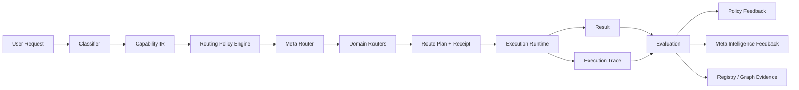

# AI Capability Compiler 目标架构

> AI Capability Compiler 的目标架构与长期研究边界

本文是 ModelMirror 的**目标架构与长期研究说明**。它定义希望建立的系统边界、核心抽象、反馈回路和安全门禁，不是当前生产能力清单。当前可运行拓扑以[当前系统架构](../ARCHITECTURE.md)为准。

最后更新日期：2026-08-09
维护人：模镜团队

## 状态口径

本文只使用以下成熟度状态：

| 状态 | 含义 |
| --- | --- |
| **Available** | 当前已提交代码形成可验证闭环；仍不自动等于已发布或完成真实供应商验收。 |
| **Experimental** | 有可运行原型或局部闭环，但接口、存储或语义仍可能变化。 |
| **In Progress** | 存在实现证据，但尚未形成稳定、可复现的主分支闭环。 |
| **Planned** | 已进入目标设计或路线，但仓库没有足够实现证据。 |
| **Research** | 长期研究问题，尚无可承诺的产品形态或交付时间。 |

## Architecture Overview

AI Capability Compiler 的目标是把用户目标编译为结构化能力需求，再从异构 AI 生态中选择、组合、执行并评测一条合适路径。

核心主链路是：

```text
User Request
→ Classifier
→ Capability IR
→ Meta Router / Routing Policy Engine
→ Domain Routers
→ Execution Runtime
→ Evaluation
→ Registry / Policy / Meta Intelligence Feedback
```

它把“资源是什么”“任务需要什么”“如何执行”“执行得怎样”分成可治理的契约。这样做的目的不是增加抽象层，而是让选择、组合、成本和风险能够被观察、解释和回退。

## Goals

- 用统一、可版本化的方式描述模型、Skill、MCP、知识库、Agent、工作流和外部工具。
- 把任务复杂度、能力需求、工具需求、模块映射和执行约束转换为 Capability IR。
- 允许不同资源类型保留独立 Router，并由 Meta Router 选择路由策略和组合。
- 让运行过程形成可审计 Trace，并对质量、成本、时延和可靠性进行评测。
- 用经验证的结果改进资源描述、路由策略和元能力生成。
- 对所有生成、修改和部署动作施加权限、测试、审批、发布与回退门禁。
- 保持模型供应商、Agent 框架和工作流运行器可替换。

## Non-Goals

- 不把目标架构描述为当前已经上线的企业级控制平面。
- 不重新实现所有模型网关、Agent 框架、MCP Server、向量库和工作流引擎。
- 不把简单意图分类、静态标签或局部自动路由包装成完整 Capability Compiler。
- 不以“一个万能模型”取代按任务约束组合能力的架构。
- 不复制第三方闭源模型权重，也不宣称可以蒸馏出万能超级模型。
- 不允许无人监管、无测试、无审批的系统自修改或自动部署。
- 不在目标文档中承诺未经仓库证据验证的性能、成本、用户规模、安全或合规结果。

## Design Principles

1. **事实与愿景分层**：当前实现、目标架构和研究方向必须使用不同状态与时态。
2. **显式中间表示**：用户目标先转为 Capability IR，再绑定具体供应商和资源。
3. **分域路由**：Model、Provider、Skill、MCP、RAG 和 Handoff 各自保留专门策略。
4. **策略与执行分离**：Meta Router 决定“采用什么策略”，Runtime 负责“安全地执行”。
5. **评测闭环**：没有可靠评测的 Trace 不直接进入策略更新或蒸馏。
6. **最小充分复杂度**：优先选择满足约束的最低复杂度层级，再有证据地升级。
7. **可观察与可回退**：分类、路由、调用、评测和变更都应有 Receipt、Trace 或审计记录。
8. **Harness 先行**：权限、沙箱、输入校验、测试、PR 和发布门禁属于架构本身。

## 完整架构图


> **状态说明：** 该图描述目标架构与长期研究方向，不代表所有层级均已达到生产可用状态。图中名称是设计词汇，实际状态以本文的仓库证据与成熟度矩阵为准。

## 八层目标架构

### 1. AI Ecosystem Layer / AI 生态资源层

这一层提供可被发现、描述和调用的异构资源：

- 各类文本、视觉、音频、视频和专用模型；
- Skill 与 Prompt；
- MCP Server、外部 API、数据源和工具；
- 开源 Agent / Workflow 框架；
- 垂类 Agent 与多 Agent 工作流；
- 知识库、RAG 管线和记忆系统；
- Harness、Benchmark 和评测数据集。

资源进入系统不等于获得信任。每项资源都应保留来源、版本、许可、接口、能力证据和更新时间；动态价格、可用性与 Benchmark 结果还需要时间戳和来源。

### 2. Capability Registry & Knowledge Graph / 能力注册表与能力图谱

#### Universal AI Asset Schema / 统一 AI 资产模型

目标 Schema 至少覆盖：

- `identity`：稳定 ID、名称、类型、供应商与版本；
- `provenance`：来源、许可、维护者与同步时间；
- `interfaces`：输入输出模态、协议、鉴权和调用方式；
- `capabilities`：能力声明及其证据；
- `economics`：价格、配额和成本估算来源；
- `performance`：时延、可靠性和评测记录，而非无来源的静态结论；
- `compatibility`：可配合的 Tool、Skill、Runtime、数据格式和安全策略；
- `lifecycle`：成熟度、弃用状态和版本迁移信息。

这仍是目标 Schema，不是当前静态 TypeScript 目录的既成契约。

#### Capability Registry / 能力注册表

Registry 保存经过校验的资产记录、版本和可调用入口，回答“系统知道哪些资源、当前可否使用”。它需要与运行时健康状态、权限和租户边界分离，避免把目录存在误当作调用可用。

#### Capability Knowledge Graph / 能力知识图谱

Knowledge Graph 连接任务、能力、资源、约束、兼容关系和执行结果，回答“哪些资源在什么条件下适合一起工作”。图中边应来自明确证据，例如版本兼容、成功执行、评测结果或人工审核，而不是只由标签相似度推断。

#### Capability Genome / 能力基因组

Capability Genome 是一个智能系统或资源组合的**结构化、可版本化能力配置**，可由以下部分组成：

```text
Model + Prompt + Skill + Tool + Memory + Workflow + Policy + Evaluation Evidence
```

它不是神秘的生物学概念，不表示模型权重，也不保证组合后的涌现能力。它更接近可复现的配置清单、组合配方和证据包。

### 3. Classifier + Capability IR / 分类器与能力中间表示

#### Classifier 的职责

Classifier 不是普通意图分类器。目标职责包括：

- 判断任务复杂度和风险等级；
- 识别所需能力与输入输出模态；
- 判断是否需要工具、知识库、记忆或人工介入；
- 映射应进入的产品模块和执行层级；
- 提取质量、成本、时延、可靠性和数据边界约束；
- 标注缺失信息、置信度和需要用户确认的决策。

低置信度或高风险分类应触发澄清、人工审批或安全降级，不应被强制转换为确定执行计划。

#### Complexity Ladder / 复杂度阶梯

```text
垂类小模型
→ 主流大模型
→ 多模型 Fusion
→ 单 Agent
→ 多 Agent 系统
```

这是一条选择阶梯，不是“越复杂越好”的排名。Router 应先尝试满足能力、质量和风险约束的最低层级；只有评测或规则表明不足时才升级。

#### Capability IR / 能力中间表示

Capability IR 是用户需求和具体 AI 资源之间的供应商中立表示。以下仅为设计示例，不是当前 API 契约：

```json
{
  "schema_version": "0.1-draft",
  "task": "比较三份方案并生成带来源的建议",
  "complexity": "high",
  "capabilities": ["reasoning", "retrieval", "comparison", "generation"],
  "tool_use": {
    "required": true,
    "categories": ["knowledge_retrieval"]
  },
  "module": "workflow",
  "execution_level": "single-agent",
  "constraints": {
    "cost": "medium",
    "latency": "medium",
    "quality": "high",
    "reliability": "high",
    "data_boundary": "local-preferred"
  },
  "evaluation": {
    "requires_citations": true,
    "rubric_ids": ["factuality", "coverage"]
  },
  "confidence": 0.74,
  "requires_approval": false
}
```

IR 应可版本化、可校验，并保留从用户输入到字段推断的解释与证据。模型 ID、供应商 URL 和临时凭据不应固化进通用 IR。

### 4. Router Federation / 路由联邦层

不同资源类型需要不同策略，因此目标架构采用独立 Router：

| Router | 主要职责 |
| --- | --- |
| Model Router | 在模型候选中选择满足能力与约束的模型。 |
| Routing Policy Router / Policy Catalog Adapter | 提供成本优先、质量优先、低时延、降级或探索等候选策略配置，不做最终决策。 |
| I/O Modality Router | 处理文本、图片、音频、视频和文件的能力匹配与转换。 |
| Capability Router | 将 IR 能力映射到可用资产或组合。 |
| Provider Router | 在供应商、区域、配额和健康状态间选择调用端点。 |
| Skill Router | 选择、排序并注入适合任务的 Skill。 |
| MCP Router | 在可授权工具中选择 MCP Server 与 Tool。 |
| RAG Chunking Strategy Router | 选择解析、切分、检索和重排策略。 |
| A2A / Handoff Router | 选择 Agent 协作、移交和人工介入路径。 |

#### Meta Router 与 Routing Policy Engine

两者是协作组件，不是三个重叠名称：

- **Routing Policy Engine** 评估约束，对 Policy Catalog 中的候选策略打分并给出适用性解释；
- **Meta Router** 调用 Policy Engine，编排 Domain Router、复杂度层级、fallback 与审批路径。

Meta Router 不只是选择某个模型。它读取 Capability IR、资源健康状态和策略结果，决定：

- 使用哪个路由策略；
- 调用哪些 Domain Router；
- 采用哪个复杂度层级；
- 是否需要 fallback、并行比较或人工审批；
- 如何生成可解释 Route Plan 与 Route Receipt。

策略输入可包含 Quality、Cost、Latency、Reliability、Capability Fit、权限、数据边界和历史评测。任何动态选择都应记录候选集、过滤原因、最终决策和策略版本。

### 5. Meta Intelligence Layer / 元能力层

Meta Intelligence 的目标不是直接包办所有用户任务，而是生成、编排和优化其他能力：

- **Meta Planner**：把目标转成可编辑 Agentic Workflow；
- **Prompt Architects**：把模糊需求转成领域特化结构化提示词；
- **Capability Generator**：生成候选能力组合或 Genome；
- **Skill Creator**：生成、验证和版本化 Skill；
- **MCP Builder**：生成 MCP 适配方案与受控实现；
- **Workflow Architect**：设计流程、变量、错误路径和人工门禁；
- **Agent Builder**：组合角色、模型、工具、记忆和策略；
- **Meta Evaluator**：为能力生成 Rubric、测试和回归门禁。

所有产物先是草稿。进入可用 Registry 前必须经过 schema 校验、静态检查、权限审查、隔离测试、评测和人工批准；涉及代码或部署时还必须经过 PR 与发布流程。

### 6. Execution Runtime / 执行运行时

Execution Runtime 负责安全地执行 Route Plan，包括：

- Planner 与 Executor；
- 模型调用、Tool Calls 与 MCP 会话；
- Workflow、单 Agent 和多 Agent Collaboration；
- Result Synthesis；
- Episodic / Semantic / Procedural Memory；
- Session Context 与变量作用域；
- Trace Logging、Checkpoint 与 Route Receipt；
- Safety、Guardrails、预算和取消机制。

控制面决定策略，数据面执行具体调用。凭据、原始敏感输入和完整工具输出不应默认进入控制面日志。运行时需要幂等性标识、超时、重试边界和对副作用工具的明确审批。

### 7. Evaluation System / 评测与反思层

每次执行应产生可关联的 Trace，并从以下维度评估：

- **Quality**：任务正确性、完整性和格式约束；
- **Cost**：模型、工具、存储和人工成本；
- **Latency**：端到端与分阶段时延；
- **Reliability**：成功率、重试、降级和一致性；
- **User Feedback**：显式反馈与可解释的任务结果信号；
- **Reflection & Repair**：错误诊断、候选修复和回归验证。

#### Execution Trace Dataset

Trace Dataset 的最小结构可包含：

```text
Request → Classification → Capability IR → Route Plan
→ Calls / Events → Result → Evaluation → Feedback / Repair
```

运行日志不自动等于高质量数据集。进入长期数据资产前需要脱敏、授权、去重、质量标记、保留策略和版本化评测。线上反馈与离线 Benchmark 也应分开记录，避免用单一代理指标驱动错误优化。

### 8. Evolution, Distillation & AI Capability Kernel

这一层包含三条不同的演进链路，不能混为“系统自动变强”。

#### A. Knowledge Evolution / 知识演进

```text
Source Discovery → Fetch → Validate → Review → Registry Update → Graph Update
```

目标是跟踪模型、框架、MCP 和生态更新。抓取结果必须保留来源、版本和时间，未经验证的数据不能直接覆盖 Registry。

#### B. Intelligence Evolution / 智能演进

- Prompt Evolution；
- Agent Evolution；
- Workflow Evolution；
- 基于 Benchmark 与真实任务评测的策略优化。

候选变体应在隔离环境中与基线对比，并设置质量、安全和成本退出门槛。

#### C. System Evolution / 系统演进

```text
Observe
→ Diagnose
→ Coding Agent in isolated workspace
→ Patch / PR
→ Tests and review
→ Controlled Deploy / Ops
→ Monitor and rollback
```

ACP 或其他 Agent 协议只解决交互契约，不替代工作区隔离、权限策略、凭据边界和发布审批。Self-Evolving 指受控反馈闭环，不表示系统可以绕过人类和工程门禁修改自身。

## 主链路：Request → IR → Routing → Runtime → Evaluation



关键契约建议如下：

| 阶段 | 输入 | 输出 | 必要护栏 |
| --- | --- | --- | --- |
| Classifier | 用户请求、上下文、权限 | 带置信度的能力与复杂度判断 | 澄清、拒绝和人工审批路径 |
| IR Builder | 分类结果与约束 | 可校验 Capability IR | Schema 版本、来源解释 |
| Meta Router | IR、资源状态、策略 | Route Plan、候选与决策理由 | 预算、权限、fallback 边界 |
| Runtime | Route Plan 与授权 | Result、Trace、Receipt | 超时、取消、沙箱、敏感信息策略 |
| Evaluation | Result、Trace、Rubric | Evaluation Record | 评测版本、偏差和失败标记 |
| Feedback | 经批准的评测记录 | Registry / Policy / Draft 更新 | 人工审核、回归、回退 |

## 四条反馈回路

### 1. Runtime → Evaluation → Evolution → Router Federation

执行结果经过评测和版本化实验后，才可更新路由策略或候选排序。一次成功或单一用户反馈不应直接改变全局策略。

### 2. Runtime → Evaluation → Meta Intelligence

失败模式和高质量样例可用于生成或改进 Prompt、Agent、Skill、MCP 与 Workflow 草稿。产物仍需验证与人工门禁。

### 3. Knowledge Evolution → Registry & Knowledge Graph

外部生态更新经过抓取、来源验证、兼容性检查和审核后，进入 Registry 与 Graph。动态信息需要过期策略。

### 4. Distillation Engine → AI Capability Kernel → Router / Meta Intelligence

只有经过稳定评测的系统级经验才可能被压缩为更轻量策略，并在影子流量或离线 Harness 中验证后反馈到 Router 与 Meta Intelligence。

## Distillation Engine 的边界

Distillation Engine 研究的对象是经过评测的系统策略，而不是第三方闭源模型参数。可能的输入包括：

- 路由候选与选择策略；
- 规划步骤和失败修复策略；
- 工具选择、参数模式与权限结果；
- 记忆读写和上下文裁剪策略；
- Rubric、评测结果和用户批准信号。

不应进入的内容包括未经授权的用户数据、明文凭据、受许可限制的内容、未经验证的模型输出和无法追溯来源的 Trace。

## AI Capability Kernel / 智能能力内核

AI Capability Kernel 是长期研究中的轻量系统组合，而不是单一“超级模型”。概念组成可以是：

```text
Small Model
+ Router
+ Planner
+ Tool Policy
+ Memory
+ Evaluation
```

它的目标是在明确任务分布内复用经过验证的系统策略，降低部分任务的成本和时延，同时保留升级到更强模型、工具或 Agent 系统的路径。Kernel 必须携带版本、适用范围、评测基线和失效条件。

## Safety、Guardrails、测试和发布门禁

### 数据与权限

- 凭据只在服务端和最小作用域中使用，不写入 IR、Trace 或前端代码。
- Registry 声明、实际可调用权限与用户授权分别建模。
- 工具默认遵循最小权限；有副作用的调用需要显式批准和幂等性设计。
- Trace 进入数据集前必须完成授权、脱敏、保留期限和删除策略检查。

### 执行隔离

- Coding Agent、MCP 和文件工具运行在受限工作区或沙箱中。
- 不把 ACP、A2A 或 MCP 协议本身当作安全边界。
- 网络、文件系统、进程和环境变量使用 allowlist；禁止默认挂载用户主目录、Docker Socket 或无关工作区。

### 变更门禁

```text
Proposal
→ Static Validation
→ Isolated Test
→ Evaluation against baseline
→ Human Review / Approval
→ PR and required checks
→ Staged release
→ Monitoring and rollback
```

任何系统生成的 Prompt、Skill、MCP、Agent、Workflow 或代码都应保留来源、版本、评测和批准记录。失败、超预算、低置信度或策略冲突时，应降级到安全路径或请求人工决策。

## Current Implementation Mapping

当前仓库已经提供资源浏览、原生模型路由、多模态聊天、MCP、Skill、经典工作流、本地知识流水线、Data X 与 Agent Studio 等底座；它们是目标架构的输入与早期执行面，不代表八层控制平面已经闭环。

当前事实边界：

- `/workflow` 指向经典自研 React Flow 画布；`/workflow-native` 是隔离静态校验实验线。
- `/rag` 及其 Pipeline、Evaluation 与 Inbox 子路由使用本地知识库；保留的 Dify proxy / iframe 不是当前主路由。
- `/chat/auto` 使用原生 Model Router 完成策略、健康、预算和回执管理；OmniRoute 是可选兼容侧车，newAPI / OpenAI-compatible 网关和 OpenRouter 仍是上游模型能力来源。
- Chat 已覆盖图片、STT、TTS、实时音频与视频入口；具体模型仍依赖服务端连接、供应商能力和逐链路验收。
- Data X、Agent Studio 与 Agent App/API 已形成主分支实现，但当前部署仍以本地单实例、显式授权和模块级存储为主要边界。
- 部分 Runtime、AgentTask、Handoff 和审计状态仍是轻量或内存态；已存在的 Run、Checkpoint 与模块评测也不等于统一 Execution Trace Dataset。
- 本地 mock、目录标签或测试覆盖不等同于真实 newAPI、OpenRouter、OmniRoute、Office Host 或其他供应商验收。

## 架构成熟度矩阵

| Layer / Capability | Repository Evidence | Status | Notes |
| --- | --- | --- | --- |
| 模型、Agent、MCP、Skill、Prompt 与 Plugin 资源入口 | `client/src/App.tsx`、相关 Browser / Profile / Plugin 页面 | Available | 各条目仍有 ready、planned、blocked 等自身状态；这些目录尚未统一为 Universal Asset Schema。 |
| 原生 Model Router 与 `/chat/auto` | `server/model_router/`、`server/tests/test_model_router_*.py`、`client/src/pages/ChatPage.tsx` | Available | 支持目录、策略、熔断、预算、回执和上下文优化；它是模型域路由，不是 Router Federation。 |
| 统一聊天与多模态工作区 | `server/multimodal/`、`server/tests/test_multimodal_*.py`、`ChatPage.tsx` | Available | 已覆盖图片、音频与视频子链路；真实可用范围仍取决于已配置 Provider 和专项验收。 |
| MCP stdio Runtime 与安全状态目录 | `server/mcp/`、`client/src/data/mcpProjects.ts`、`server/tests/test_mcp_*.py` | Available | Runtime 与目录已进入主分支；目录数量不代表全部条目可安装或可调用，生产多租户权限仍需建设。 |
| Skill 安装与聊天注入 | `server/skills/`、`client/src/pages/SkillBrowserPage.tsx`、`server/tests/test_skill_integration.py` | Available | 不等于自动 Skill 生成、评测和发布。 |
| 经典 Workflow | `client/src/pages/WorkflowClassicPage.tsx`、`server/main.py` 的 `/api/workflow/run` | Available | 部分高级节点是渐进实验能力；状态并非完整持久化调度。 |
| 本地 RAG、Knowledge Pipeline、Evaluation 与 Inbox | `server/rag/`、`client/src/pages/RagPage.tsx`、`server/tests/test_rag_*.py` | Available | 主路径已包含图、执行、评测与审批子能力；高级策略仍按模块测试和权限边界使用。 |
| Data X | `server/datax/`、`client/src/pages/DataX*Page.tsx`、`server/tests/test_datax*.py` | Available | 提供本地项目、受限导入、语义模型、版本化指标与提案审批；不是通用外部数据控制平面。 |
| Agent Studio 与 Agent App/API | `client/src/pages/XpertStudio*Page.tsx`、`client/src/pages/XpertAppPage.tsx`、`server/xperts/` | Available | 支持草稿、版本和受控部署；不等于自治的跨组织 Agent 网络。 |
| OmniRoute 与 Office Host 可选侧车 | `server/omniroute/`、`server/office_host/`、相关专项测试 | Available | 仅在显式 profile、配置与验收下启用；OmniRoute 是兼容回退，Office Host 不是默认解析前提。 |
| Runtime Capability Registry / RunRegistry | `server/xpert_runtime/capabilities.py`、`server/xpert_runtime/run_registry.py` | Experimental | 是局部运行时抽象，不是全生态 Capability Registry 或持久化 Trace 平台。 |
| Meta-Agent 工作流草稿 | `server/meta_agent/`、`client/src/pages/MetaAgentPage.tsx`、`server/tests/test_meta_agent.py` | Experimental | 生成并静态校验草稿，不执行自治多 Agent 调度。 |
| Fusion、自动派工、AI Team | `client/src/pages/ExpertTeamPage.tsx`、`server/main.py` 的相关 API | Experimental | 多模型综合、规则匹配和模型接力，不是 Router Federation。 |
| workflow-native | `server/api/workflow_native.py`、`server/workflow_native/validate.py` | Experimental | 当前只有 templates / validate；没有独立 run API。 |
| Runtime Ops、AgentTask 与 Handoff | `client/src/pages/RuntimeOpsPage.tsx`、`server/xpert_runtime/agent_tasks.py` | Experimental | 只读观测和轻量状态闭环，主要为内存态。 |
| Skill Creator 与模块级生成/评测闭环 | `client/src/pages/SkillCreatorStudioPage.tsx`、`server/skills/creator_*.py`、模块专项测试 | Experimental | 已有受控工作台不等于通用 Meta Capability Generator。 |
| Universal AI Asset Schema | 本文目标设计；当前目录 schema 不统一 | Planned | 先定义最小版本、来源和证据字段，再迁移目录。 |
| Capability Knowledge Graph / Genome | 本文目标设计 | Planned | 当前没有图谱存储、关系证据或版本化 Genome 服务。 |
| Classifier + Capability IR | 当前仅有局部规则匹配；本文给出 IR 草案 | Planned | 需要 schema、置信度、解释和评测基线。 |
| Router Federation + Meta Router | 当前有原生 Model Router、局部 Handoff 与策略实验 | Planned | 仍需跨 Model、Skill、MCP、RAG、Provider 等 Domain Router 的统一策略契约、Route Plan 与 Receipt。 |
| 跨资源 Meta Capability Generator / MCP Builder | 本文目标设计；当前只有模块级 Creator 与草稿能力 | Planned | 生成只是第一步，还需要统一验证、评测、权限和发布门禁。 |
| 统一 Evaluation Contract / Engine | 当前已有 RAG、Benchmark、Run 与模块级评测 | Planned | 仍需统一 Rubric、版本、记录、成本口径与失败语义后才能接入全局反馈。 |
| Execution Trace Dataset | 当前没有经授权、脱敏和评测的数据集闭环 | Research | 不把日志数量称为已形成的数据资产。 |
| Knowledge / Intelligence / System Evolution | 本文受控反馈设计 | Research | 当前没有自动更新策略与完整门禁闭环。 |
| Distillation Engine / AI Capability Kernel | 本文长期研究边界 | Research | 没有已训练 Kernel、蒸馏服务或性能结论。 |

## Terminology

本文统一使用以下核心术语：

- **AI Capability Compiler / AI 能力编译器**：将目标编译为能力需求、路由计划和执行组合的目标产品引擎。
- **AI Capability Control Plane / AI 能力控制平面**：统一注册、策略、路由、治理和观测的商业方向。
- **Capability IR / 能力中间表示**：用户目标与具体资源之间的供应商中立结构。
- **Router Federation / 路由联邦**：由多个 Domain Router 和 Meta Router 组成的目标路由体系。
- **Meta Intelligence / 元能力**：生成或优化其他 Prompt、Skill、MCP、Agent 和 Workflow 的能力。
- **Execution Trace Dataset / 执行轨迹数据集**：经过授权、脱敏和评测的完整执行记录集合。
- **AI Capability Kernel / 智能能力内核**：在限定任务范围内复用经验证系统策略的长期研究组合。

完整中英文定义见[术语表](../GLOSSARY.md)。若本文与模块实现文档冲突，当前状态以代码、测试、配置和[当前系统架构](../ARCHITECTURE.md)为准。

## 相关阅读

- [ModelMirror 产品愿景](../VISION.md)
- [当前系统架构](../ARCHITECTURE.md)
- [Harness Engineering](../HARNESS_ENGINEERING.md)
- [元智能体集成](../META_AGENT.md)
- [MCP 集成](../MCP_INTEGRATION.md)
- [RAG 集成](../RAG_INTEGRATION.md)
- [workflow-native 设计](../workflow-native-design.md)
