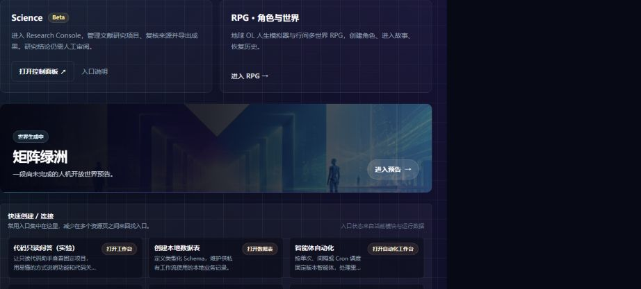
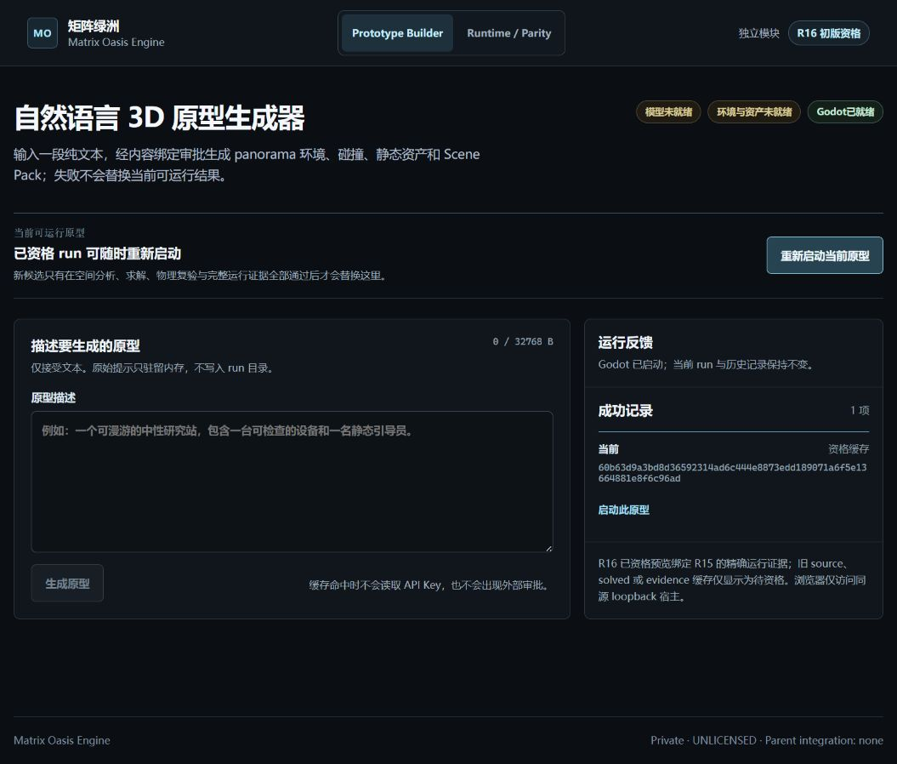

# 原矩阵绿洲入口接入 Creator 与 Studio 排版复核

2026-09-17；基线 `eeb5bbd2` 加本次补充。按用户后续明确要求，Science 与 RPG 并排，保留矩阵绿洲原 UI，将原“进入矩阵绿洲”按钮接到真实 Creator。此记录替代上一轮两个 Beta 卡片布局结论；旧截图及未启动记录保留为历史。

## 实际界面验收

- **通过**：共享 Studio 上 Science 在左、RPG 在右；DOM 两卡 y 均为 322.67、宽均为 453，x 分别为 316/785。手机 390×844 自动纵排，clientWidth 与 scrollWidth 均为 380。
- **通过**：`MatrixOasisTeaser` 函数与 `b266b870` 完全一致；原图、样式、文案及原 `/matrix-oasis` 页面结构未重写。`MatrixOasisPage.css` 未变更。没有单列 Creator 卡片、按钮或面板。
- **通过**：Studio 点击原面板进入 `/matrix-oasis`，可见原“进入矩阵绿洲”；点击后显示原入场动画和“跳过”，随后同标签进入 `http://127.0.0.1:43110/`，可见 Prototype Builder、R16 初版资格和成功记录 1 项。
- **通过**：自动测试分别验证原动画结束、点击“跳过”均导航到相同 Creator 地址；地址沿用公开 runtime config `MATRIX_OASIS_CONSOLE_URL`。
- **通过**：Creator 恢复中性案例，点击“重新启动当前原型”，实际界面回执为“Godot 已启动；当前 run 与历史记录保持不变”。
- **未运行**：新模型/Marble/Meshy 生成，本轮 Provider 请求 0。模型及资产服务显示未就绪，生成按钮禁用。
- **待人工**：本轮 Godot 原生窗口里的空间、画面与操作体验；不以启动回执代替游戏画面质量验收。

正式浏览器工具实际截图，未重绘。Studio SHA-256 `d56a06347af9a1f9b9512f83b30af4a813671fcbb7dc2ee68a68cf18ea9dab89`；Creator SHA-256 `fcd4f31bc47bcfd96d509fa3490479d56bc83016fd7b6bd294b96c923ca1530c`。从本任务原始工具结果提取并逐字节校验，不含凭据或私人草稿。

## Creator 启动与缓存定位

在当前工作树独立模块执行 `npm.cmd ci --ignore-scripts --no-audit --no-fund`、`npm.cmd run build:creator`。锁文件未变更，模块源码未修改。Godot 实测版本 `4.6.3.stable.official.7d41c59c4`，仓外 executable 位于 `C:/tmp/matrix-oasis-r15-tools/`。

宿主绑定 `127.0.0.1:43110`，本轮最终启动 PID 47304（重启/停止前必须重新核对归属），输出 `MATRIX_OASIS_R16_CREATOR_MVP_READY`。仅配置公开缓存模型标识 `gpt-5.6-luna`，没有配置模型 endpoint 或任何 Provider 凭据，未切换生成模型。

历史五根：

| 参数 | `C:/tmp/` 下目录 |
| --- | --- |
| `--run-root` | `matrix-oasis-r10-runs` |
| `--spatial-run-root` | `matrix-oasis-r11-spatial-primary-density-v8-overlay` |
| `--solved-run-root` | `matrix-oasis-r14-solved-neutral-r15-requalified-v1` |
| `--evidence-run-root` | `matrix-oasis-r15-evidence-neutral-v3` |
| `--qualified-run-root` | `matrix-oasis-r16-neutral-qualified` |

启动脚本为模块已有 `scripts/preview-r16.mjs`，额外传 `--port 43110`。本轮日志、PID 保存在模块忽略目录 `test-reports/studio-creator-20260917/`；不提交日志、缓存、生成资产或凭据。

首次启动未指定缓存模型标识，因此历史被既有 sanitizeR16Recovered 的模型匹配规则过滤；第二次匹配模型后因选择旧空间根而只能显示 source-only 待资格。既有宿主会尝试本地资格恢复，但该根未通过强引用校验，不计为成功。本轮未改冻结校验、未覆盖旧资格。随后仅在 metadata 指向同一 source run 的空间根内做只读强引用验证，定位到 density-v8-overlay，并重启本轮自有进程。最终历史恢复成功。初始错误页曾被浏览器 data: URL 规则阻断，未读取或绕过；服务恢复后通过正式 HTTP 页面验收。

资格文件最终 SHA-256 仍为 `60b63d9a3bd8d36592314ad6c444e8873edd189071a6f5e13664881e8f6c96ad`，与历史资格 ID 相同；绑定 R15 evidence `04359c15960e8904f866e0f34ea7983ed1299a86867d5f6840ca52d0ca09ad20`。启动成功不外推为新的游戏质量验收。

## 验证、部署与回退

- 前端 4 文件 56 项通过：StudioBetaPanels、MatrixOasisPage、helpContent、HelpCenterPage；帮助基线同步后 14 项再次通过。
- Creator `node --test tests/r16-host.test.mjs tests/r16-preview.test.mjs`：13/13 通过；独立 Creator build 通过（248 modules）。
- 前端 Docker build（含 TypeScript/Vite）通过，保留既有 bundle size 警告。
- 共享 client 镜像 `sha256:53fd9db9803823c417c18d771c91b69d5d2c3c42b360bb3e4d0c6abf63f0b48c`；部署检查 server/client 环境变更键为空、挂载与网络保留，server 镜像未改变。
- PR 上一轮全量 CI 的已知失败仍单独保留，不将本轮局部通过等同全量 CI 通过。
- 回退前端仅撤回本补充提交，镜像标签 `modelmirror-client:pre-creator-entry-20260917`；保留服务配置与数据。停止 Creator 必须重新确认 43110 listener、PID、Node executable 与本轮脚本参数一致；仅停止本轮实例，不清理历史缓存、Godot 原件或工作树。
