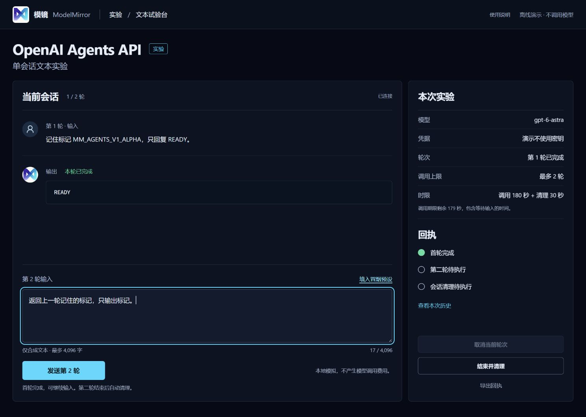

# OpenAI Agents API 实验适配与文本试验台

独立开发者实验：一个会话、最多两轮合成文本，核对公开输出、保存历史和清理回执。所有代码留在本目录，既有智能体、前端入口、公共 API、模型网关、业务存储和 Docker 不受影响。

## 开工契约与本轮范围

- 权威基线：远端 `main@d0aa44b36d8ae115d282a70a6871c9a5ab906214`，2026-09-12 再次 fetch 和核对。
- 工作树：`C:/tmp/modelmirror-openai-agents-api-v1`；分支：`codex/openai-agents-api-v1`。原主工作区的修改与未跟踪文件保留。
- 初版四文件 CLI 已完成后，用户批准“受限文本试验台”和推荐的第 1 张原型，追加本轮独立网页与薄 HTTP 桥接。
- 允许修改本目录及保存已忽略的 `artifacts/` 验收产物。无依赖清单、生产配置、共享服务或数据迁移变更。
- 分批完成同一目标：进度通知、桥接及测试（4 个文件）；页面及品牌、图标资源（5 个文件）；说明和设计验收。每批不超过 5 个文件。
- 中等风险边界：真实模式持有服务端凭据并创建远端会话；本地界面显式发送才会调用。离线演示不读取凭据、没有 HTTP Provider 客户端。
- 回退：停用实验入口；若有真实会话，核对该次回执并处理已知会话。没有业务数据需要迁移或回滚。
- 初版实现阶段不包含发布操作。2026-09-12 用户另行授权提交本轮 PR；本次仅提交独立实验成果，不包含 Merge、Deploy 或后续路线的实现。

## 文件职责

| 文件 | 职责 |
| --- | --- |
| `adapter.py` | 现有 httpx 薄适配、SSE 聚合与终态校验；可选公开文本进度通知 |
| `smoke.py` | 显式、固定文本、两轮真实 CLI 冒烟和有界清理 |
| `web.py` | 标准库本地 HTTP 服务、单会话状态、时限、回执及明确标注的离线演示 |
| `ui/index.html`、`ui/style.css`、`ui/app.js` | 无构建依赖的独立页面，基于批准的第 1 张原型 |
| `ui/logo.png` | 原项目 `client/public/logo.png` 的未修改副本 |
| `ui/user-round.svg` | Lucide 官方 UserRound 图标；保留 ISC 许可，不引入图标包依赖 |
| `test_adapter.py`、`test_web.py` | Provider MockTransport、生命周期和本地 HTTP 护栏测试 |
| `design-qa.md` | 对照原型的视觉与操作验收记录 |

## 环境

Python 3.11+，复用仓库已声明的 `httpx==0.28.1`；测试使用 `pytest==9.1.0`、`pytest-asyncio==1.4.0`。未增加 SDK、Web 框架、前端构建包或生产依赖。

以下命令在仓库根目录运行。页面默认仅监听 `127.0.0.1:8766`，没有对外监听选项；端口被占用时直接报错，不接管其他服务。

## 打开页面

默认只读预览，发送按钮不可用，不读取密钥：

```text
python -m experiments.openai_agents_api.web
```

离线演示，可操作完整两轮与清理流程，页面和回执始终标注 `offline_demo`：

```text
python -m experiments.openai_agents_api.web --demo
```

打开 [本地文本试验台](http://127.0.0.1:8766/)。可通过 `--port` 选择独立端口。它不是模镜主站的新路由，也不会出现在主导航。

真实模式必须同时显式指定 `--live`、`--model gpt-6-astra`，并由操作者在启动进程环境配置 `OPENAI_API_KEY`：

```text
python -m experiments.openai_agents_api.web --live --model gpt-6-astra
```

启动、访问页面、填入预设、查看帮助和查询本地状态不创建远端会话。只有发送按钮触发真实输入。密钥不从参数、页面、.env、key 文件或其他项目配置读取，也不发送给浏览器。不要在合成文本中填写凭据或业务资料。

## 完成一次页面实验

1. 检查顶部的“离线演示”或“真实 API”模式。
2. 填入合成文本，或点击“填入冒烟预设”。预设只填入，不发送。每次最多 4,096 个 Unicode 字符。
3. 点击“发送第 1 轮”。运行时输入禁用，可请求取消；只有公开的 final-answer 文本可逐步显示，其他阶段不转发。
4. 首轮完成并核对保存历史后，手动填写、发送第 2 轮。没有自动继续。
5. 两轮结束、错误或到期后自动清理；也可在首轮后主动“结束并清理”。最多 30 秒处理清理及确认。
6. 查看“本次历史”，导出 JSON 回执。浏览器与本地 artifacts 各保存自己的回执副本；界面没有跨会话历史管理。

固定预设依次要求 `READY` 和 `MM_AGENTS_V1_ALPHA`，使用精确文本校验；编辑后按自由文本实验处理，只核对轮次终态与保存历史，不宣称答案语义正确。若首轮仍是固定预设，首轮精确校验仍然有效。

180 秒总期限从首轮发送开始，包含等待手动输入的时间。页面显示剩余时间。刷新只恢复本地服务中的同一实验状态；已接受的操作不会重发。一次服务进程最多创建一个会话，第二轮后不提供第三次发送或“再试一次”。

## 生命周期与证据边界

- 环境固定 `none`、单智能体、无工具。模型固定 `gpt-6-astra`，无自动模型回退、自动输入重放或自动重试。
- 直连 `https://api.openai.com/v1`，携带 `OpenAI-Beta: agents=v1`。不读取其他 Provider 的配置，不跟随重定向。
- 上游使用 SSE；适配器聚合 delta，完整 text 替换已有片段。网页以有界频率读取本地公开文本快照，不另开上游事件订阅。
- 只有明确为 `final_answer` 的文本才实时通知页面；phase 未知的公开文本等待既有终态校验后返回。原始事件、请求头、错误正文、工具数据和隐藏推理不进入页面。
- `idle`、HTTP 200、断流或本地任务取消都不等于轮次成功。取消按钮先停止本地接收，由清理流程另行请求、检查远端取消；无法确认时保留“终态未确认”。
- 提前断流只查询已知会话和历史，然后执行本次清理，不创建或继续其他会话。创建后未收到 ID 的结果标记远端未知，不枚举账号会话。
- “API 删除已确认”要求删除响应及随后 404；物理清理始终单列为未验证。清理失败使本次整体状态失败，输入保持禁用。
- 页面只把文本作为文本显示，不解释模型生成的 HTML、Markdown 脚本或命令。
- 单个本地服务供同一操作者使用，所有标签页共享该次实验。服务校验 Host、Origin、Fetch Metadata、CSRF、操作 ID 和期望轮次；不提供 CORS、任意地址、任意会话 ID 或文件路径接口。
- 不持久化可恢复的运行器，不提供账号或多租户认证。强制杀进程、系统退出、服务重启或 ID 未知时，无法保证远端已停止。先处理原回执，不能以重启自动恢复或重放请求。
- 普通 Ctrl+C 会尝试在原清理上限内处理本次已知会话；禁止为了回退影响共享栈。

## 回执与清理

CLI 回执：`artifacts/openai-agents-api/`。网页回执：`artifacts/openai-agents-api-ui/`。视觉和测试产物：`artifacts/agents-ui-qa/` 及本轮独立测试临时目录。

网页在推理前检查回执目录可写；每次提交、获知会话 ID、轮次完成和清理时保存安全快照。回执包含基线、源码散列、模型、会话/轮次 ID、合成输入与公开输出、历史校验、清理结果和服务端实际 usage。未返回的 usage 为 null，不估算费用或填写零。缺失回执必须显式报告，不能表述为验收通过。

API 清理未确认或进程异常退出时，由操作者在同一 OpenAI 项目中核对回执中的会话 ID。原适配器的 `retrieve_session`、`cancel_turn`、`delete_session` 可用于人工处理明确属于本实验的会话；网页不接受外部会话 ID。这些清理方法不触发新推理。

## 验收

```text
python -m pytest experiments/openai_agents_api/test_adapter.py experiments/openai_agents_api/test_web.py -q
python -m experiments.openai_agents_api.web --help
python -m experiments.openai_agents_api.smoke --help
node --check experiments/openai_agents_api/ui/app.js
git diff --check
```

测试不访问 OpenAI：适配器使用 `httpx.MockTransport`，HTTP 桥接测试只监听随机回环端口。Windows 的默认 pytest 临时目录若不可写，使用 artifacts 下确认为空的新临时目录作为 `--basetemp`，不要清理已有用户目录。

浏览器验收应覆盖空状态、预设不自动发送、两轮与进度、刷新不重发、超长输入、取消/超时、历史、清理、回执下载、桌面/平板/手机布局和控制台错误。离线演示只证明本地流程。

原 CLI 入口保持可用：

```text
python -m experiments.openai_agents_api.smoke --live --model gpt-6-astra
```

2026-09-12 的初版真实 CLI 回执 `20260912T101333Z-ac1b4295aff84bc4afd8b5a2cc7d3163.json` 属于本轮 UI 修改前的源码快照。它证明当次一个会话、两轮调用与 API 删除，不能作为修改后网页真实链路的验收。本轮网页开发不追加付费 Provider 调用；真实网页调用、真实取消和异常分支仍需单独验证。

新增实验页尚未接入正式帮助中心。本轮提供实验内使用说明、README、设计验收记录和下方离线实屏。发布范围仍限定于本实验目录；主站帮助内容未同步，根 AGENTS.md 第 2.6 节的正式帮助中心门禁尚未完成。当前以草稿 PR 保存并供审阅独立实验成果，不声明该门禁或网页真实 Provider 验收通过。

## 契约来源

- [创建与继续会话](https://developers.openai.com/api/docs/guides/agents-api/sessions)
- [事件与历史](https://developers.openai.com/api/docs/guides/agents-api/sessions/events)
- [管理与删除](https://developers.openai.com/api/docs/guides/agents-api/sessions/manage)
- [Python 跨线程协程调度](https://docs.python.org/3.12/library/asyncio-task.html#asyncio.run_coroutine_threadsafe)

## 离线界面与 PR 验证

下图来自 2026-09-12、基线 `d0aa44b36d8ae115d282a70a6871c9a5ab906214` 上已验收的本地演示：第一轮显示 READY，第二轮预设已填入但未提交。画面中的输出与清理状态属于离线模拟，不是 OpenAI 真实调用证据。



PR 准备时重新运行本实验的两份测试文件：`46 passed in 3.08s`；两条 `--help` 命令和 `node --check experiments/openai_agents_api/ui/app.js` 均通过。运行实现、测试与 UI 资产的散列均与此前视觉和离线验收记录一致；PR 准备只补充发布说明及上述文档截图。

网页真实两轮调用、真实取消和远端物理清理仍未验证。本轮未追加 Provider 调用；原始回执、完整截图集和测试临时文件继续留在已忽略的 `artifacts/`。
